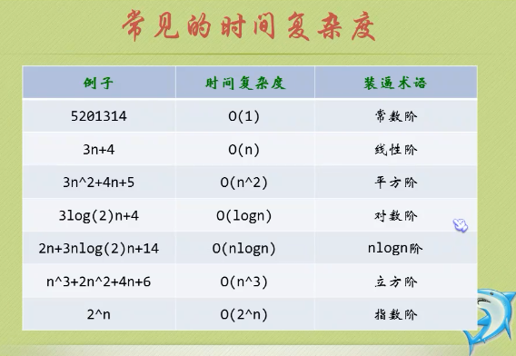
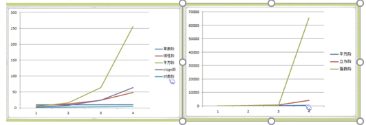
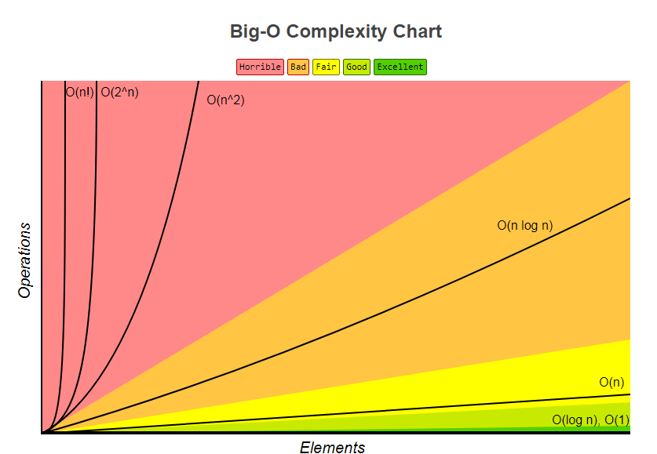

# 复杂度分析

## 算法时间复杂度
### 1、算法的时间复杂度定义

**定义**：

在进行算法分析时，语句总的执行次数T(n)是关于问题规模n的函数，进而分析T(n)随n的变化情况并确定T(n)的数量级。算法的时间复杂度，也就是算法的时间量度，记作T(n)=O(f(n)),它表示随问题规模n的增大，算法执行时间的增长率和f(n)的增长率相同，称作算法的渐进时间复杂度，简称时间复杂度。其中f(n)是问题规模n的某个函数。

**关键点：**

函数执行次数 == 时间

**大O记法：**

用大写O()来体现算法时间复杂度的记法。称为大O记法。
> 一般情况下，随着n的增大，T(n)增长最慢的算法为最优算法。

### 2、推到大O阶
1. 用常数1取代运行时间中的所有加法常数。
2. 在修改后的运算次数函数中，只保留最高阶项。
3. 如果最高阶项存在且不是1，则去除与这个项相乘的常数。
4. 以上处理之后，得到的结果就是大O阶。

### 3、常数阶
这种与问题大小无关（n的多少），执行时间恒定的算法，称为具有O(1)的时间复杂度，又称常数阶。
### 4、线性阶
分析线性阶的算法复杂度，关键要分析循环结构的运行情况。

- O(n)
### 5、平方阶
 循环的时间复杂度等于循环体的复杂度乘以该循环运行的次数.

- O(n^2)
### 6、对数阶：
- O(logn)
### 7、常见的时间复杂度：

常用的时间复杂度所耗费的时间从小到大依次为：
O(1)< O(logn)<O(n)< O(nlogn)<O(n^2)< O(n^3)<O(2^n)< O(n!)<O(n^n)

## 最坏情况与平均情况：
 最坏情况运行时间是一种保证，那就是运行时间将不会再坏了。在应用中，这是一种最重要的需求。通常，除非特别指定，我们提到的运行时间都是最坏情况的运行时间。

平均运行时间是所有情况中最有意义的，因为它是期望的运行时间。

对算法的分析，一种方法是计算所有情况的平均值，这种时间复杂度的计算方法称为时间复杂度。另一种方法是计算最坏情况下的时间复杂度，这种方法称为最坏时间复杂度。
> 一般在没有特殊说明情况下，都是指最坏时间复杂度。

## 算法空间复杂度
算法的空间复杂度通过计算算法所需的存储空间实现，算法空间复杂度的计算公式：
`S(n)=O(f(n))`,其中，n为问题的规模，f(n)为语句关于n所占存储空间的函数。

—般情况下，一个程序在机器上执行时，除了需要存储程序本身的指令、常数、 变量和输入数据外，还需要存储对数据操作的存储单元。若输入数据所占空间只取决 于问题本身，和算法无关，这样只需要分析该算法在实现时所需的辅助单元即可。若 算法执行时所需的辅助空间相对于输入数据埴而言是个常数，则称此算法为原地工 作，空间复杂度为O(1).

> 通常，我们都使用“时间复杂度”来指运行时间的需求，使用“空间复杂度”指 空间需求。
> 当不用限定词地使用“复杂度”时，通常都是指时间复杂度。
## [Big-O 速查表](https://www.bigocheatsheet.com/)

 **Big-O Complexity Chart：**

**Common Data Structure Operations：**

**Array Sorting Algorithms：**

## 参考资料 

* [Master Theorem](https://en.wikipedia.org/wiki/Master_theorem_(analysis_of_algorithms)) 
* [主定理](https://zh.wikipedia.org/wiki/%E4%B8%BB%E5%AE%9A%E7%90%86)