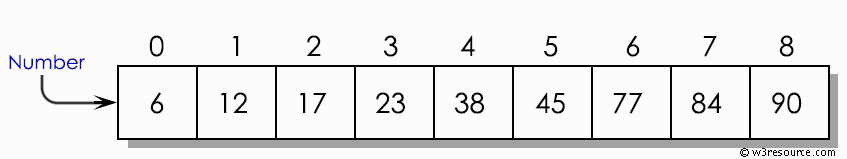
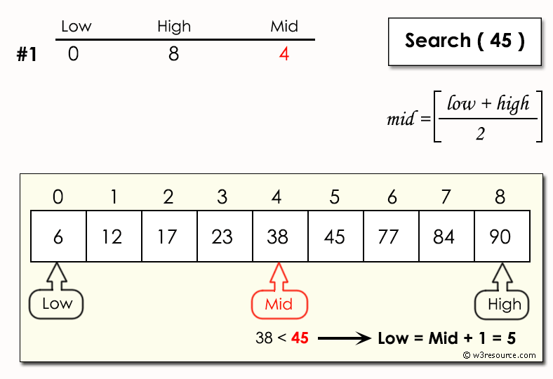
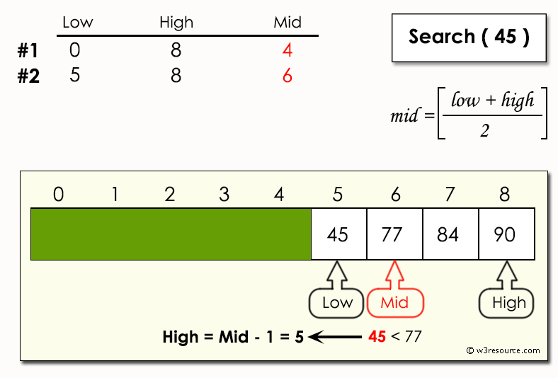
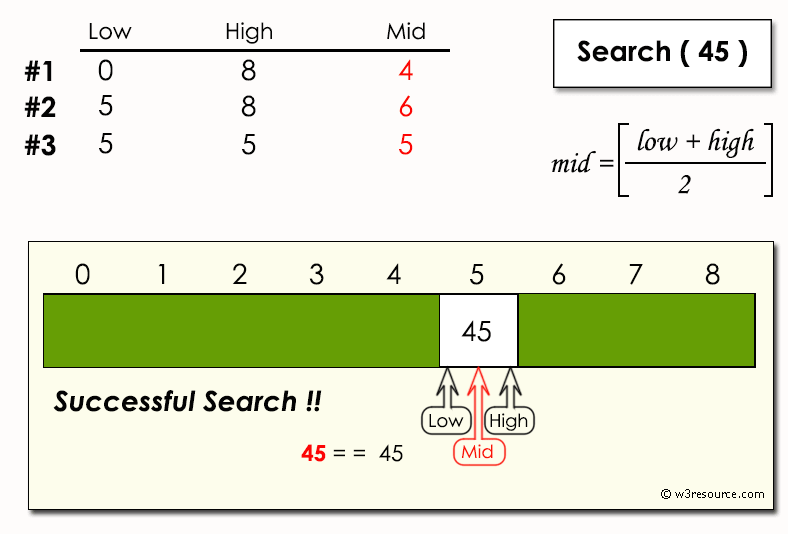

# Binarysearch

## 概述
二进制搜索是一种运行时间复杂度为O（log n）的快速搜索算法。这种搜索算法基于分而治之的原理。为了使该算法正常工作，数据收集应采用排序形式。

二进制搜索通过比较集合中最中间的项来查找特定项。如果发生匹配，则返回项目的索引。如果中间项目大于该项目，则在中间项目左侧的子数组中搜索该项目。否则，将在中间项目右侧的子数组中搜索该项目。该过程也将在子阵列上继续进行，直到子阵列的大小减小到零为止。

## 算法
二分搜索是一种在有序数组中查找某一特定元素的搜索算法。搜索过程从数组的中间元素开始，如果中间元素正好是要查找的元素，则搜索过程结束；如果某一特定元素大于或者小于中间元素，则在数组大于或小于中间元素的那一半中查找，而且跟开始一样从中间元素开始比较。如果在某一步骤数组为空，则代表找不到。这种搜索算法每一次比较都使搜索范围缩小一半。

## 过程分析









1. 先找到这个 数组的中间的下标  `midIndex =  (leftIndex + rightIndex) / 2`
2.  开始比较  让 findVal  和  arr[midIndex ]  比较
3.  如果  findVal  >  arr[midIndex ]   , 则应当到 arr数组 [  midIndex + 1 : rightIndex  ]
4.  如果  findVal  <  arr[midIndex ]   , 则应当到 arr数组 [  leftIndex : midIndex -1   ]
5.  如果  findVal  ==  arr[midIndex ]   , 找到
6.  将 2, 3, 4, 5 的逻辑进行递归.
7.  什么情况下，表示找不到 当   leftIndex   > rightIndex  成立，则表示没有

## 复杂度分析
- 平均时间复杂度  `O(logN)`

## 代码模板（伪代码）
```c
Procedure binary_search
   A ← sorted array
   n ← size of array
   x ← value to be searched

   Set lowerBound = 1
   Set upperBound = n 

   while x not found
      if upperBound < lowerBound 
         EXIT: x does not exists.
   
      set midPoint = lowerBound + ( upperBound - lowerBound ) / 2
      
      if A[midPoint] < x
         set lowerBound = midPoint + 1
         
      if A[midPoint] > x
         set upperBound = midPoint - 1 

      if A[midPoint] = x 
         EXIT: x found at location midPoint
   end while
   
end procedure
```
```python
left, right = 0, len(array)  - 1
while left <=  right;
    //mid =  (left + right) / 2
    mid = left + (right - left) / 2
    if array[mid] == target:
        // find the target
        break or return result
    elif array[mid] < target :
        left = mid + 1
    else:
        right = mid - 1
```
## 实现
* c
```
#include <stdio.h>

#define MAX 20

// array of items on which linear search will be conducted. 
int intArray[MAX] = {1,2,3,4,6,7,9,11,12,14,15,16,17,19,33,34,43,45,55,66};

void printline(int count) {
   int i;
	
   for(i = 0;i <count-1;i++) {
      printf("=");
   }
	
   printf("=\n");
}

int find(int data) {
   int lowerBound = 0;
   int upperBound = MAX -1;
   int midPoint = -1;
   int comparisons = 0;      
   int index = -1;
	
   while(lowerBound <= upperBound) {
      printf("Comparison %d\n" , (comparisons +1) );
      printf("lowerBound : %d, intArray[%d] = %d\n",lowerBound,lowerBound,
         intArray[lowerBound]);
      printf("upperBound : %d, intArray[%d] = %d\n",upperBound,upperBound,
         intArray[upperBound]);
      comparisons++;
		
      // compute the mid point
      // midPoint = (lowerBound + upperBound) / 2;
      midPoint = lowerBound + (upperBound - lowerBound) / 2;	
		
      // data found
      if(intArray[midPoint] == data) {
         index = midPoint;
         break;
      } else {
         // if data is larger 
         if(intArray[midPoint] < data) {
            // data is in upper half
            lowerBound = midPoint + 1;
         }
         // data is smaller 
         else {
            // data is in lower half 
            upperBound = midPoint -1;
         }
      }               
   }
   printf("Total comparisons made: %d" , comparisons);
   return index;
}

void display() {
   int i;
   printf("[");
	
   // navigate through all items 
   for(i = 0;i<MAX;i++) {
      printf("%d ",intArray[i]);
   }
	
   printf("]\n");
}

void main() {
   printf("Input Array: ");
   display();
   printline(50);
	
   //find location of 1
   int location = find(55);

   // if element was found 
   if(location != -1)
      printf("\nElement found at location: %d" ,(location+1));
   else
      printf("\nElement not found.");
}
```
* java
```java
public static int binarySearch(int[] dataset ,int data) { 
	int beginIndex = 0; 				
	int endIndex = dataset.length - 1;  
	int midIndex = -1; 					
	if(data <dataset[beginIndex]||data>dataset[endIndex]||beginIndex>endIndex){ 
		return -1; 
	} 
	while(beginIndex <= endIndex) { 
		midIndex = (beginIndex+endIndex)/2;
		if(data <dataset[midIndex]) { 
			endIndex = midIndex-1; 
		} else if(data>dataset[midIndex]) { 
			beginIndex = midIndex+1; 
		}else { 
			return midIndex; 
		} 
	} 
	return -1; 
} 	
```
* Golang
``` golang
func BinarySearch(array []int, startIndex, endIndex, find int) {
	if len(array) == 0 {
		return
	}
	if startIndex > endIndex {
		fmt.Printf("%d 不是数组中元素!!!!\n", find)
		return
	}
	middle := (startIndex + endIndex) / 2

	if array[middle] > find {
		BinarySearch(array, startIndex, middle-1, find)
	} else if array[middle] < find {
		BinarySearch(array, middle+1, endIndex, find)
	} else {
		fmt.Printf("%d 在数组中的下标为 %d \n", find, middle)
	}
}

```
* Python
```python
def binarySearch(alist, item):

    first = 0
    last = len(alist) - 1
    found = False

    while first <= last and not found:
        midpoint = (first + last) // 2
        if alist[midpoint] == item:
            found = True
        else:
            if item < alist[midpoint]:
                last = midpoint - 1
            else:
                first = midpoint + 1

    return found
```