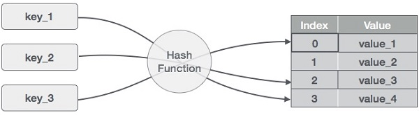

# Hash Table
在计算中，哈希表（散列映射）是一种数据结构，它实现一个关联数组 抽象数据类型，即可以映射的结构的键来值。哈希表使用哈希函数将索引（也称为哈希码）计算到存储桶或插槽的数组中，从中可以找到所需的值。

理想情况下，哈希函数会将每个键分配给唯一的存储桶，但是大多数哈希表设计采用了不完善的哈希函数，这可能会导致哈希冲突，其中哈希函数会为多个键生成相同的索引。总是以某种方式解决这种冲突

## 概述
哈希表是一种以关联方式存储数据的数据结构。在哈希表中，数据以数组格式存储，其中每个数据值都有自己的唯一索引值。如果我们知道所需数据的索引，则数据访问将变得非常快。

## Hashing 散列
散列是一种将键值范围转换为数组索引范围的技术。我们将使用模运算符来获取一系列键值。考虑一个大小为20的哈希表的示例，



- (1,20)
- (2,70)
- (42,80)
- (4,25)
- (12,44)
- (14,32)
- (17,11)
- (13,78)
- (37,98)


## 基本操作
* Search  -搜索哈希表中的元素。
* Insert  -在哈希表中插入一个元素。
* delete  -删除一个哈希表的元素。
## 模板
定义具有一些数据和关键字的数据项，基于该数据项和关键字将在哈希表中进行搜索。
1. DataItem
```
struct DataItem {
   int data;
   int key;
};
```
2. Hash Method
定义一种哈希方法来计算数据项键的哈希码。
```
int hashCode(int key){
   return key % SIZE;
}
```
3. Search Operation 搜索操作
每当要搜索元素时，都要计算传递的键的哈希码，并使用该哈希码作为数组中的索引来定位元素。如果在计算的哈希码中找不到元素，请使用线性探测使该元素领先。
```
struct DataItem *search(int key) {
   //get the hash
   int hashIndex = hashCode(key);
	
   //move in array until an empty
   while(hashArray[hashIndex] != NULL) {
	
      if(hashArray[hashIndex]->key == key)
         return hashArray[hashIndex];
			
      //go to next cell
      ++hashIndex;
		
      //wrap around the table
      hashIndex %= SIZE;
   }

   return NULL;        
}
```
4. Insert Operation 插入操作
每当要插入元素时，都要计算传递的键的哈希码，并使用该哈希码作为数组中的索引来找到索引。如果在计算出的哈希码中找到一个元素，则对空位置使用线性探测。
```
void insert(int key,int data) {
   struct DataItem *item = (struct DataItem*) malloc(sizeof(struct DataItem));
   item->data = data;  
   item->key = key;     

   //get the hash 
   int hashIndex = hashCode(key);

   //move in array until an empty or deleted cell
   while(hashArray[hashIndex] != NULL && hashArray[hashIndex]->key != -1) {
      //go to next cell
      ++hashIndex;
		
      //wrap around the table
      hashIndex %= SIZE;
   }
	
   hashArray[hashIndex] = item;        
}
``` 
5. Delete Operation 删除操作
每当要删除元素时，都要计算传递的键的哈希码，并使用该哈希码作为数组中的索引来找到索引。如果在计算的哈希码中找不到元素，请使用线性探测使该元素领先。找到后，在其中存储一个虚拟项目以保持哈希表的性能不变。
```
struct DataItem* delete(struct DataItem* item) {
   int key = item->key;

   //get the hash 
   int hashIndex = hashCode(key);

   //move in array until an empty 
   while(hashArray[hashIndex] !=NULL) {
	
      if(hashArray[hashIndex]->key == key) {
         struct DataItem* temp = hashArray[hashIndex]; 
			
         //assign a dummy item at deleted position
         hashArray[hashIndex] = dummyItem; 
         return temp;
      } 
		
      //go to next cell
      ++hashIndex;
		
      //wrap around the table
      hashIndex %= SIZE;
   }  
	
   return NULL;        
}
```
## Hash Collision  哈希冲突
### 哈希冲突
现实中的哈希函数不是完美的，当两个不同的输入值对应一个输出值时，就会产生“碰撞”，这个时候便需要解决冲突。
### 冲突解决方案
* 单独链表法
   - 将散列到同一个存储位置的所有元素保存在一个链表中。实现时，一种策略是散列表同一位置的所有冲突结果都是用栈存放的，新元素被插入到表的前端还是后端完全取决于怎样方便
* 链地址法
   - 为每个 Hash 值建立一个单链表，当发生冲突时，将记录插入到链表中。
* 开放定址法(再散列)
   - 基本思想是：当关键字key的哈希地址p=H（key）出现冲突时，以p为基础，产生另一个哈希地址p1，如果p1仍然冲突，再以p为基础，产生另一个哈希地址p2，…，直到找出一个不冲突的哈希地址pi ，将相应元素存入其中。
   - 如果一次不够，就再来一次，直到冲突不再发生。
* 建立一个公共溢出区
    - 将哈希表分为基本表和溢出表两部分，凡是和基本表发生冲突的元素，一律填入溢出表
## 实现
* c
```c
#include <stdio.h>
#include <string.h>
#include <stdlib.h>
#include <stdbool.h>

#define SIZE 20

struct DataItem {
   int data;   
   int key;
};

struct DataItem* hashArray[SIZE]; 
struct DataItem* dummyItem;
struct DataItem* item;

int hashCode(int key) {
   return key % SIZE;
}

struct DataItem *search(int key) {
   //get the hash 
   int hashIndex = hashCode(key);  
	
   //move in array until an empty 
   while(hashArray[hashIndex] != NULL) {
	
      if(hashArray[hashIndex]->key == key)
         return hashArray[hashIndex]; 
			
      //go to next cell
      ++hashIndex;
		
      //wrap around the table
      hashIndex %= SIZE;
   }        
	
   return NULL;        
}

void insert(int key,int data) {

   struct DataItem *item = (struct DataItem*) malloc(sizeof(struct DataItem));
   item->data = data;  
   item->key = key;

   //get the hash 
   int hashIndex = hashCode(key);

   //move in array until an empty or deleted cell
   while(hashArray[hashIndex] != NULL && hashArray[hashIndex]->key != -1) {
      //go to next cell
      ++hashIndex;
		
      //wrap around the table
      hashIndex %= SIZE;
   }
	
   hashArray[hashIndex] = item;
}

struct DataItem* delete(struct DataItem* item) {
   int key = item->key;

   //get the hash 
   int hashIndex = hashCode(key);

   //move in array until an empty
   while(hashArray[hashIndex] != NULL) {
	
      if(hashArray[hashIndex]->key == key) {
         struct DataItem* temp = hashArray[hashIndex]; 
			
         //assign a dummy item at deleted position
         hashArray[hashIndex] = dummyItem; 
         return temp;
      }
		
      //go to next cell
      ++hashIndex;
		
      //wrap around the table
      hashIndex %= SIZE;
   }      
	
   return NULL;        
}

void display() {
   int i = 0;
	
   for(i = 0; i<SIZE; i++) {
	
      if(hashArray[i] != NULL)
         printf(" (%d,%d)",hashArray[i]->key,hashArray[i]->data);
      else
         printf(" ~~ ");
   }
	
   printf("\n");
}

int main() {
   dummyItem = (struct DataItem*) malloc(sizeof(struct DataItem));
   dummyItem->data = -1;  
   dummyItem->key = -1; 

   insert(1, 20);
   insert(2, 70);
   insert(42, 80);
   insert(4, 25);
   insert(12, 44);
   insert(14, 32);
   insert(17, 11);
   insert(13, 78);
   insert(37, 97);

   display();
   item = search(37);

   if(item != NULL) {
      printf("Element found: %d\n", item->data);
   } else {
      printf("Element not found\n");
   }

   delete(item);
   item = search(37);

   if(item != NULL) {
      printf("Element found: %d\n", item->data);
   } else {
      printf("Element not found\n");
   }
}
```