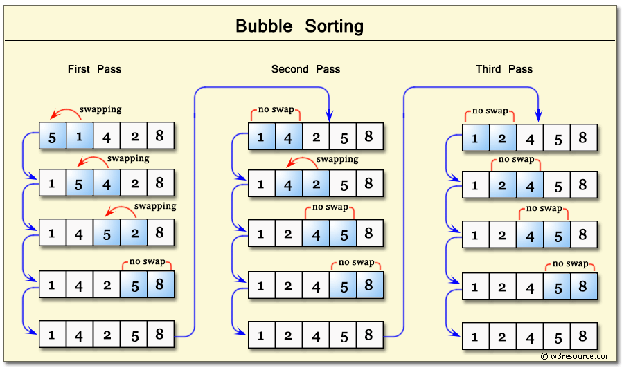

# 冒泡排序-BubbleSort

## 基本思想
冒泡排序是一种简单的排序算法。该排序算法是基于比较的算法，其中比较每对相邻元素，如果元素不按顺序交换。该算法不适用于大型数据集，因为它的平均和最坏情况下的复杂度为O(n^2)，其中n是项数。

## 排序过程
``` c
begin BubbleSort(list)

   for all elements of list
      if list[i] > list[i+1]
         swap(list[i], list[i+1])
      end if
   end for
   
   return list
   
end BubbleSort
```




**参考理解：**
- 首先，将 n 个元素中的第一个和第二个进行比较，如果两个元素的位置为逆序，则交换两个元素的位置；
- 进而比较第二个和第三个元素关键字，如此类推，直到比较第 n-1 个元素和第 n 个元素为止； 
- 上述过程描述了起泡排序的第一趟排序过程，在第一趟排序过程中，我们将关键字最大的元素通过交换操作放到了具有 n 个元素的序列的最一个位置上。 
- 然后进行第二趟排序，在第二趟排序过程中对元素序列的前 n-1 个元素进行相同操作，其结果是将关键字次大的元素通过交换放到第 n-1 个位置上。一般来说，第 i 趟排序是对元素序列的前 n-i+1 个元素进行排序，使得前 n-i+1 个元素中关键字最大的元素被放置到第 n-i+1 个位置上。排序共进行 n-1 趟，即可使得元素序列按关键字有序。


总结冒泡排序的思路：
1. 每一次的外部排序，确定一个数的顺序
2. 外部排序的次数是 数组的大小-1
3. 每次外部排序的比较次数在减少.
4. 每外部排序的比较次数-1


## 复杂度分析
- 平均时间复杂度  `O(n^2)`
- 空间复杂度    `O(1)`
> 效率最低的排序算法

## 算法优化
**问题：**
- 数据的顺序排好之后，冒泡算法仍然会继续进行下一轮的比较，直到arr.length-1次，后面的比较没有意义的。

**优化方案：**
- 设置标志位flag，如果发生了交换flag设置为true；如果没有交换就设置为false。

- 这样当一轮比较结束后如果flag仍为false，即：这一轮没有发生交换，说明数据的顺序已经排好，没有必要继续进行下去。

## 代码模板

```c
procedure bubbleSort( list : array of items )

   loop = list.count;
   
   for i = 0 to loop-1 do:
      swapped = false
		
      for j = 0 to loop-1 do:
      
         /* compare the adjacent elements */   
         if list[j] > list[j+1] then
            /* swap them */
            swap( list[j], list[j+1] )		 
            swapped = true
         end if
         
      end for
      
      /*if no number was swapped that means 
      array is sorted now, break the loop.*/
      
      if(not swapped) then
         break
      end if
      
   end for
   
end procedure return list
```
## 代码实现
* C
```c
#include <stdio.h>
#include <stdbool.h>

#define MAX 10

int list[MAX] = {1,8,4,6,0,3,5,2,7,9};

void display() {
   int i;
   printf("[");
	
   // navigate through all items 
   for(i = 0; i < MAX; i++) {
      printf("%d ",list[i]);
   }
	
   printf("]\n");
}

void bubbleSort() {
   int temp;
   int i,j;
	
   bool swapped = false;
   
   // loop through all numbers 
   for(i = 0; i < MAX-1; i++) { 
      swapped = false;
		
      // loop through numbers falling ahead 
      for(j = 0; j < MAX-1-i; j++) {
         printf("     Items compared: [ %d, %d ] ", list[j],list[j+1]);

         // check if next number is lesser than current no
         //   swap the numbers. 
         //  (Bubble up the highest number)
			
         if(list[j] > list[j+1]) {
            temp = list[j];
            list[j] = list[j+1];
            list[j+1] = temp;

            swapped = true;
            printf(" => swapped [%d, %d]\n",list[j],list[j+1]);
         } else {
            printf(" => not swapped\n");
         }
			
      }

      // if no number was swapped that means 
      //   array is sorted now, break the loop. 
      if(!swapped) {
         break;
      }
      
      printf("Iteration %d#: ",(i+1)); 
      display();
   }
	
}

void main() {
   printf("Input Array: ");
   display();
   printf("\n");
	
   bubbleSort();
   printf("\nOutput Array: ");
   display();
}
```

* Java
```java
public static void BubblesortT(int[] arrays) {
	int len = arrays.length;
	if (len <= 1) {
	    return;
	} 

	int tmp;
	boolean flag;

	for (int i = 0; i < len - 1; i++){
       
        flag = false;
        
        for (int j = 0; j < len - i - 1; j++){
	        if (arrays[j] > arrays[j + 1]){
	            tmp = arrays[j];
	            arrays[j] = arrays[j + 1];
	            arrays[j + 1] = tmp;

	            flag = true;
	        }
	    }

	    if(!flag) break;
	}

}	
```

* Golang
```go
func BubbleSort(arrays []int){   
    count := len(arrays)
	if count <= 1 {
		return
	}

	flag := false

	for i := 0; i < count - 1; i++ {
		for j := 0; j < count - i - 1; j++ {
			if arrays[j] > arrays[j + 1] {
				arrays[j], arrays[j + 1] = arrays[j + 1], arrays[j]
				flag = true
			}
		}

		if !flag {
			break
		} 
	}
```

* Python
```python

def bubbleSort(alist):
    n = len(alist)
    if n < 1:
        return
    
    for i in range(n):
        for j in range(0, n-i-1): 
            if alist[j] > alist[j + 1] :
                alist[j], alist[j + 1] = alist[j + 1], alist[j]


# 代码优化
def bubbleSort(alist):
    
    count = len(alist)-1
    if count < 0:
        return

    flag = True

    while count > 0 and flag:
       
       flag = False
       
       for i in range(count):
           if alist[i]>alist[i + 1]:
               alist[i], alist[i + 1] = alist[i + 1], alist[i]
               
               flag = True
               
       count = count - 1
```
* JavaScript 
```JavaScript
function bubbleSort(arr) {
    var len = arr.length;
    for (var i = 0; i < len - 1; i++) {
        for (var j = 0; j < len - 1 - i; j++) {
            if (arr[j] > arr[j+1]) {        // 相邻元素两两对比
                var temp = arr[j+1];        // 元素交换
                arr[j+1] = arr[j];
                arr[j] = temp;
            }
        }
    }
    return arr;
}
```
* Rust
```rust
```