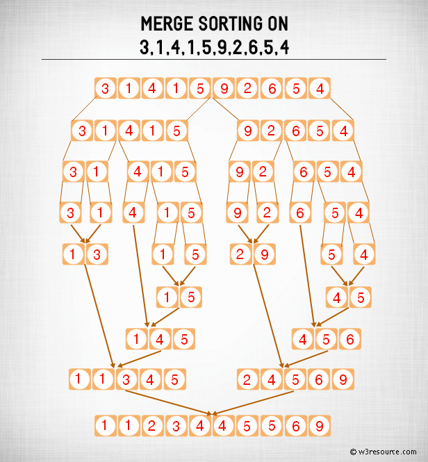

# 归并排序-MergeSort

## 基本思想
归并排序（Merge sort）是一种基于分治法（Divide and Conquer）的排序技术。最坏情况下的时间复杂度为O(N*logN)。

归并排序首先将数组分成相等的两半，然后以排序的方式将它们合并。

归并排序是一种递归算法，可将列表连续分成两半。如果列表为空或只有一项，则按定义（基本情况）进行排序。如果列表中有多个项目，我们将拆分列表并递归地在两个半部上调用合并排序。一旦将两半分类，就执行称为合并的基本操作。合并是获取两个较小的排序列表并将它们组合到一个单独的，排序的新列表中的过程。

## 排序过程
合并排序会继续将列表分为相等的一半，直到无法再对其进行划分为止。根据定义，如果它只是列表中的一个元素，则会对其进行排序。然后，合并排序将合并较小的排序列表，使新列表也保持排序。
- 步骤1:如果它只是列表中已经被排序的一个元素，则返回。
- 步骤2:将列表递归分为两半，直到无法再对其进行划分。
- 第3步:将较小的列表按排序顺序合并到新列表中。

1. 在合并排序中拆分列表


2.合并在一起的列表


合并排序：图片演示



## 复杂度分析
- 时间复杂度    `O(N*logN)`
- 空间复杂度    `O(N)`
## 代码模板
```c
procedure mergesort( var a as array )
   if ( n == 1 ) return a

   var l1 as array = a[0] ... a[n/2]
   var l2 as array = a[n/2+1] ... a[n]

   l1 = mergesort( l1 )
   l2 = mergesort( l2 )

   return merge( l1, l2 )
end procedure

procedure merge( var a as array, var b as array )

   var c as array
   while ( a and b have elements )
      if ( a[0] > b[0] )
         add b[0] to the end of c
         remove b[0] from b
      else
         add a[0] to the end of c
         remove a[0] from a
      end if
   end while
   
   while ( a has elements )
      add a[0] to the end of c
      remove a[0] from a
   end while
   
   while ( b has elements )
      add b[0] to the end of c
      remove b[0] from b
   end while
   
   return c
	
end procedure
```
## 代码实现
* C
```c
#include <stdio.h>

#define max 10

int a[11] = { 10, 14, 19, 26, 27, 31, 33, 35, 42, 44, 0 };
int b[10];

void merging(int low, int mid, int high) {
   int l1, l2, i;

   for(l1 = low, l2 = mid + 1, i = low; l1 <= mid && l2 <= high; i++) {
      if(a[l1] <= a[l2])
         b[i] = a[l1++];
      else
         b[i] = a[l2++];
   }
   
   while(l1 <= mid)    
      b[i++] = a[l1++];

   while(l2 <= high)   
      b[i++] = a[l2++];

   for(i = low; i <= high; i++)
      a[i] = b[i];
}

void sort(int low, int high) {
   int mid;
   
   if(low < high) {
      mid = (low + high) / 2;
      sort(low, mid);
      sort(mid+1, high);
      merging(low, mid, high);
   } else { 
      return;
   }   
}

int main() { 
   int i;

   printf("List before sorting\n");
   
   for(i = 0; i <= max; i++)
      printf("%d ", a[i]);

   sort(0, max);

   printf("\nList after sorting\n");
   
   for(i = 0; i <= max; i++)
      printf("%d ", a[i]);
}
```
* Java
```java
public int[] sort(int[] arr)  {

    if (arr.length < 2) {
        return arr;
    }
    int middle = (int) Math.floor(arr.length / 2);

    int[] left = Arrays.copyOfRange(arr, 0, middle);
    int[] right = Arrays.copyOfRange(arr, middle, arr.length);

    return merge(sort(left), sort(right));
}

protected int[] merge(int[] left, int[] right) {
    int[] result = new int[left.length + right.length];
    int i = 0;
    while (left.length > 0 && right.length > 0) {
        if (left[0] <= right[0]) {
            result[i++] = left[0];
            left = Arrays.copyOfRange(left, 1, left.length);
        } else {
             result[i++] = right[0];
            right = Arrays.copyOfRange(right, 1, right.length);
         }
    }

    while (left.length > 0) {
        result[i++] = left[0];
        left = Arrays.copyOfRange(left, 1, left.length);
    }

    while (right.length > 0) {
        result[i++] = right[0];
        right = Arrays.copyOfRange(right, 1, right.length);
    }

    return result;
}

```
* GO
```golang
func mergeSort(arr []int) []int {
        length := len(arr)
        if length < 2 {
                return arr
        }
        middle := length / 2
        left := arr[0:middle]
        right := arr[middle:]
        return merge(mergeSort(left), mergeSort(right))
}

func merge(left []int, right []int) []int {
        var result []int
        for len(left) != 0 && len(right) != 0 {
                if left[0] <= right[0] {
                        result = append(result, left[0])
                        left = left[1:]
                } else {
                        result = append(result, right[0])
                        right = right[1:]
                }
        }

        for len(left) != 0 {
                result = append(result, left[0])
                left = left[1:]
        }

        for len(right) != 0 {
                result = append(result, right[0])
                right = right[1:]
        }

        return result
}
```
* Python
```python
def mergeSort(nlist):
    print("Splitting ",nlist)
    if len(nlist)>1:
        mid = len(nlist)//2
        lefthalf = nlist[:mid]
        righthalf = nlist[mid:]

        mergeSort(lefthalf)
        mergeSort(righthalf)
        i=j=k=0       
        while i < len(lefthalf) and j < len(righthalf):
            if lefthalf[i] < righthalf[j]:
                nlist[k]=lefthalf[i]
                i=i+1
            else:
                nlist[k]=righthalf[j]
                j=j+1
            k=k+1

        while i < len(lefthalf):
            nlist[k]=lefthalf[i]
            i=i+1
            k=k+1

        while j < len(righthalf):
            nlist[k]=righthalf[j]
            j=j+1
            k=k+1
    print("Merging ",nlist)
```
* JavaScript
```javascript
function mergeSort(arr) {  // 采用自上而下的递归方法
    var len = arr.length;
    if(len < 2) {
        return arr;
    }
    var middle = Math.floor(len / 2),
        left = arr.slice(0, middle),
        right = arr.slice(middle);
    return merge(mergeSort(left), mergeSort(right));
}

function merge(left, right)
{
    var result = [];

    while (left.length && right.length) {
        if (left[0] <= right[0]) {
            result.push(left.shift());
        } else {
            result.push(right.shift());
        }
    }

    while (left.length)
        result.push(left.shift());

    while (right.length)
        result.push(right.shift());

    return result;
}
```
* Rust
```rust
```