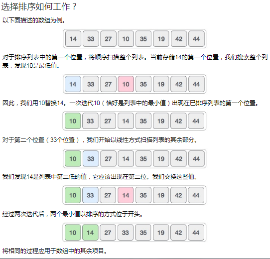

# 选择排序-SelctionSort

## 基本思想
选择排序是一种简单的排序算法。此排序算法是一种基于比较的算法，其中，列表分为两部分，左端为已排序部分，右端为未排序部分。最初，已排序部分为空，未排序部分为整个列表。

从未排序的数组中选择最小的元素，并与最左边的元素交换，该元素成为排序数组的一部分。此过程继续将未排序的数组边界向右移动一个元素。

该算法不适用于大型数据集，因为其平均复杂度和最坏情况复杂度均为O(N^2)，其中n是项数

## 排序过程
- 步骤1:将MIN设置为位置0
- 第2步:搜索列表中的最小元素
- 步骤3:交换位置MIN处的值
- 步骤4:增加MIN以指向下一个元素
- 步骤5:重复直到列表被排序



下图显示了整个排序过程:


## 复杂度分析
- 时间复杂度    `O(N^2)`
- 空间复杂度    `O(1)`

## 代码模板
```c
procedure selection sort 
   list  : array of items
   n     : size of list

   for i = 1 to n - 1
   /* set current element as minimum*/
      min = i    
  
      /* check the element to be minimum */
      for j = i+1 to n 
         if list[j] < list[min] then
            min = j;
         end if
      end for

      /* swap the minimum element with the current element*/
      if indexMin != i  then
         swap list[min] and list[i]
      end if
   end for
	
end procedure
```
## 代码实现
* C
```c
#include <stdio.h>
#include <stdbool.h>

#define MAX 7

int intArray[MAX] = {4,6,3,2,1,9,7};

void printline(int count) {
   int i;
	
   for(i = 0;i < count-1;i++) {
      printf("=");
   }
	
   printf("=\n");
}

void display() {
   int i;
   printf("[");
	
   // navigate through all items 
   for(i = 0;i < MAX;i++) {
      printf("%d ", intArray[i]);
   }
	
   printf("]\n");
}

void selectionSort() {
   int indexMin,i,j;
	
   // loop through all numbers 
   for(i = 0; i < MAX-1; i++) { 
	
      // set current element as minimum 
      indexMin = i;
		
      // check the element to be minimum 
      for(j = i+1;j < MAX;j++) {
         if(intArray[j] < intArray[indexMin]) {
            indexMin = j;
         }
      }

      if(indexMin != i) {
         printf("Items swapped: [ %d, %d ]\n" , intArray[i], intArray[indexMin]); 
			
         // swap the numbers 
         int temp = intArray[indexMin];
         intArray[indexMin] = intArray[i];
         intArray[i] = temp;
      }          

      printf("Iteration %d#:",(i+1));
      display();
   }
}  

void main() {
   printf("Input Array: ");
   display();
   printline(50);
   selectionSort();
   printf("Output Array: ");
   display();
   printline(50);
}
```
* Java
```java
public class SelectSort {
	public static void select_sort(int array[], int lenth) {

		for (int i = 0; i < lenth - 1; i++) {

			int minIndex = i;
			for (int j = i + 1; j < lenth; j++) {
				if (array[j] < array[minIndex]) {
					minIndex = j;
				}
			}
			if (minIndex != i) {
				int temp = array[i];
				array[i] = array[minIndex];
				array[minIndex] = temp;
			}
		}
	}
}

```
* GO
```golang
func selectionSort(arr []int) []int {
    length := len(arr)
    for i := 0; i < length-1; i++ {
        min := i
        for j := i + 1; j < length; j++ {
            if arr[min] > arr[j] {
                min = j
            }
        }
        arr[i], arr[min] = arr[min], arr[i]
    }
    return arr
}
```
* Python
```python
def selectionSort(alist):
   for fillslot in range(len(alist)-1,0,-1):
       positionOfMax=0
       for location in range(1,fillslot+1):
           if alist[location]>alist[positionOfMax]:
               positionOfMax = location

       alist[fillslot], alist[positionOfMax] = alist[positionOfMax] alist[fillslot]
```
* JavaScript
```javascript
function selectionSort(arr) {
    var len = arr.length;
    var minIndex, temp;
    for (var i = 0; i < len - 1; i++) {
        minIndex = i;
        for (var j = i + 1; j < len; j++) {
            if (arr[j] < arr[minIndex]) {     // 寻找最小的数
                minIndex = j;                 // 将最小数的索引保存
            }
        }
        temp = arr[i];
        arr[i] = arr[minIndex];
        arr[minIndex] = temp;
    }
    return arr;
}
```
* Rust
```rust
```