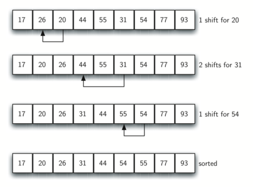

# 希尔排序-ShellSort
Shell排序是一种高效的排序算法，它基于插入排序算法。如果较小的值在最右端并且必须移到最左端，则该算法避免了在插入排序的情况下发生大的移位。

该算法对广泛分布的元素使用插入排序，首先对它们进行排序，然后对间距较小的元素进行排序。该间隔称为间隔
## 基本思想
在要排序的一组数中，根据某一增量分为若干子序列，并对子序列分别进行插入排序。
然后逐渐将增量减小,并重复上述过程。直至增量为1,此时数据序列基本有序,最后进行插入排序。

希尔排序的基本思想是：先将整个待排序的记录序列分割成为若干子序列分别进行直接插入排序，待整个序列中的记录"基本有序"时，再对全体记录进行依次直接插入排序。
## 排序过程
- 步骤1:初始化增量h的值
- 步骤2:将列表分为等间隔h的较小子列表
- 步骤3:使用插入排序对这些子列表进行排序
- 步骤3:重复直到对完整列表进行排序



## 复杂度分析
- 时间复杂度    `O(N*logN)`
- 空间复杂度    `O(1)`
## 代码模板
```c
procedure shellSort()
   A : array of items 
	
   /* calculate interval*/
   while interval < A.length /3 do:
      interval = interval * 3 + 1	    
   end while
   
   while interval > 0 do:

      for outer = interval; outer < A.length; outer ++ do:

      /* select value to be inserted */
      valueToInsert = A[outer]
      inner = outer;

         /*shift element towards right*/
         while inner > interval -1 && A[inner - interval] >= valueToInsert do:
            A[inner] = A[inner - interval]
            inner = inner - interval
         end while

      /* insert the number at hole position */
      A[inner] = valueToInsert

      end for

   /* calculate interval*/
   interval = (interval -1) /3;	  

   end while
   
end procedure
```
## 代码实现
* C
```c
#include <stdio.h>
#include <stdbool.h>

#define MAX 7

int intArray[MAX] = {4,6,3,2,1,9,7};

void printline(int count) {
   int i;
	
   for(i = 0;i < count-1;i++) {
      printf("=");
   }
	
   printf("=\n");
}

void display() {
   int i;
   printf("[");
	
   // navigate through all items 
   for(i = 0;i < MAX;i++) {
      printf("%d ",intArray[i]);
   }
	
   printf("]\n");
}

void shellSort() {
   int inner, outer;
   int valueToInsert;
   int interval = 1;   
   int elements = MAX;
   int i = 0;
   
   while(interval <= elements/3) {
      interval = interval*3 +1;
   }

   while(interval > 0) {
      printf("iteration %d#:",i); 
      display();
      
      for(outer = interval; outer < elements; outer++) {
         valueToInsert = intArray[outer];
         inner = outer;
			
         while(inner > interval -1 && intArray[inner - interval] 
            >= valueToInsert) {
            intArray[inner] = intArray[inner - interval];
            inner -=interval;
            printf(" item moved :%d\n",intArray[inner]);
         }
         
         intArray[inner] = valueToInsert;
         printf(" item inserted :%d, at position :%d\n",valueToInsert,inner);
      }
		
      interval = (interval -1) /3;
      i++;
   }          
}

int main() {
   printf("Input Array: ");
   display();
   printline(50);
   shellSort();
   printf("Output Array: ");
   display();
   printline(50);
   return 1;
}
```
* Java
```java
public class ShellSort {

	public static void shell_sort(int[] arr) {
		int L = arr.length;
		for (int gap = L / 2; gap > 0; gap /= 2) {
			for (int i = gap; i < L; i++) {
				insert(arr, gap, i);
			}
		}
	}

	public static void insert(int[] arr, int gap, int i) {
	
		int inserted = arr[i];
		int j;
		for (j = i - gap; j >= 0 && inserted < arr[j]; j -= gap) {
			arr[j + gap] = arr[j];
		}
		arr[j + gap] = inserted;
	}

}

```
* GO
```golang

func ShellSort(arr []int) []int {
	length := len(arr)

	for gap := length / 2; gap > 0; gap /= 2 {
		for i := gap; i < length; i++ {
			insert(arr, gap, i)
		}
	}

	return arr
}

func insert(arr []int, gap, i int) {
	tmp := arr[i]
	j := i - gap
	for j >= 0 && tmp < arr[j] {
		arr[j+gap] = arr[j]
		j -= gap
	}
	arr[j+gap] = tmp
}

```
* Python
```python
def shellSort(alist):
    sublistcount = len(alist)//2
    while sublistcount > 0:

      for startposition in range(sublistcount):
        gapInsertionSort(alist,startposition,sublistcount)

      print("After increments of size",sublistcount,"The list is",alist)

      sublistcount = sublistcount // 2

def gapInsertionSort(alist,start,gap):
    for i in range(start+gap,len(alist),gap):

        currentvalue = alist[i]
        position = i

        while position>=gap and alist[position-gap]>currentvalue:
            alist[position]=alist[position-gap]
            position = position-gap

        alist[position]=currentvalue
```
* JavaScript
```javascript
function shellSort(arr) {
    var len = arr.length,
        temp,
        gap = 1;
    while(gap < len/3) {          //动态定义间隔序列
        gap =gap*3+1;
    }
    for (gap; gap > 0; gap = Math.floor(gap/3)) {
        for (var i = gap; i < len; i++) {
            temp = arr[i];
            for (var j = i-gap; j >= 0 && arr[j] > temp; j-=gap) {
                arr[j+gap] = arr[j];
            }
            arr[j+gap] = temp;
        }
    }
    return arr;
}
```
* Rust
```rust
```