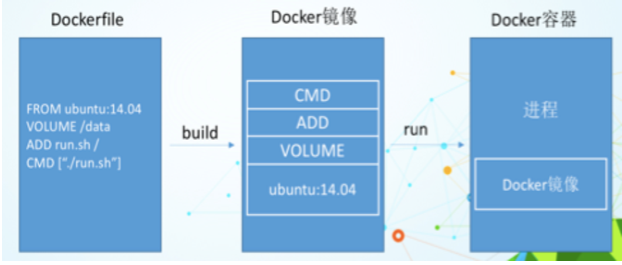
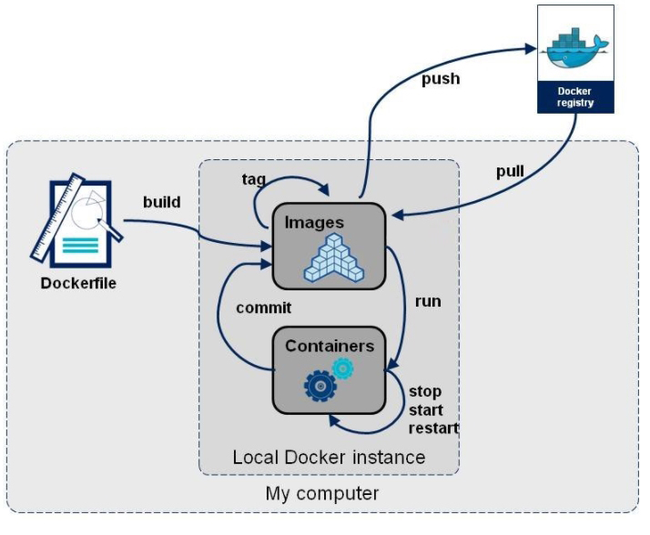

# DockerFile解析
Dockerfile 将在您的容器内定义环境中执行的操作。
## 是什么
  Dockerfile是用来构建Docker镜像的构建文件，是由一系列命令和参数构成的脚本。
### 构建三步骤
1. 编写Dockerfile文件
2. docker build
3. docker run
## DockerFile构建过程解析
### Dockerfile内容基础知识
- 每条保留字指令都必须为大写字母且后面要跟随至少一个参数
- 指令按照从上到下，顺序执行
- `#`表示注释
- 每条指令都会创建一个新的镜像层，并对镜像进行提交
### Docker执行Dockerfile的大致流程
1. docker从基础镜像运行一个容器
2. 执行一条指令并对容器作出修改
3. 执行类似docker commit的操作提交一个新的镜像层
4. docker再基于刚提交的镜像运行一个新容器
5. 执行dockerfile中的下一条指令直到所有指令都执行完成
### 总结
 
从应用软件的角度来看，Dockerfile、Docker镜像与Docker容器分别代表软件的三个不同阶段，
*  Dockerfile是软件的原材料
*  Docker镜像是软件的交付品
*  Docker容器则可以认为是软件的运行态。
Dockerfile面向开发，Docker镜像成为交付标准，Docker容器则涉及部署与运维，三者缺一不可，合力充当Docker体系的基石。

1. Dockerfile，需要定义一个Dockerfile，Dockerfile定义了进程需要的一切东西。Dockerfile涉及的内容包括执行代码或者是文件、环境变量、依赖包、运行时环境、动态链接库、操作系统的发行版、服务进程和内核进程(当应用进程需要和系统服务和内核进程打交道，这时需要考虑如何设计namespace的权限控制)等等;
 
2. Docker镜像，在用Dockerfile定义一个文件之后，docker build时会产生一个Docker镜像，当运行 Docker镜像时，会真正开始提供服务;
 
3. Docker容器，容器是直接提供服务的。
 
## DockerFile体系结构(保留字指令)
|指令|描述|
|:------|:------|
|FROM|基础镜像，当前新镜像是基于哪个镜像的
|MAINTAINER|镜像维护者的姓名和邮箱地址
|RUN|容器构建时需要运行的命令
|EXPOSE|当前容器对外暴露出的端口
|WORKDIR|指定在创建容器后，终端默认登陆的进来工作目录，一个落脚点
|ENV|用来在构建镜像过程中设置环境变量
|ADD|将宿主机目录下的文件拷贝进镜像且ADD命令会自动处理URL和解压tar压缩包
|COPY|类似ADD，拷贝文件和目录到镜像中。 将从构建上下文目录中 <源路径> 的文件/目录复制到新的一层的镜像内的 <目标路径> 位置
|VOLUME|容器数据卷，用于数据保存和持久化工作
|CMD|指定一个容器启动时要运行的命令;Dockerfile 中可以有多个 CMD 指令，但只有最后一个生效，CMD 会被 docker run 之后的参数替换
|ENTRYPOINT |指定一个容器启动时要运行的命令;ENTRYPOINT 的目的和 CMD 一样，都是在指定容器启动程序及参数
|ONBUILD|当构建一个被继承的Dockerfile时运行命令，父镜像在被子继承后父镜像的onbuild被触发
## 总结

