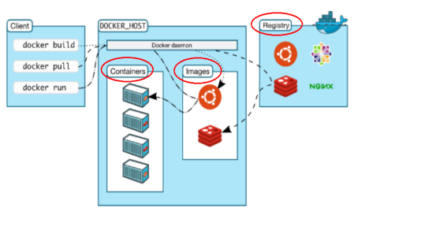

# Docker 基础理论

## Docker的架构图
 
## Docker的基本组成
- 镜像（image）
- 容器（container）
- 仓库（repository）

###  镜像（image）
Docker 镜像（Image）就是一个只读的模板。镜像可以用来创建 Docker 容器，**一个镜像可以创建很多容器**。
 
###   容器（container）
 
Docker 利用容器（Container）独立运行的一个或一组应用。**容器是用镜像创建的运行实例。**
 
它可以被启动、开始、停止、删除。每个容器都是相互隔离的、保证安全的平台。
 
**可以把容器看做是一个简易版的 Linux 环境**（包括root用户权限、进程空间、用户空间和网络空间等）和运行在其中的应用程序。
 
容器的定义和镜像几乎一模一样，也是一堆层的统一视角，唯一区别在于容器的最上面那一层是可读可写的。

###   仓库（repository）
 
仓库（Repository）是**集中存放镜像**文件的场所。

仓库(Repository)和仓库注册服务器（Registry）是有区别的。仓库注册服务器上往往存放着多个仓库，每个仓库中又包含了多个镜像，每个镜像有不同的标签（tag）。
 
仓库分为公开仓库（Public）和私有仓库（Private）两种形式。
> 最大的公开仓库是 Docker Hub(https://hub.docker.com/)，存放了数量庞大的镜像供用户下载。国内的公开仓库包括阿里云 、网易云 等

###   小总结
需要正确的理解仓储/镜像/容器这几个概念:
 
 Docker 本身是一个容器运行载体或称之为管理引擎。我们把应用程序和配置依赖打包好形成一个可交付的运行环境，这个打包好的运行环境就似乎 image镜像文件。只有通过这个镜像文件才能生成 Docker 容器。image 文件可以看作是容器的模板。Docker 根据 image 文件生成容器的实例。同一个 image 文件，可以生成多个同时运行的容器实例。
 
*  image 文件生成的容器实例，本身也是一个文件，称为镜像文件。
 
*  一个容器运行一种服务，当我们需要的时候，就可以通过docker客户端创建一个对应的运行实例，也就是我们的容器
 
* 至于仓储，就是放了一堆镜像的地方，我们可以把镜像发布到仓储中，需要的时候从仓储中拉下来就可以了。
 

## Docker底层原理

### Docker是怎么工作的
Docker是一个Client-Server结构的系统，Docker守护进程运行在主机上， 然后通过Socket连接从客户端访问，守护进程从客户端接受命令并管理运行在主机上的容器。 容器，是一个运行时环境，就是我们前面说到的集装箱。

 
### 为什么Docker比较比VM快
- (1)docker有着比虚拟机更少的抽象层。由亍docker不需要Hypervisor实现硬件资源虚拟化,运行在docker容器上的程序直接使用的都是实际物理机的硬件资源。因此在CPU、内存利用率上docker将会在效率上有明显优势。
 
- (2)docker利用的是宿主机的内核,而不需要Guest OS。因此,当新建一个容器时,docker不需要和虚拟机一样重新加载一个操作系统内核。仍而避免引寻、加载操作系统内核返个比较费时费资源的过程,当新建一个虚拟机时,虚拟机软件需要加载Guest OS,返个新建过程是分钟级别的。而docker由于直接利用宿主机的操作系统,则省略了返个过程,因此新建一个docker容器只需要几秒钟。
 
 
 
 
 
 
