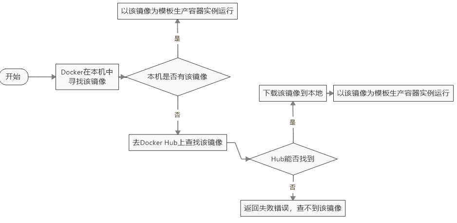

# Docker安装

## 前提条件
目前，CentOS 仅发行版本中的内核支持 Docker。
Docker 运行在 CentOS 7 上，要求系统为64位、系统内核版本为 3.10 以上。
Docker 运行在 CentOS-6.5 或更高的版本的 CentOS 上，要求系统为64位、系统内核版本为 2.6.32-431 或者更高版本。
 
### 查看自己的内核
uname命令用于打印当前系统相关信息（内核版本号、硬件架构、主机名称和操作系统类型等）。
```
uname -r
```
 
### 查看已安装的CentOS版本信息
```
lsb_release -a 

```
> CentOS6.8有，CentOS7无该命令


## CentOS7安装Docker

### 安装步骤
1. 官网安装参考手册
-  https://docs.docker.com/install/linux/docker-ce/centos/
- https://docs.docker-cn.com/engine/installation/linux/docker-ce/centos/#prerequisites
2. 确定你是CentOS7及以上版本
```
cat /etc/redhat-release
```
3. yum安装gcc相关
    - CentOS7能上外网
    - `yum -y install gcc`
    - `yum -y install gcc-c++`
4. 卸载旧版本

  - `yum -y remove docker docker-common docker-selinux docker-engine`
  - 2018.3官网版本
```
   
yum remove docker \
                  docker-client \
                  docker-client-latest \
                  docker-common \
                  docker-latest \
                  docker-latest-logrotate \
                  docker-logrotate \
                  docker-selinux \
                  docker-engine-selinux \
                  docker-engine

  ```
5. 安装需要的软件包

    `yum install -y yum-utils device-mapper-persistent-data lvm2`
6. 设置stable镜像仓库

  - 大坑

    `yum-config-manager --add-repo https://download.docker.com/linux/centos/docker-ce.repo`
  - 推荐

   ` yum-config-manager --add-repo http://mirrors.aliyun.com/docker-ce/linux/centos/docker-ce.repo`
7. 更新yum软件包索引

    `yum makecache fast`
8. 安装DOCKER CE

   ` yum -y install docker-ce`
9. 启动docker

    `systemctl start docker`
10. 测试

    `docker version`
    `docker run hello-world`
11. 配置镜像加速

  - mkdir -p /etc/docker
  - vim  /etc/docker/daemon.json
```
   
 #网易云
{"registry-mirrors": ["http://hub-mirror.c.163.com"] }
 
 
 
 #阿里云
{
  "registry-mirrors": ["https://｛自已的编码｝.mirror.aliyuncs.com"]
}

  ```
  - systemctl daemon-reload
  - systemctl restart docker
12. 卸载
```
  systemctl stop docker 
  yum -y remove docker-ce
  rm -rf /var/lib/docker
```

## 阿里云16.0.4 安装Docker
```
apt install docker.io
```
```
curl -sSL https://get.docker.com/ | sh 
sudo docker run hello-world
```
## 镜像加速

### 阿里云镜像加速
  1. 获得加速器地址连接
    - 登陆阿里云开发者平台
    - 获取加速器地址
  2. 配置本机Docker运行镜像加速器
  3. 重新启动Docker后台服务：service docker restart
  4. Linux 系统下配置完加速器需要检查是否生效
### 网易云加速
  基本同上述阿里云.配置Json串的地方不同了:
 
```
{
 "registry-mirrors": ["http://hub-mirror.c.163.com"]
}
```

## 启动Docker后台容器(测试运行 hello-world)
  - docker run hello-world
  - run干了什么
  


 

 
 
 
 
 
 
 
 
 
 
 
 
