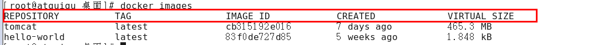
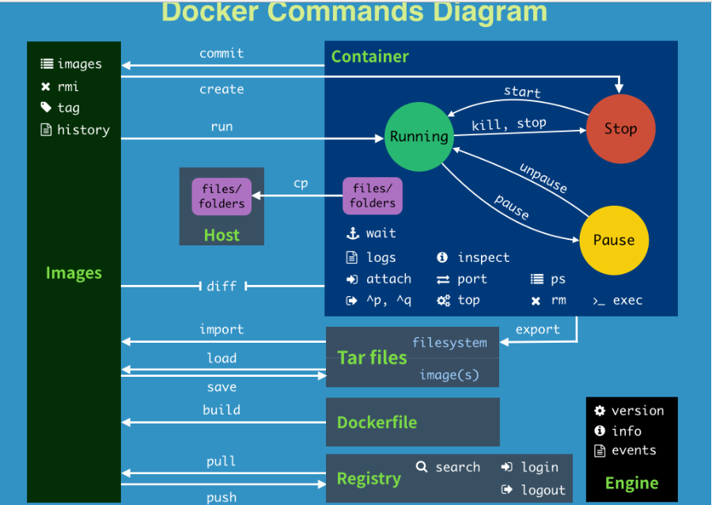

# Docker常用命令
## 帮助命令
  ```
  docker version
  docker info
  docker --help
  ```

## 镜像命令 images
### docker images
1. 列出本地主机上的镜像
2. OPTIONS说明：

      -a :列出本地所有的镜像（含中间映像层）

      -q :只显示镜像ID。

      --digests :显示镜像的摘要信息

      --no-trunc :显示完整的镜像信息

3. 各个选项说明:

  
 
    - REPOSITORY：表示镜像的仓库源

    - TAG：镜像的标签

    - IMAGE ID：镜像ID

    - CREATED：镜像创建时间

    - SIZE：镜像大小

    同一仓库源可以有多个 TAG，代表这个仓库源的不同个版本，我们使`REPOSITORY:TAG` 来定义不同的镜像。

    如果你不指定一个镜像的版本标签，例如你只使用 ubuntu，docker 将默认使用 `ubuntu:latest` 镜像
 
 

### docker search 某个XXX镜像名字

1.  网站
    https://hub.docker.com
2.  命令
    `docker search [OPTIONS] 镜像名字`
    OPTIONS说明：

    -   --no-trunc : 显示完整的镜像描述

    -   -s : 列出收藏数不小于指定值的镜像。
    
    -   --automated : 只列出 automated build类型的镜像；
### docker pull 某个XXX镜像名字
  - 下载镜像
  - docker pull 镜像名字[:TAG]
### docker rmi 某个XXX镜像名字ID
  - 删除镜像
  - 删除单个
    `docker rmi  -f 镜像ID`
  - 删除多个
    `docker rmi -f 镜像名1:TAG 镜像名2:TAG `
  - 删除全部
    `docker rmi -f $(docker images -qa)`
  
## 容器命令

###  首先pull镜像
有镜像才能创建容器，这是根本前提(下载一个CentOS镜像演示)
```
docker pull centos
```
###   新建并启动容器
1. 新建并启动容器
```
docker run [OPTIONS] IMAGE [COMMAND] [ARG...]

 OPTIONS说明（常用）：有些是一个减号，有些是两个减号
 
    --name="容器新名字": 为容器指定一个名称；
    -d: 后台运行容器，并返回容器ID，也即启动守护式容器；
    -i：以交互模式运行容器，通常与 -t 同时使用；
    -t：为容器重新分配一个伪输入终端，通常与 -i 同时使用；
    -P: 随机端口映射；
    -p: 指定端口映射，有以下四种格式
        ip:hostPort:containerPort
        ip::containerPort
        hostPort:containerPort
        containerPort

```
2. 启动交互式容器
使用镜像centos:latest以交互模式启动一个容器,在容器内执行/bin/bash命令。
```

docker run -it centos /bin/bash 
```
###   列出当前所有正在运行的容器
```
docker ps [OPTIONS]

OPTIONS说明（常用）： 
    -a :列出当前所有正在运行的容器+历史上运行过的
    -l :显示最近创建的容器。
    -n：显示最近n个创建的容器。
    -q :静默模式，只显示容器编号。
    --no-trunc :不截断输出。


```
###   退出容器
两种退出方式
-   `exit`
    容器停止退出
-   `ctrl+P+Q`
    容器不停止退出
###   启动容器
```
  docker start 容器ID或者容器名
```
###   重启容器
```
  docker restart 容器ID或者容器名
```
###   停止容器
```
  docker stop 容器ID或者容器名
```
###   强制停止容器
```
  docker kill 容器ID或者容器名
```
###   删除已停止的容器
```
docker rm 容器ID
```
一次性删除多个容器
```
docker rm -f $(docker ps -a -q)
-docker ps -a -q | xargs docker rm

```
1.停止所有的container，这样才能够删除其中的images：
```
docker stop $(docker ps -a -q)
```
如果想要删除所有container的话再加一个指令：
```
docker rm $(docker ps -a -q)
docker rm `docker ps -a -q`
```
2.查看当前有些什么images
```
docker images
```
3.删除images，通过image的id来指定删除谁
```
docker rmi <image id>
```
想要删除untagged images，也就是那些id为<None>的image的话可以用
```
docker rmi $(docker images | grep "^<none>" | awk "{print $3}")
```
要删除全部image的话
```
docker rmi $(docker images -q)
```
###   重要命令
1. 启动守护式容器
```
docker run -d 容器名
```
2. 查看容器日志
```
docker logs -f -t --tail 容器ID
```
参数说明：
  *   -t 是加入时间戳
  *   -f 跟随最新的日志打印
  *   --tail 数字 显示最后多少条

3. 查看容器内运行的进程
```
docker top 容器ID
```
4. 查看容器内部细节
```
docker inspect 容器ID
```
5. 进入正在运行的容器并以命令行交互
```
  docker exec -it 容器ID bashShell
```
重新进入
```
docker attach 容器ID
```
上述两个区别：
- attach 直接进入容器启动命令的终端，不会启动新的进程
- exec 是在容器中打开新的终端，并且可以启动新的进程
```
root@Aws:~# docker exec -it 6960b3524a76 ls -l /tmp
total 4
-rwx------ 1 root root 836 Oct  6 19:15 ks-script-7RxiSx
-rw------- 1 root root   0 Oct  6 19:14 yum.log
root@Aws:~# docker attach 6960b3524a76
[root@6960b3524a76 /]# ls -l /tmp
total 4
-rwx------ 1 root root 836 Oct  6 19:15 ks-script-7RxiSx
-rw------- 1 root root   0 Oct  6 19:14 yum.log
[root@6960b3524a76 /]# 
```
6. 从容器内拷贝文件到主机上
```
docker cp  容器ID:容器内路径 目的主机路径`
```

## 总结：

 

### 命令整理
|命令|描述|说明|
|:------|:------|:------|
|attach|    Attach to a running container|                 # 当前 shell 下 attach 连接指定运行镜像
|build|     Build an image from a Dockerfile |             # 通过 Dockerfile 定制镜像
|commit |   Create a new image from a container changes |  # 提交当前容器为新的镜像
|cp  |      Copy files/folders from the containers filesystem to the host path|   #从容器中拷贝指定文件或者目录到宿主机中
|create|    Create a new container|                        # 创建一个新的容器，同 run，但不启动容器
|diff|      Inspect changes on a container's filesystem|   # 查看 docker 容器变化
|events|    Get real time events from the server |         # 从 docker 服务获取容器实时事件
|exec |     Run a command in an existing container|        # 在已存在的容器上运行命令
|export |   Stream the contents of a container as a tar archive|   # 导出容器的内容流作为一个 tar 归档文件[对应 import ]
|history|   Show the history of an image    |              # 展示一个镜像形成历史
|images|    List images|                                   # 列出系统当前镜像
|import|    Create a new filesystem image from the contents of a tarball| # 从tar包中的内容创建一个新的文件系统映像[对应export]
|info |     Display system-wide information|               # 显示系统相关信息
|inspect |  Return low-level information on a container|   # 查看容器详细信息
|kill |     Kill a running container  |                    # kill 指定 docker 容器
|load |     Load an image from a tar archive|              # 从一个 tar 包中加载一个镜像[对应 save]
|login |    Register or Login to the docker registry server|    # 注册或者登陆一个 docker 源服务器
|logout|    Log out from a Docker registry server |         # 从当前 Docker registry 退出
|logs |     Fetch the logs of a container  |               # 输出当前容器日志信息
|port |     Lookup the public-facing port which is NAT-ed to PRIVATE_PORT|    # 查看映射端口对应的容器内部源端口
|pause |    Pause all processes within a container|        # 暂停容器
|ps |       List containers|                               # 列出容器列表
|pull|      Pull an image or a repository from the docker registry server|   # 从docker镜像源服务器拉取指定镜像或者库镜像
|push|      Push an image or a repository to the docker registry server|    # 推送指定镜像或者库镜像至docker源服务器
|restart|   Restart a running container |                  # 重启运行的容器
|rm|        Remove one or more containers |                # 移除一个或者多个容器
|rmi |      Remove one or more images  |           # 移除一个或多个镜像[无容器使用该镜像才可删除，否则需删除相关容器才可继续或 -f 强制删除]
|run|       Run a command in a new container|              # 创建一个新的容器并运行一个命令
|save |     Save an image to a tar archive |               # 保存一个镜像为一个 tar 包[对应 load]
|search|    Search for an image on the Docker Hub  |       # 在 docker hub 中搜索镜像
|start|     Start a stopped containers |                   # 启动容器
|stop|      Stop a running containers  |                   # 停止容器
|tag |      Tag an image into a repository|                # 给源中镜像打标签
|top |      Lookup the running processes of a container|   # 查看容器中运行的进程信息
|unpause|   Unpause a paused container |                   # 取消暂停容器
|version|   Show the docker version information |          # 查看 docker 版本号
|wait|      Block until a container stops, then print its exit code|   # 截取容器停止时的退出状态值

## 基本 Docker 命令列表
```
docker build -t friendlyname .# 使用此目录的 Dockerfile 创建镜像
docker run -p 4000:80 friendlyname  # 运行端口 4000 到 90 的“友好名称”映射
docker run -d -p 4000:80 friendlyname         # 内容相同，但在分离模式下
docker ps                                 # 查看所有正在运行的容器的列表
docker stop <hash>                     # 平稳地停止指定的容器
docker ps -a           # 查看所有容器的列表，甚至包含未运行的容器
docker kill <hash>                   # 强制关闭指定的容器
docker rm <hash>              # 从此机器中删除指定的容器
docker rm $(docker ps -a -q)           # 从此机器中删除所有容器
docker images -a                               # 显示此机器上的所有镜像
docker rmi <imagename>            # 从此机器中删除指定的镜像
docker rmi $(docker images -q)             # 从此机器中删除所有镜像
docker login             # 使用您的 Docker 凭证登录此 CLI 会话
docker tag <image> username/repository:tag  # 标记 <image> 以上传到镜像库
docker push username/repository:tag            # 将已标记的镜像上传到镜像库
docker run username/repository:tag                   # 运行镜像库中的镜像
```