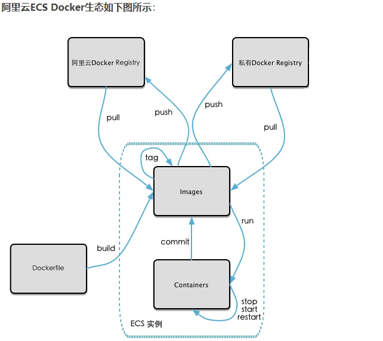
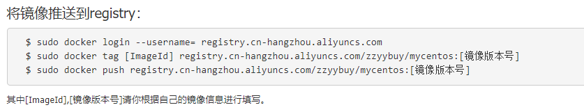

# 镜像发布
以本地镜像发布到阿里云为例

## 本地镜像发布到阿里云流程

## 镜像的生成方法
从容器创建一个新的镜像
```
 docker commit [OPTIONS] 容器ID [REPOSITORY[:TAG]]
 ```
## 将本地镜像推送到阿里云
1. 确定本地镜像素材原型
2. 阿里云开发者平台
*  https://dev.aliyun.com/search.html
3. 创建仓库镜像
    - 命名空间
    - 仓库名称
4. 将镜像推送到registry

5. 公有云查询详情

## 将阿里云上的镜像下载到本地
```
docker pull
```