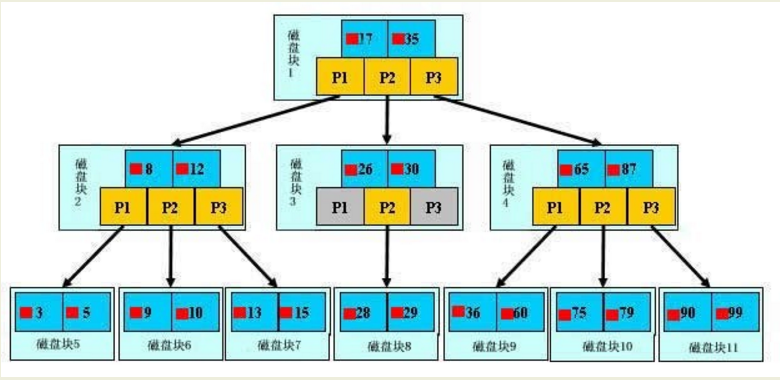

# MySQL 索引
MySQL索引的建立对于MySQL的高效运行是很重要的，索引可以大大提高MySQL的检索速度。

常见的索引类型有：主键索引、唯一索引、普通索引、全文索引、组合索引
## MySQL 索引原理
MySQL支持诸多存储引擎，而各种存储引擎对索引的支持也各不相同，因此MySQL数据库支持多种索引类型，如BTree索引，B+Tree索引，哈希索引，全文索引等。
### BTree索引
BTree是平衡搜索多叉树，设树的度为d（d>1），高度为h，那么BTree要满足以一下条件：

- 每个叶子结点的高度一样，等于h；

- 每个非叶子结点由n-1个key和n个指针point组成，其中d<=n<=2d,key和point相互间隔，结点两端一定是key；

- 叶子结点指针都为null；

- 非叶子结点的key都是[key,data]二元组，其中key表示作为索引的键，data为键值所在行的数据；

BTree的结构如下：



在BTree的机构下，就可以使用二分查找的查找方式，查找复杂度为h*log(n)，一般来说树的高度是很小的，一般为3左右，因此BTree是一个非常高效的查找结构。
### B+Tree索引
B+Tree是BTree的一个变种，设d为树的度数，h为树的高度，B+Tree和BTree的不同主要在于：

- B+Tree中的非叶子结点不存储数据，只存储键值；

- B+Tree的叶子结点没有指针，所有键值都会出现在叶子结点上，且key存储的键值对应的数据的物理地址；


一般来说B+Tree比BTree更适合实现外存的索引结构，因为存储引擎的设计专家巧妙的利用了外存（磁盘）的存储结构，即磁盘的一个扇区是整数倍的page（页），页是存储中的一个单位，通常默认为4K，因此索引结构的节点被设计为一个页的大小，然后利用外存的“预读取”原则，每次读取的时候，把整个节点的数据读取到内存中，然后在内存中查找，已知内存的读取速度是外存读取I/O速度的几百倍，那么提升查找速度的关键就在于尽可能少的磁盘I/O，那么可以知道，每个节点中的key个数越多，那么树的高度越小，需要I/O的次数越少，因此一般来说B+Tree比BTree更快，因为B+Tree的非叶节点中不存储data，就可以存储更多的key。

### 全文索引：
FULLTEXT（全文）索引，仅可用于MyISAM和InnoDB，针对较大的数据，生成全文索引非常的消耗时间和空间。对于文本的大对象，或者较大的CHAR类型的数据，如果使用普通索引，那么匹配文本前几个字符还是可行的，但是想要匹配文本中间的几个单词，那么就要使用LIKE %word%来匹配，这样需要很长的时间来处理，响应时间会大大增加，这种情况，就可使用时FULLTEXT索引了，在生成FULLTEXT索引时，会为文本生成一份单词的清单，在索引时及根据这个单词的清单来索引。

* 对于较大的数据集，把数据添加到一个没有FULLTEXT索引的表，然后添加FULLTEXT索引的速度比把数据添加到一个已经有FULLTEXT索引的表快。
* MySQL自带的全文索引只能用于MyISAM存储引擎，如果是其它数据引擎，那么全文索引不会生效。

* 在MySQL中，全文索引支队英文有用，目前对中文还不支持。

* 在MySQL中，如果检索的字符串太短则无法检索得到预期的结果，检索的字符串长度至少为4字节，此外，如果检索的字符包括停止词，那么停止词会被忽略。


### 哈希索引：
只有memory（内存）存储引擎支持哈希索引，哈希索引用索引列的值计算该值的hashCode，然后在hashCode相应的位置存执该值所在行数据的物理位置，因为使用散列算法，因此访问速度非常快，但是一个值只能对应一个hashCode，而且是散列的分布方式，因此哈希索引不支持范围查找和排序的功能。

## 索引分类
### 普通索引

### 唯一索引
索引列的值必须唯一，但允许有空值。如果是组合索引，则列值的组合必须唯一
### 主键索引
即主索引，根据主键建立索引，不允许重复，不允许空值；
### 全文索引
用大文本对象的列构建的索引
### 组合索引
用多个列组合构建的索引，这多个列中的值不允许有空值

## 索引的基础

索引类似于书籍的目录，要想找到一本数的某个特定主题，需要先查找书的目录，定位对应的页码

存储引擎使用类似的方式进行数据查询，先去索引当中找到对应的值，然后根据匹配的索引找到对应的数据行。

## 创建索引的语法：

首先创建一个表：
```
create table t1 (id int primary key,username varchar(20),password varchar(20));
```
- 创建单个索引的语法：`CREATE INDEX 索引名 on 表名（字段名）`

> 索引名一般是：表名_字段名

- 给id创建索引：`CREATE INDEX t1_id on t1(id);`

- 创建联合索引的语法：CREATE INDEX 索引名 on 表名（字段名1，字段名2）

- 给username和password创建联合索引：CREATE index t1_username_password ON t1(username,password)

> 其中index还可以替换成unique，primary key，分别代表唯一索引和主键索引

- 删除索引：DROP INDEX t1_username_password ON t1

## 索引对性能的影响：

- 大大减少服务器需要扫描的数据量。

- 帮助服务器避免排序和临时表。

- 将随机I/O变顺序I/O。

- 大大提高查询速度。

- 降低写的速度（不良影响）。

- 磁盘占用（不良影响）。

## 索引的使用场景：

- 对于非常小的表，大部分情况下全表扫描效率更高。

- 中到大型表，索引非常有效。

- 特大型的表，建立和使用索引的代价会随之增大，可以使用分区技术来解决。

## 索引的类型：索引很多种类型，是在MySQL的存储引擎实现的。

- 普通索引：最基本的索引，没有任何约束限制。

- 唯一索引：和普通索引类似，但是具有唯一性约束。

- 主键索引：特殊的唯一索引，不允许有空值。

### 索引的区别：
- 一个表只能有一个主键索引，但是可以有多个唯一索引。

- 主键索引一定是唯一索引，唯一索引不是主键索引。

- 主键可以与外键构成参照完整性约束，防止数据不一致。

- 联合索引：将多个列组合在一起创建索引，可以覆盖多个列。（也叫复合索引，组合索引）

- 外键索引：只有InnoDB类型的表才可以使用外键索引，保证数据的一致性、完整性、和实现级联操作（基本不用）。

- 全文索引：MySQL自带的全文索引只能用于MyISAM，并且只能对英文进行全文检索 （基本不用）

## MySQL索引的创建原则

- 最适合创建索引的列是出现在WHERE或ON子句中的列，或连接子句中的列而不是出现在SELECT关键字后的列。

- 索引列的基数越大，数据区分度越高，索引的效果越好。

- 对于字符串进行索引，应该制定一个前缀长度，可以节省大量的索引空间。

- 根据情况创建联合索引，联合索引可以提高查询效率。

- 避免创建过多的索引，索引会额外占用磁盘空间，降低写操作效率。

- 主键尽可能选择较短的数据类型，可以有效减少索引的磁盘占用提高查询效率。

## MySQL索引的注意事项

1. 联合索引遵循前缀原则
```
KEY(a,b,c)WHERE a = 1 AND b = 2 AND c = 3WHERE a = 1 AND b = 2WHERE a = 1
#以上SQL语句可以用到索引WHERE b = 2 AND c = 3WHERE a = 1 AND c = 3#以上SQL语句用不到索引
```
2. LIKE查询，%不能在前
```
WHERE name LIKE "%wang%"
#以上语句用不到索引，可以用外部的ElasticSearch、Lucene等全文搜索引擎替代。
```
3. 列值为空（NULL）时是可以使用索引的，但MySQL难以优化引用了可空列的查询,它会使索引、索引统计和值更加复杂。可空列需要更多的储存空间，还需要在MySQL内部进行特殊处理。

4. 如果MySQL估计使用索引比全表扫描更慢，会放弃使用索引，例如：表中只有100条数据左右。对于SQL语句`WHERE id > 1 AND id < 100`，MySQL会优先考虑全表扫描。

5. 如果关键词or前面的条件中的列有索引，后面的没有，所有列的索引都不会被用到。

6. 列类型是字符串，查询时一定要给值加引号，否则索引失效，例如：列name varchar(16)，存储了字符串"100" 
```
`WHERE name = 100`
# 以上SQL语句能搜到，但无法用到索引。
```
## MySQL索引的原理

MySQL索引是用一种叫做聚簇索引的数据结构实现的，下面我们就来看一下什么是聚簇索引。

聚簇索引是一种数据存储方式，它实际上是在同一个结构中保存了B+树索引和数据行，InnoDB表是按照聚簇索引组织的（类似于Oracle的索引组织表）。

> 注：B+ 树是一种树数据结构，是一个n叉排序树，每个节点通常有多个孩子，一棵B+树包含根节点、内部节点和叶子节点。根节点可能是一个叶子节点，也可能是一个包含两个或两个以上孩子节点的节点。B+ 树通常用于数据库和操作系统的文件系统中。NTFS, ReiserFS, NSS, XFS, JFS, ReFS 和BFS等文件系统都在使用B+树作为元数据索引。B+ 树的特点是能够保持数据稳定有序，其插入与修改拥有较稳定的对数时间复杂度。B+ 树元素自底向上插入。

InnoDB通过主键聚簇数据，如果没有定义主键，会选择一个唯一的非空索引代替，如果没有这样的索引，会隐式定义个主键作为聚簇索引。

下图形象说明了聚簇索引表(InnoDB)和普通的堆组织表(MyISAM)的区别：

- 对于普通的堆组织表来说（右图），表数据和索引是分别存储的，主键索引和二级索引存储上没有任何区别。
- 而对于聚簇索引表来说（左图），表数据是和主键一起存储的，主键索引的叶结点存储行数据，二级索引的叶结点存储行的主键值。

聚簇索引表最大限度地提高了I/O密集型应用的性能，但它也有以下几个限制：

1. 插入速度严重依赖于插入顺序，按照主键的顺序插入是最快的方式，否则将会出现页分裂，严重影响性能。因此，对于InnoDB表，我们一般都会定义一个自增的ID列为主键。

2. 更新主键的代价很高，因为将会导致被更新的行移动。因此，对于InnoDB表，我们一般定义主键为不可更新。

3. 二级索引访问需要两次索引查找，第一次找到主键值，第二次根据主键值找到行数据。

二级索引的叶节点存储的是主键值，而不是行指针，这是为了减少当出现行移动或数据页分裂时二级索引的维护工作，但会让二级索引占用更多的空间。

