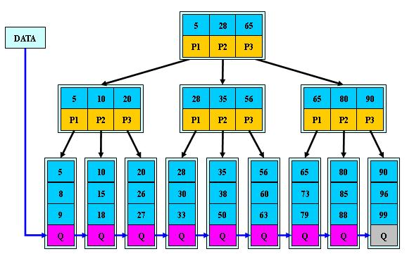

# 索引优化分析

##  索引简介
### 是什么

- MySQL官方对索引的定义为：索引（Index）是帮助MySQL高效获取数据的数据结构。 可以得到索引的本质：索引是数据结构。

- 可以简单理解为“排好序的快速查找数据结构”。

    - 详解(重要)

        在数据之外，数据库系统还维护着满足特定查找算法的数据结构，这些数据结构以某种方式引用（指向）数据，这样就可以在这些数据结构上实现高级查找算法。这种数据结构，就是索引。

        下图就是一种可能的索引方式示例：

        

        左边是数据表，一共有两列七条记录，最左边的是数据记录的物理地址

        为了加快Col2的查找，可以维护一个右边所示的二叉查找树，每个节点分别包含索引键值和一个指向对应数据记录物理地址的指针，这样就可以运用二叉查找在一定的复杂度内获取到相应数据，从而快速的检索出符合条件的记录。

    - 结论

        数据本身之外，数据库还维护着一个满足特定查找算法的数据结构，这些数据结构以某种方式指向数据，这样就可以在这些数据结构的基础上实现高级查找算法，这种数据结构就是索引。
 
一般来说索引本身也很大，不可能全部存储在内存中，因此索引往往以索引文件的形式存储的磁盘上
### 优势
- 类似大学图书馆建书目索引，提高数据检索的效率，降低数据库的IO成本
- 通过索引列对数据进行排序，降低数据排序的成本，降低了CPU的消耗
### 劣势
- 虽然索引大大提高了查询速度，同时却会降低更新表的速度，如对表进行INSERT、UPDATE和DELETE。 因为更新表时，MySQL不仅要保存数据，还要保存一下索引文件每次更新添加了索引列的字段， 都会调整因为更新所带来的键值变化后的索引信息
- 实际上索引也是一张表，该表保存了主键与索引字段，并指向实体表的记录，所以索引列也是要占用空间的
### mysql索引结构
#### BTree索引

**原理图**

 
 
【初始化介绍】 
一颗b树，浅蓝色的块我们称之为一个磁盘块，可以看到每个磁盘块包含几个数据项（深蓝色所示）和指针（黄色所示），
如磁盘块1包含数据项17和35，包含指针P1、P2、P3，
P1表示小于17的磁盘块，P2表示在17和35之间的磁盘块，P3表示大于35的磁盘块。
真实的数据存在于叶子节点即3、5、9、10、13、15、28、29、36、60、75、79、90、99。
非叶子节点只不存储真实的数据，只存储指引搜索方向的数据项，如17、35并不真实存在于数据表中。
 
【查找过程】
如果要查找数据项29，那么首先会把磁盘块1由磁盘加载到内存，此时发生一次IO，在内存中用二分查找确定29在17和35之间，锁定磁盘块1的P2指针，内存时间因为非常短（相比磁盘的IO）可以忽略不计，通过磁盘块1的P2指针的磁盘地址把磁盘块3由磁盘加载到内存，发生第二次IO，29在26和30之间，锁定磁盘块3的P2指针，通过指针加载磁盘块8到内存，发生第三次IO，同时内存中做二分查找找到29，结束查询，总计三次IO。
 
真实的情况是，3层的b+树可以表示上百万的数据，如果上百万的数据查找只需要三次IO，性能提高将是巨大的，如果没有索引，每个数据项都要发生一次IO，那么总共需要百万次的IO，显然成本非常非常高。


#### B+Tree索引

**原理图**

 

**B树和B+树的区别**

- B-树的关键字和记录是放在一起的，叶子节点可以看作外部节点，不包含任何信息；B+树的非叶子节点中只有关键字和指向下一个节点的索引，记录只放在叶子节点中。
- 在B-树中，越靠近根节点的记录查找时间越快，只要找到关键字即可确定记录的存在；而B+树中每个记录的查找时间基本是一样的，都需要从根节点走到叶子节点，而且在叶子节点中还要再比较关键字。从这个角度看B-树的性能好像要比B+树好，而在实际应用中却是B+树的性能要好些。因为B+树的非叶子节点不存放实际的数据，这样每个节点可容纳的元素个数比B-树多，树高比B-树小，这样带来的好处是减少磁盘访问次数。尽管B+树找到一个记录所需的比较次数要比B-树多，但是一次磁盘访问的时间相当于成百上千次内存比较的时间，因此实际中B+树的性能可能还会好些，而且B+树的叶子节点使用指针连接在一起，方便顺序遍历（例如查看一个目录下的所有文件，一个表中的所有记录等），这也是很多数据库和文件系统使用B+树的缘故。 

思考：为什么说B+树比B-树更适合实际应用中操作系统的文件索引和数据库索引？

- B+树的磁盘读写代价更低 

    B+树的内部结点并没有指向关键字具体信息的指针。因此其内部结点相对B 树更小。如果把所有同一内部结点的关键字存放在同一盘块中，那么盘块所能容纳的关键字数量也越多。一次性读入内存中的需要查找的关键字也就越多。相对来说IO读写次数也就降低了。 
-  B+树的查询效率更加稳定

    由于非终结点并不是最终指向文件内容的结点，而只是叶子结点中关键字的索引。所以任何关键字的查找必须走一条从根结点到叶子结点的路。所有关键字查询的路径长度相同，导致每一个数据的查询效率相当。
#### 聚簇索引与非聚簇索引
聚簇索引并不是一种单独的索引类型，而是一种数据存储方式。
术语‘聚簇’表示数据行和相邻的键值聚簇的存储在一起。
 如下图，左侧的索引就是聚簇索引，因为数据行在磁盘的排列和索引排序保持一致。

 
 
**聚簇索引的好处：**

- 按照聚簇索引排列顺序，查询显示一定范围数据的时候，由于数据都是紧密相连，数据库不不用从多个数据块中提取数据，所以节省了大量的io操作。

**聚簇索引的限制：**

- 对于mysql数据库目前只有innodb数据引擎支持聚簇索引，而Myisam并不支持聚簇索引。
- 由于数据物理存储排序方式只能有一种，所以每个Mysql的表只能有一个聚簇索引。一般情况下就是该表的主键。
- 为了充分利用聚簇索引的聚簇的特性，所以innodb表的主键列尽量选用有序的顺序id，而不建议用无序的id，比如uuid这种。
 
 
 

###  mysql索引分类

#### 单值索引
即一个索引只包含单个列，一个表可以有多个单列索引

**语法**

随表一起建索引：
```
CREATE TABLE customer (id INT(10) UNSIGNED  AUTO_INCREMENT ,customer_no VARCHAR(200),customer_name VARCHAR(200),
  PRIMARY KEY(id),
  KEY (customer_name)
);
```  
单独建单值索引：
```
CREATE  INDEX idx_customer_name ON customer(customer_name); 
``` 
删除索引：
```
DROP INDEX idx_customer_name  on customer;
```
#### 唯一索引
索引列的值必须唯一，但允许有空值

**语法**

随表一起建索引：
```
CREATE TABLE customer (id INT(10) UNSIGNED  AUTO_INCREMENT ,customer_no VARCHAR(200),customer_name VARCHAR(200),
  PRIMARY KEY(id),
  KEY (customer_name),
  UNIQUE (customer_no)
);
```  
单独建唯一索引：
```
CREATE UNIQUE INDEX idx_customer_no ON customer(customer_no); 
 ```
删除索引：
```
DROP INDEX idx_customer_no on customer ;
```
#### 主键索引
设定为主键后数据库会自动建立索引，innodb为聚簇索引

**语法**

随表一起建索引：
```
CREATE TABLE customer (id INT(10) UNSIGNED  AUTO_INCREMENT ,customer_no VARCHAR(200),customer_name VARCHAR(200),
  PRIMARY KEY(id) 
);
   
CREATE TABLE customer2 (id INT(10) UNSIGNED   ,customer_no VARCHAR(200),customer_name VARCHAR(200),
  PRIMARY KEY(id) 
);
```
 单独建主键索引：
 ```
ALTER TABLE customer 
 add PRIMARY KEY customer(customer_no);  
``` 
删除建主键索引：
```
ALTER TABLE customer 
 drop PRIMARY KEY ;  
``` 
修改建主键索引：

必须先删除掉(drop)原索引，再新建(add)索引

#### 复合索引
即一个索引包含多个列

**语法**

 随表一起建索引：
 ```
CREATE TABLE customer (id INT(10) UNSIGNED  AUTO_INCREMENT ,customer_no VARCHAR(200),customer_name VARCHAR(200),
  PRIMARY KEY(id),
  KEY (customer_name),
  UNIQUE (customer_name),
  KEY (customer_no,customer_name)
);
``` 
单独建索引：
```
CREATE  INDEX idx_no_name ON customer(customer_no,customer_name); 
``` 
删除索引：
```
DROP INDEX idx_no_name  on customer ;
```
#### 基本语法

创建
```
CREATE  [UNIQUE ]  INDEX [indexName] ON table_name(column)) 
```
删除
```
DROP INDEX [indexName] ON mytable; 
```
查看
```
SHOW INDEX FROM table_name\G
```
#### 使用ALTER命令
   
有四种方式来添加数据表的索引：

- `ALTER TABLE tbl_name ADD PRIMARY KEY (column_list)`: 该语句添加一个主键，这意味着索引值必须是唯一的，且不能为NULL。
 
- `ALTER TABLE tbl_name ADD UNIQUE index_name (column_list)`: 这条语句创建索引的值必须是唯一的（除了NULL外，NULL可能会出现多次）。
 
- `ALTER TABLE tbl_name ADD INDEX index_name (column_list)`: 添加普通索引，索引值可出现多次。
 
- `ALTER TABLE tbl_name ADD FULLTEXT index_name (column_list)`:该语句指定了索引为 FULLTEXT ，用于全文索引。
 

### 哪些情况需要创建索引
- 主键自动建立唯一索引
- 频繁作为查询条件的字段应该创建索引
- 查询中与其它表关联的字段，外键关系建立索引
- 单键/组合索引的选择问题， 组合索引性价比更高
- 查询中排序的字段，排序字段若通过索引去访问将大大提高排序速度
- 查询中统计或者分组字段
### 哪些情况不要创建索引 
- 表记录太少
- 经常增删改的表或者字段
    Why:提高了查询速度，同时却会降低更新表的速度，如对表进行INSERT、UPDATE和DELETE。 因为更新表时，MySQL不仅要保存数据，还要保存一下索引文件
- Where条件里用不到的字段不创建索引
- 过滤性不好的不适合建索引
## 性能分析-Explain

### 是什么(查看执行计划)
使用EXPLAIN关键字可以模拟优化器执行SQL查询语句，从而知道MySQL是 如何处理你的SQL语句的。分析你的查询语句或是表结构的性能瓶颈
> 官网介绍:http://dev.mysql.com/doc/refman/5.5/en/explain-output.html
### 能干嘛
- 表的读取顺序
- 哪些索引可以使用
- 数据读取操作的操作类型
- 哪些索引被实际使用
- 表之间的引用
- 每张表有多少行被物理查询
### 怎么玩
- Explain + SQL语句
- 执行计划包含的信息
```
id|select_type|table|possile_keys|key|key_len|ref|rows|Extra
```
### 各字段解释
#### id
- select查询的序列号,包含一组数字，表示查询中执行select子句或操作表的顺序

- 三种情况

  - id相同，执行顺序由上至下
  - id不同，如果是子查询，id的序号会递增，id值越大优先级越高，越先被执行
  - id相同不同，同时存在

- 关注点

    id号每个号码，表示一趟独立的查询。一个sql 的查询趟数越少越好。
#### select_type
**有哪些**


**查询的类型，主要是用于区别 普通查询、联合查询、子查询等的复杂查询**

- SIMPLE
    简单的 select 查询,查询中不包含子查询或者UNION
- PRIMARY
    查询中若包含任何复杂的子部分，最外层查询则被标记为Primary
- DERIVED
    在FROM列表中包含的子查询被标记为DERIVED(衍生) MySQL会递归执行这些子查询, 把结果放在临时表里。
- SUBQUERY
    在SELECT或WHERE列表中包含了子查询
- DEPENDENT SUBQUERY
    在SELECT或WHERE列表中包含了子查询,子查询基于外层
- UNCACHEABLE SUBQUREY
    
- UNION
    若第二个SELECT出现在UNION之后，则被标记为UNION； 若UNION包含在FROM子句的子查询中,外层SELECT将被标记为：DERIVED
- UNION RESULT
    从UNION表获取结果的SELECT

#### table
      显示这一行的数据是关于哪张表的
#### type
- 访问类型排列 ALL|index|range|ref|eq_ref|const,system|NULL|

    type显示的是访问类型，是较为重要的一个指标，结果值从最好到最坏依次是： 
    ``` 
    system > const > eq_ref > ref > fulltext > ref_or_null > index_merge > unique_subquery > index_subquery > range > index > ALL 
    ``` 
    system>const>eq_ref>ref>range>index>ALL 
    一般来说，得保证查询至少达到range级别，最好能达到ref。

- 显示查询使用了何种类型， 从最好到最差依次是： `system>const>eq_ref>ref>range>index>ALL`
  - system

    表只有一行记录（等于系统表），这是const类型的特列，平时不会出现，这个也可以忽略不计
  - const

    表示通过索引一次就找到了,const用于比较primary key或者unique索引。因为只匹配一行数据，所以很快 如将主键置于where列表中，MySQL就能将该查询转换为一个常量
  - eq_ref

    唯一性索引扫描，对于每个索引键，表中只有一条记录与之匹配。常见于主键或唯一索引扫描
  - ref

    非唯一性索引扫描，返回匹配某个单独值的所有行. 本质上也是一种索引访问，它返回所有匹配某个单独值的行，然而， 它可能会找到多个符合条件的行，所以他应该属于查找和扫描的混合体
  - range

    只检索给定范围的行,使用一个索引来选择行。key 列显示使用了哪个索引 一般就是在你的where语句中出现了between、<、>、in等的查询 这种范围扫描索引扫描比全表扫描要好，因为它只需要开始于索引的某一点，而结束语另一点，不用扫描全部索引。
  - index

    出现index是sql使用了索引但是没用通过索引进行过滤，一般是使用了覆盖索引或者是利用索引进行了排序分组
  - all

    Full Table Scan，将遍历全表以找到匹配的行
  - index_merge

    在查询过程中需要多个索引组合使用，通常出现在有 or 的关键字的sql中
  - ref_or_null

    对于某个字段既需要关联条件，也需要null值得情况下。查询优化器会选择用ref_or_null连接查询。
  - index_subquery

    利用索引来关联子查询，不再全表扫描。
  - unique_subquery 

    该联接类型类似于index_subquery。 子查询中的唯一索引
  > 备注：一般来说，得保证查询至少达到range级别，最好能达到ref。
#### possible_keys
显示可能应用在这张表中的索引，一个或多个。 

查询涉及到的字段上若存在索引，则该索引将被列出，但不一定被查询实际使用
#### key
实际使用的索引。如果为NULL，则没有使用索引

查询中若使用了覆盖索引，则该索引和查询的select字段重叠
#### key_len
表示索引中使用的字节数，可通过该列计算查询中使用的索引的长度。 

key_len字段能够帮你检查是否充分的利用上了索引
####  ref
显示索引的哪一列被使用了，如果可能的话，是一个常数。哪些列或常量被用于查找索引列上的值
#### rows
- rows列显示MySQL认为它执行查询时必须检查的行数。
- 越少越好
#### Extra 包含不适合在其他列中显示但十分重要的额外信息
- Using filesort 

    - 说明mysql会对数据使用一个外部的索引排序，而不是按照表内的索引顺序进行读取。 
    - MySQL中无法利用索引完成的排序操作称为“文件排序”
- Using temporary 

    - 使了用临时表保存中间结果,MySQL在对查询结果排序时使用临时表。
    - 常见于排序 order by 和分组查询 group by。
- USING index
  - 表示相应的select操作中使用了覆盖索引(Covering Index)，避免访问了表的数据行，效率不错！ 如果同时出现using where，表明索引被用来执行索引键值的查找; 如果没有同时出现using where，表明索引只是用来读取数据而非利用索引执行查找。
  - 利用索引进行了排序或分组
- Using where

     - 表明使用了where过滤
- using join buffer

     - 使用了连接缓存：
- impossible where

    -  where子句的值总是false，不能用来获取任何元组
- select tables optimized away

    - 在没有GROUPBY子句的情况下，基于索引优化MIN/MAX操作或者 对于MyISAM存储引擎优化COUNT(*)操作，不必等到执行阶段再进行计算， 查询执行计划生成的阶段即完成优化。
## 查询优化

### 单表使用索引及常见索引失效

####  案例(索引失效)

- 全值匹配我最爱

      建立索引

- 最佳左前缀法则

      如果索引了多列，要遵守最左前缀法则。指的是查询从索引的最左前列开始并且不跳过索引中的列。
- 不在索引列上做任何操作（计算、函数、(自动or手动)类型转换），会导致索引失效而转向全表扫描
- 存储引擎不能使用索引中范围条件右边的列
- mysql 在使用不等于(!= 或者<>)的时候无法使用索引会导致全表扫描
- is not null 也无法使用索引,但是is null是可以使用索引的
- like以通配符开头('%abc...')mysql索引失效会变成全表扫描的操作
- 字符串不加单引号索引失效
- 小总结

    假设index(a,b,c)
    |Where语句|	索引是否被使用|
    |------|------|
    |where a = 3|	Y,使用到a
    |where a = 3 and b = 5|	Y,使用到a，b
    |where a = 3 and b = 5 and c = 4|	Y,使用到a,b,c
    |where b = 3 或者 where b = 3 and c = 4  或者 where c = 4|	N
    |where a = 3 and c = 5|	使用到a， 但是c不可以，b中间断了
    |where a = 3 and b > 4 and c = 5|	使用到a和b， c不能用在范围之后，b断了
    |where a is null and b is not null|  	  is null 支持索引 但是is not null 不支持,所以 a 可以使用索引,但是  b不可以使用
    |where a <> 3 |  	 不能使用索引
    |where   abs(a) =3|	不能使用 索引
    |where a = 3 and b like 'kk%' and c = 4|	Y,使用到a,b,c
    |where a = 3 and b like '%kk' and c = 4|	Y,只用到a
    |where a = 3 and b like '%kk%' and c = 4|	Y,只用到a
    |where a = 3 and b like 'k%kk%' and c = 4|	Y,使用到a,b,c
 
####  一般性建议
- 对于单键索引，尽量选择针对当前query过滤性更好的索引
- 在选择组合索引的时候，当前Query中过滤性最好的字段在索引字段顺序中，位置越靠前越好。
- 在选择组合索引的时候，尽量选择可以能够包含当前query中的where字句中更多字段的索引
- 在选择组合索引的时候，如果某个字段可能出现范围查询时，尽量把这个字段放在索引次序的最后面
- 书写sql语句时，尽量避免造成索引失效的情况
### 关联查询优化
- 1、保证被驱动表的join字段已经被索引
- 2、left join 时，选择小表作为驱动表，大表作为被驱动表。
- 3、inner join 时，mysql会自己帮你把小结果集的表选为驱动表。
- 4、子查询尽量不要放在被驱动表，有可能使用不到索引。
- 5、能够直接多表关联的尽量直接关联，不用子查询。
### 子查询优化
- 尽量不要使用not in  或者 not exists
- 用left outer join  on  xxx is null 替代
### 排序分组优化
#### case
- 无过滤 不索引
- 顺序错，必排序
- 方向反 必排序
#### 索引的选择
- 索引的选择
        - 当范围条件和group by 或者 order by  的字段出现二选一时 ，优先观察条件字段的过滤数量，如果过滤的数据足够多，而需要排序的数据并不多时，优先把索引放在范围字段上。反之，亦然。
- 如果不在索引列上，filesort有两种算法： mysql就要启动双路排序和单路排序
  - 双路排序
        - MySQL 4.1之前是使用双路排序,字面意思就是两次扫描磁盘，最终得到数据， 读取行指针和orderby列，对他们进行排序，然后扫描已经排序好的列表，按照列表中的值重新从列表中读取对应的数据输出
        - 从磁盘取排序字段，在buffer进行排序，再从磁盘取其他字段。
  - 取一批数据，要对磁盘进行了两次扫描，众所周知，I\O是很耗时的，所以在mysql4.1之后，出现了第二种改进的算法，就是单路排序。
  - 单路排序
        - 从磁盘读取查询需要的所有列，按照order by列在buffer对它们进行排序，然后扫描排序后的列表进行输出， 它的效率更快一些，避免了第二次读取数据。并且把随机IO变成了顺序IO,但是它会使用更多的空间， 因为它把每一行都保存在内存中了。
  - 结论及引申出的问题

    - 由于单路是后出的，总体而言好过双路
    - 但是用单路有问题

            在sort_buffer中，方法B比方法A要多占用很多空间，因为方法B是把所有字段都取出, 所以有可能取出的数据的总大小超出了sort_buffer的容量，导致每次只能取sort_buffer容量大小的数据，进行排序（创建tmp文件，多路合并），排完再取取sort_buffer容量大小，再排……从而多次I/O。

            本来想省一次I/O操作，反而导致了大量的I/O操作，反而得不偿失。
  - 优化策略
    - 增大sort_buffer_size参数的设置
    - 增大max_length_for_sort_data参数的设置
    - 减少select 后面的查询的字段。
    - Why
         
        提高Order By的速度
        
        1. Order by时select * 是一个大忌只Query需要的字段， 这点非常重要。在这里的影响是：
        1.1 当Query的字段大小总和小于max_length_for_sort_data 而且排序字段不是 TEXT|BLOB 类型时，会用改进后的算法——单路排序， 否则用老算法——多路排序。
        1.2 两种算法的数据都有可能超出sort_buffer的容量，超出之后，会创建tmp文件进行合并排序，导致多次I/O，但是用单路排序算法的风险会更大一些,所以要提高sort_buffer_size。
        
        2. 尝试提高 sort_buffer_size
        不管用哪种算法，提高这个参数都会提高效率，当然，要根据系统的能力去提高，因为这个参数是针对每个进程的  1M-8M之间调整
        
        3. 尝试提高 max_length_for_sort_data
        提高这个参数， 会增加用改进算法的概率。但是如果设的太高，数据总容量超出sort_buffer_size的概率就增大，明显症状是高的磁盘I/O活动和低的处理器使用率.                  1024-8192之间调整
 
#### GROUP BY关键字优化
group by 使用索引的原则几乎跟order by一致 ，唯一区别是groupby 即使没有过滤条件用到索引，也可以直接使用索引。

### 最后使用索引的手段：覆盖索引
什么是覆盖索引？

简单说就是，select 到 from 之间查询的列 <=使用的索引列+主键