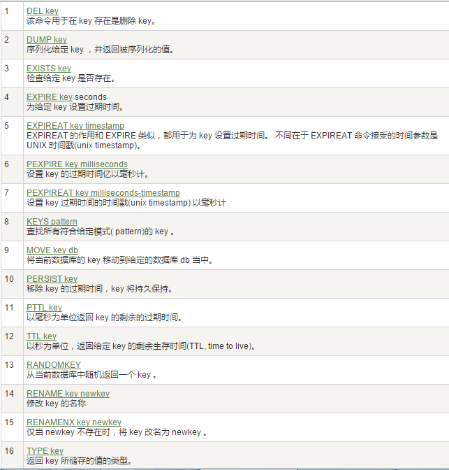
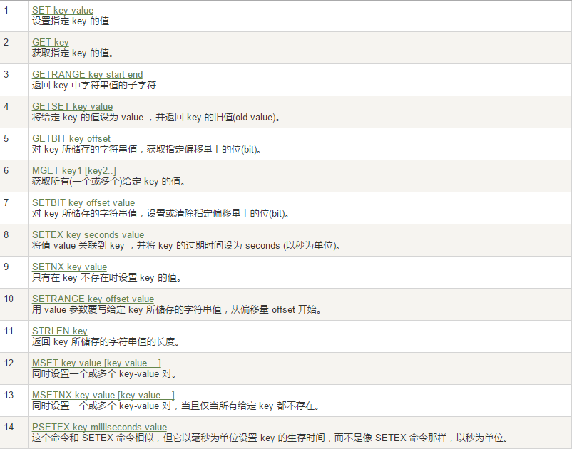
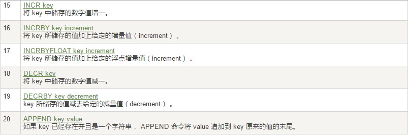
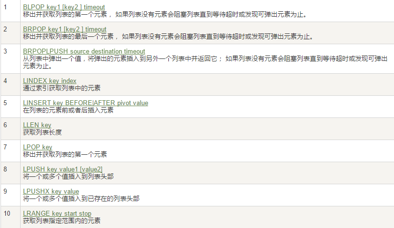
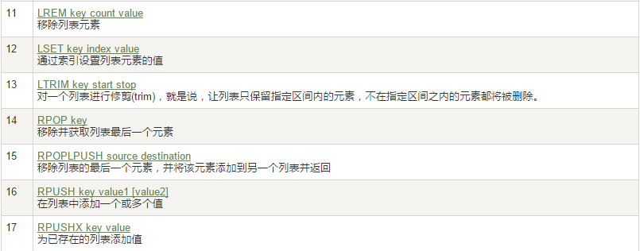
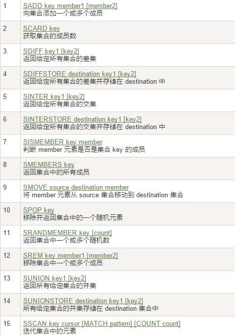
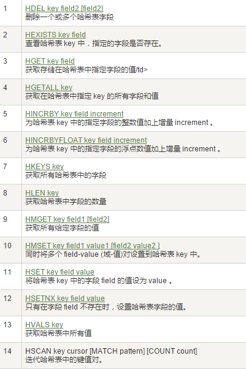
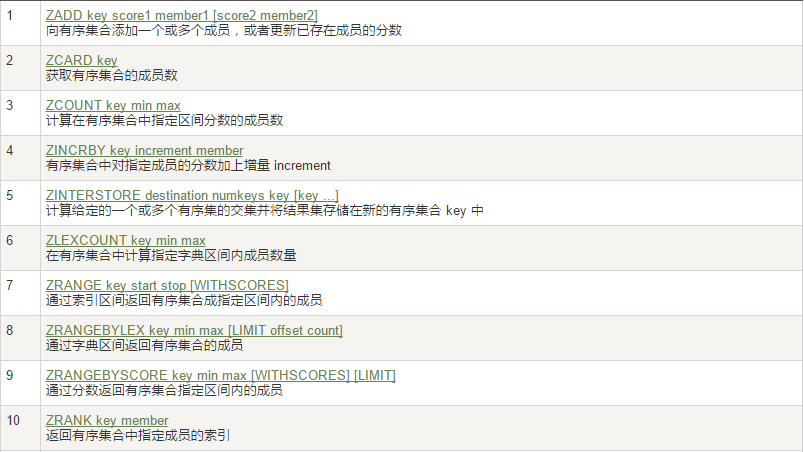
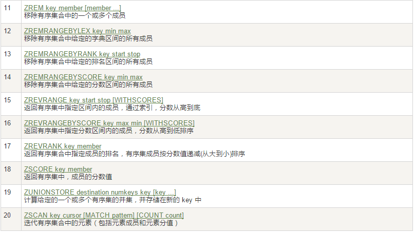

# Redis数据类型
## Redis的五大数据类型
- String（字符串）

    - string是redis最基本的类型，你可以理解成与Memcached一模一样的类型，一个key对应一个value。
    
    - string类型是二进制安全的。意思是redis的string可以包含任何数据。比如jpg图片或者序列化的对象 。
    
    - string类型是Redis最基本的数据类型，一个redis中字符串value最多可以是512M

- Hash（哈希，类似java里的Map）
    - Redis hash 是一个键值对集合。
    - Redis hash是一个string类型的field和value的映射表，hash特别适合用于存储对象。
    - 类似Java里面的Map<String,Object>
- List（列表）
    - Redis 列表是简单的字符串列表，按照插入顺序排序。你可以添加一个元素导列表的头部（左边）或者尾部（右边）。
    - 它的底层实际是个链表
- Set（集合）
    - Redis的Set是string类型的无序集合。它是通过HashTable实现实现的，
- Zset(sorted set：有序集合)
    - Redis zset 和 set 一样也是string类型元素的集合,且不允许重复的成员。
    - 不同的是每个元素都会关联一个double类型的分数。
    - redis正是通过分数来为集合中的成员进行从小到大的排序。zset的成员是唯一的,但分数(score)却可以重复。

## Redis 键(key)

### 常用方法
 
### 案例
- keys *
- exists key的名字，判断某个key是否存在
- move key db   --->当前库就没有了，被移除了
- expire key 秒钟：为给定的key设置过期时间
- ttl key 查看还有多少秒过期，-1表示永不过期，-2表示已过期
- type key 查看你的key是什么类型
##  Redis字符串(String)

### 常用方法

> 单值单value
### 案例
- set/get/del/append/strlen
- Incr/decr/incrby/decrby,一定要是数字才能进行加减
- getrange/setrange
 
    - getrange:获取指定区间范围内的值，类似between......and的关系
        > 从零到负一表示全部 
    - setrange设置指定区间范围内的值，格式是setrange key值 具体值

- setex(set with expire)键秒值/setnx(set if not exist)
    - setex:设置带过期时间的key，动态设置。
    - setex 键 秒值 真实值
    - setnx:只有在 key 不存在时设置 key 的值。
- mset/mget/msetnx
  
    - mset:同时设置一个或多个 key-value 对。 
    - mget:获取所有(一个或多个)给定 key 的值。
    - msetnx:同时设置一个或多个 key-value 对，当且仅当所有给定 key 都不存在。

- getset(先get再set)
    - getset:将给定 key 的值设为 value ，并返回 key 的旧值(old value)。
    - 简单一句话，先get然后立即set
 
 
 

##  Redis列表(List)
### 常用方法

> 单值多value
### 案例

- lpush/rpush/lrange
- lpop/rpop
- lindex，按照索引下标获得元素(从上到下)
    - 通过索引获取列表中的元素 lindex key index
- llen
    - 从left往right删除2个值等于v1的元素，返回的值为实际删除的数量
    -  LREM list3 0 值，表示删除全部给定的值。零个就是全部值
- lrem key 删N个value

- ltrim key 开始index 结束index，截取指定范围的值后再赋值给key
    - ltrim：截取指定索引区间的元素，格式是ltrim list的key 起始索引 结束索引 
- rpoplpush 源列表 目的列表
    - 移除列表的最后一个元素，并将该元素添加到另一个列表并返回
- lset key index value
- linsert key  before/after 值1 值2
    - 在list某个已有值的前后再添加具体值
- 性能总结
    - 它是一个字符串链表，left、right都可以插入添加；
    - 如果键不存在，创建新的链表；
    - 如果键已存在，新增内容；
    - 如果值全移除，对应的键也就消失了。
    - 链表的操作无论是头和尾效率都极高，但假如是对中间元素进行操作，效率就很惨淡了。

##  Redis集合(Set)
### 常用方法

> 单值多value
### 案例
- sadd/smembers/sismember
- scard，获取集合里面的元素个数
- srem key value 删除集合中元素
- srandmember key 某个整数(随机出几个数)
   
    *  从set集合里面随机取出2个
    *  如果超过最大数量就全部取出，
    *  如果写的值是负数，比如-3 ，表示需要取出3个，但是可能会有重复值。
- spop key 随机出栈
- smove key1 key2 在key1里某个值      作用是将key1里的某个值赋给key2
- 数学集合类
    - 差集：sdiff
        * 在第一个set里面而不在后面任何一个set里面的项
    - 交集：sinter
    - 并集：sunion
       
##  Redis哈希(Hash)

### 常用方法

> KV模式不变，但V是一个键值对
### 案例

- hset/hget/hmset/hmget/hgetall/hdel
- hlen
- hexists key 在key里面的某个值的key
- hkeys/hvals
- hincrby/hincrbyfloat
- hsetnx

##  Redis有序集合Zset(sorted set)
> 在set基础上，加一个score值。

> 之前set是k1 v1 v2 v3，

> 现在zset是k1 score1 v1 score2 v2
### 常用方法

### 案例

- zadd/zrange
    - Withscores
- zrangebyscore key 开始score 结束score
- zrem key 某score下对应的value值，作用是删除元素
    - 删除元素，格式是zrem zset的key 项的值，项的值可以是多个
    - zrem key score某个对应值，可以是多个值
-  zcard/zcount key score区间/zrank key values值，作用是获得下标值/zscore key 对应值,获得分数
    - zcard ：获取集合中元素个数 
    - zcount ：获取分数区间内元素个数，zcount key 开始分数区间 结束分数区间
    - zrank： 获取value在zset中的下标位置
    - zscore：按照值获得对应的分数
- zrevrank key values值，作用是逆序获得下标值
- zrevrange
- zrevrangebyscore  key 结束score 开始score
    - zrevrangebyscore zset1 90 60 withscores    分数是反着来的