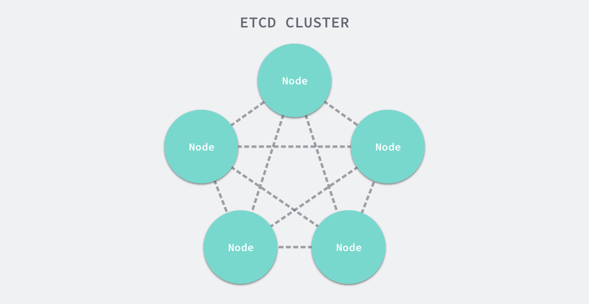
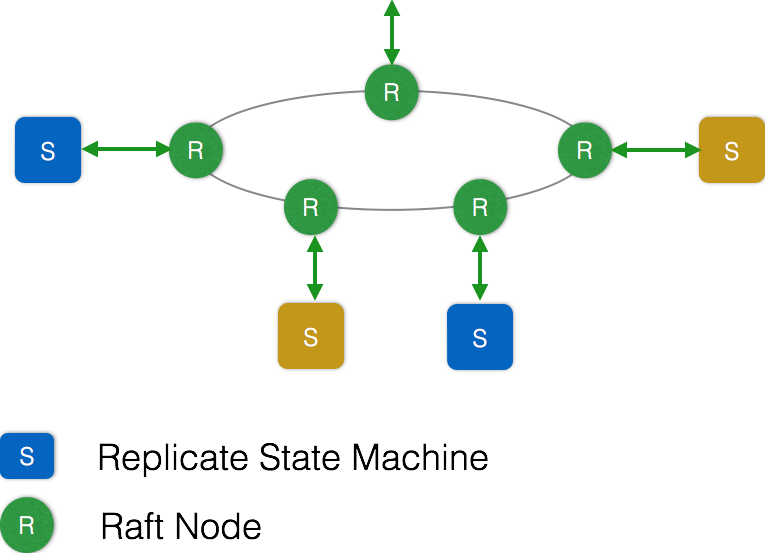
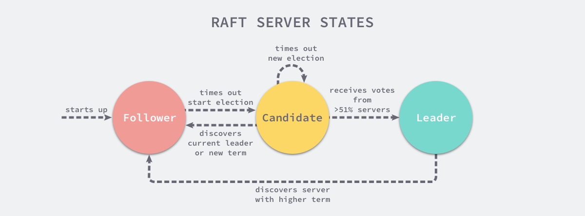
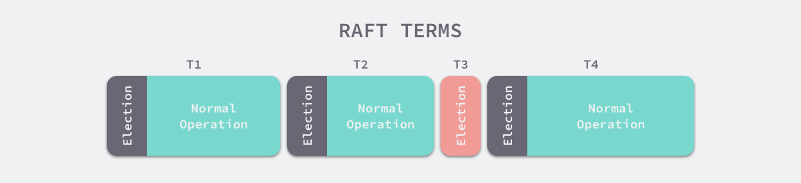
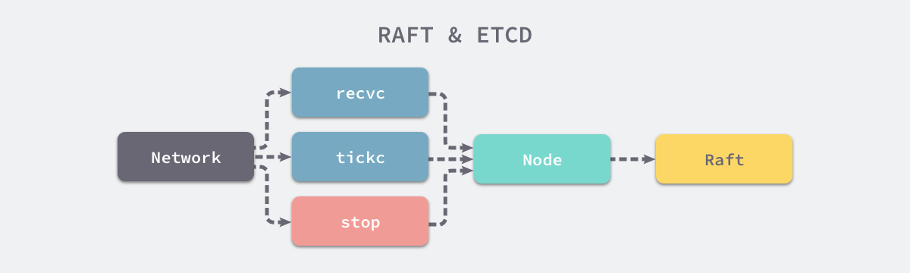
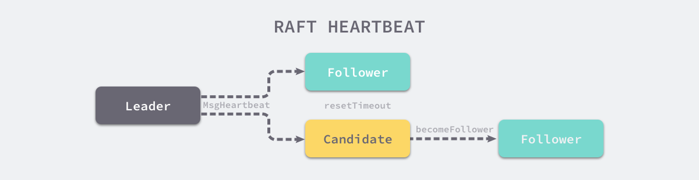
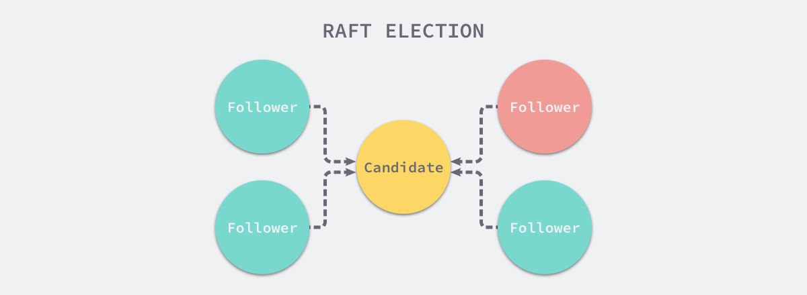
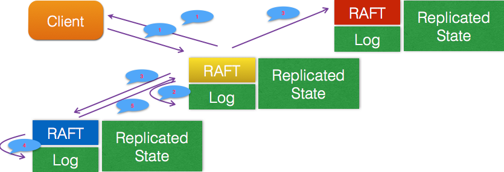

# etcd 中的raft协议
etcd 的官方将它定位成一个可信赖的分布式键值存储服务，它能够为整个分布式集群存储一些关键数据，协助分布式集群的正常运转。

etcd 和 Zookeeper 在定义上的不同：
- etcd is a distributed reliable key-value store for the most critical data of a distributed system…
- ZooKeeper is a centralized service for maintaining configuration information, naming, providing distributed synchronization, and providing group services.

其中前者是一个用于存储关键数据的键值存储，后者是一个用于管理配置等信息的中心化服务。

etcd 的使用其实非常简单，它对外提供了 gRPC 接口，我们可以通过 Protobuf 和 gRPC 直接对 etcd 中存储的数据进行管理，也可以使用官方提供的 etcdctl 操作存储的数据。
```
service KV {
  rpc Range(RangeRequest) returns (RangeResponse) {
      option (google.api.http) = {
        post: "/v3beta/kv/range"
        body: "*"
    };
  }

  rpc Put(PutRequest) returns (PutResponse) {
      option (google.api.http) = {
        post: "/v3beta/kv/put"
        body: "*"
    };
  }
}
```
# Raft

在每一个分布式系统中，etcd 往往都扮演了非常重要的地位，由于很多服务配置发现以及配置的信息都存储在 etcd 中，所以整个集群可用性的上限往往就是 etcd 的可用性，而使用 3 ~ 5 个 etcd 节点构成高可用的集群往往都是常规操作。




正是因为 etcd 在使用的过程中会启动多个节点，如何处理几个节点之间的分布式一致性就是一个比较有挑战的问题了。解决多个节点数据一致性的方案其实就是共识算法，etcd使用Raft协议来维护集群内各个节点状态的一致性。



如图所示，每个ETCD节点都维护了一个状态机，并且，任意时刻至多存在一个有效的主节点。主节点处理所有来自客户端写操作，通过Raft协议保证写操作对状态机的改动会可靠的同步到其他节点。

ETCD工作原理核心部分在于Raft协议。主要分为三个部分：选主，日志复制，安全性。这一节我们将详细介绍 Raft 以及 etcd 中 Raft 的一些实现细节。

简单说，etcd集群是一个分布式系统，由多个节点相互通信构成整体对外服务，每个节点都存储了完整的数据，并且通过Raft协议保证每个节点维护的数据是一致的。

## Raft介绍
Raft协议是用于维护一组服务节点数据一致性的协议。这一组服务节点构成一个集群，并且有一个主节点来对外提供服务。Raft 从一开始就被设计成一个易于理解和实现的共识算法，它在容错和性能上与 Paxos 协议比较类似，区别在于它将分布式一致性的问题分解成了几个子问题，然后一一进行解决。

每一个 Raft 集群中都包含多个服务器，在任意时刻，每一台服务器只可能处于 Leader、Follower 以及 Candidate 三种状态；在处于正常的状态时，集群中只会存在一个 Leader，其余的服务器都是 Follower。




>上述图片修改自 [In Search of an Understandable Consensus Algorithm](https://raft.github.io/raft.pdf) 一文 5.1 小结中图四。

所有的 Follower 节点都是被动的，它们不会主动发出任何的请求，只会响应 Leader 和 Candidate 发出的请求，对于每一个用户的可变操作，都会被路由给 Leader 节点进行处理，除了 Leader 和 Follower 节点之外，Candidate 节点其实只是集群运行过程中的一个临时状态。

Raft 集群中的时间也被切分成了不同的几个任期（Term），每一个任期都会由 Leader 的选举开始，选举结束后就会进入正常操作的阶段，直到 Leader 节点出现问题才会开始新一轮的选择。




每一个服务器都会存储当前集群的最新任期，它就像是一个单调递增的逻辑时钟，能够同步各个节点之间的状态，当前节点持有的任期会随着每一个请求被传递到其他的节点上。

Raft 协议在每一个任期的开始时都会从一个集群中选出一个节点作为集群的 Leader 节点，这个节点会负责集群中的日志的复制以及管理工作。


我们将 Raft 协议分成三个子问题：Leader 选举、日志复制以及安全性，文章会以 etcd 为例介绍 Raft 协议是如何解决这三个子问题的。

## Leader 选举
选举特点如下：

- 当集群初始化时候，每个节点都是Follower角色；

- 集群中存在至多1个有效的主节点，通过心跳与其他节点同步数据；

- 当Follower在一定时间内没有收到来自主节点的心跳，会将自己角色改变为Candidate，并发起一次选主投票；当收到包括自己在内超过半数节点赞成后，选举成功；当收到票数不足半数选举失败，或者选举超时。若本轮未选出主节点，将进行下一轮选举（出现这种情况，是由于多个节点同时选举，所有节点均为获得过半选票）。

- Candidate节点收到来自主节点的信息后，会立即终止选举过程，进入Follower角色。

- 为了避免陷入选主失败循环，每个节点未收到心跳发起选举的时间是一定范围内的随机值，这样能够避免2个节点同时发起选主。

### 初始化
使用 Raft 协议的 etcd 集群在启动节点时，会遵循 Raft 协议的规则，所有节点一开始都被初始化为 Follower 状态，新加入的节点会在 NewNode 中做一些配置的初始化，包括用于接收各种信息的 Channel：
```
// https://sourcegraph.com/github.com/etcd-io/etcd@1cab49e/-/blob/raft/node.go#L190-225
func StartNode(c *Config, peers []Peer) Node {
    r := newRaft(c)
    r.becomeFollower(1, None)
    r.raftLog.committed = r.raftLog.lastIndex()
    for _, peer := range peers {
        r.addNode(peer.ID)
    }

    n := newNode()
    go n.run(r)
    return &n
}
```
在做完这些初始化的节点和 Raft 配置的事情之后，就会进入一个由 for 和 select 组成的超大型循环，这个循环会从 Channel 中获取待处理的事件：
```
// https://sourcegraph.com/github.com/etcd-io/etcd@1cab49e/-/blob/raft/node.go#L291-423
func (n *node) run(r *raft) {
    // ...
    lead := None
    // ...
    for {
        // ...
        if lead != r.lead {
            lead = r.lead
        }
        // ...
        select {
        case m := <-n.recvc:
            r.Step(m)
        case <-n.tickc:
            r.tick()
        // ...
        case <-n.stop:
            close(n.done)
            return

        }
    }
}
```
这段代码是简化了的，感兴趣可以看看源码。整个循环内中只需要关心三个 Channel 中的消息，也就是用于接受其他节点消息的 recvc、用于触发定时任务的 tickc 以及用于暂停当前节点的 stop。



除了 stop Channel 中接收的消息之外，recvc 和 tickc 两个 Channel 中接收到事件时都会交给当前节点持有 Raft 结构体处理。

### 定时器与心跳
当节点从任意状态（包括启动）调用 becomeFollower 时，都会将节点的定时器设置为 tickElection：
```
// https://sourcegraph.com/github.com/etcd-io/etcd@1cab49e/-/blob/raft/raft.go#L636-643
func (r *raft) tickElection() {
    r.electionElapsed++

    if r.promotable() && r.pastElectionTimeout() {
        r.electionElapsed = 0
        r.Step(pb.Message{From: r.id, Type: pb.MsgHup})
    }
}
```
如果当前节点可以成为 Leader 并且上一次收到 Leader 节点的消息或者心跳已经超过了等待的时间，当前节点就会发送 MsgHup 消息尝试开始新的选举。

但是如果 Leader 节点正常运行，就能够同样通过它的定时器 tickHeartbeat 向所有的 Follower 节点广播心跳请求，也就是 MsgBeat 类型的 RPC 消息：
```
func (r *raft) tickHeartbeat() {
    r.heartbeatElapsed++
    r.electionElapsed++

    if r.heartbeatElapsed >= r.heartbeatTimeout {
        r.heartbeatElapsed = 0
        r.Step(pb.Message{From: r.id, Type: pb.MsgBeat})
    }
}
```
上述代码段 Leader 节点中调用的 Step 函数，最终会调用 stepLeader 方法，该方法会根据消息的类型进行不同的处理：
```
// https://sourcegraph.com/github.com/etcd-io/etcd@1cab49e/-/blob/raft/raft.go#L931-1142
func stepLeader(r *raft, m pb.Message) error {
    switch m.Type {
    case pb.MsgBeat:
        r.bcastHeartbeat()
        return nil
    // ...
    }

    //...
}
```
bcastHeartbeat 方法最终会向所有的 Follower 节点发送 MsgHeartbeat 类型的消息，通知它们目前 Leader 的存活状态，重置所有 Follower 持有的超时计时器。
```
// https://sourcegraph.com/github.com/etcd-io/etcd@1cab49e/-/blob/raft/raft.go#L518-534
func (r *raft) sendHeartbeat(to uint64, ctx []byte) {
    commit := min(r.getProgress(to).Match, r.raftLog.committed)
    m := pb.Message{
        To:      to,
        Type:    pb.MsgHeartbeat,
        Commit:  commit,
        Context: ctx,
    }

    r.send(m)
}
```
作为集群中的 Follower，它们会在 stepFollower 方法中处理接收到的全部消息，包括 Leader 节点发送的心跳 RPC 消息：
```
// https://sourcegraph.com/github.com/etcd-io/etcd@1cab49e/-/blob/raft/raft.go#L1191-1247
func stepFollower(r *raft, m pb.Message) error {
    switch m.Type {
    case pb.MsgHeartbeat:
        r.electionElapsed = 0
        r.lead = m.From
        r.handleHeartbeat(m)
    // ...
    }
    return nil
}
```
当 Follower 接受到了来自 Leader 的 RPC 消息 MsgHeartbeat 时，会将当前节点的选举超时时间重置并通过 handleHeartbeat 向 Leader 节点发出响应 —— 通知 Leader 当前节点能够正常运行。

而 Candidate 节点对于 MsgHeartBeat 消息的处理会稍有不同，它会先执行 becomeFollower 设置当前节点和 Raft 协议的配置：
```
// https://sourcegraph.com/github.com/etcd-io/etcd@1cab49e/-/blob/raft/raft.go#L1146-1189
func stepCandidate(r *raft, m pb.Message) error {
  // ...
    switch m.Type {
    case pb.MsgHeartbeat:
        r.becomeFollower(m.Term, m.From) // always m.Term == r.Term
        r.handleHeartbeat(m)
    }
  // ...
    return nil
}
```
Follower 与 Candidate 会根据节点类型的不同做出不同的响应，两者收到心跳请求时都会重置节点的选举超时时间，不过后者会将节点的状态直接转变成 Follower：



当 Leader 节点收到心跳的响应时就会将对应节点的状态设置为 Active，如果 Follower 节点在一段时间内没有收到来自 Leader 节点的消息就会尝试发起竞选。
```
// https://sourcegraph.com/github.com/etcd-io/etcd@1cab49e/-/blob/raft/raft.go#L636-643
func (r *raft) tickElection() {
    r.electionElapsed++

    if r.promotable() && r.pastElectionTimeout() {
        r.electionElapsed = 0
        r.Step(pb.Message{From: r.id, Type: pb.MsgHup})
    }
}
```
到了这里，心跳机制就起到了作用开始发送 MsgHup 尝试重置整个集群中的 Leader 节点，接下来我们就会开始分析 Raft 协议中的竞选流程了。

### 竞选流程
如果集群中的某一个 Follower 节点长时间内没有收到来自 Leader 的心跳请求，当前节点就会通过 MsgHup 消息进入预选举或者选举的流程。
```
// https://sourcegraph.com/github.com/etcd-io/etcd@1cab49e/-/blob/raft/raft.go#L785-927
func (r *raft) Step(m pb.Message) error {
  // ...

    switch m.Type {
    case pb.MsgHup:
        if r.state != StateLeader {
            if r.preVote {
                r.campaign(campaignPreElection)
            } else {
                r.campaign(campaignElection)
            }
        } else {
            r.logger.Debugf("%x ignoring MsgHup because already leader", r.id)
        }
    }
  // ...
  return nil
}
```
如果收到 MsgHup 消息的节点不是 Leader 状态，就会根据当前集群的配置选择进入 PreElection 或者 Election 阶段，PreElection 阶段并不会真正增加当前节点的 Term，它的主要作用是得到当前集群能否成功选举出一个 Leader 的答案，如果当前集群中只有两个节点而且没有预选举阶段，那么这两个节点的 Term 会无休止的增加，预选举阶段就是为了解决这一问题而出现的。


在这里不会讨论预选举的过程，而是将目光主要放在选举阶段，具体了解一下使用 Raft 协议的 etcd 集群是如何从众多节点中选出 Leader 节点的。

我们可以继续来分析 campaign 方法的具体实现，下面就是删去预选举相关逻辑后的代码：
```
// https://sourcegraph.com/github.com/etcd-io/etcd@1cab49e/-/blob/raft/raft.go#L730-766
func (r *raft) campaign(t CampaignType) {
    r.becomeCandidate()

    if r.quorum() == r.poll(r.id, voteRespMsgType(voteMsg), true) {
        r.becomeLeader()
        return
    }
    for id := range r.prs {
        if id == r.id {
            continue
        }

        r.send(pb.Message{Term: r.Term, To: id, Type: pb.MsgVote, Index: r.raftLog.lastIndex(), LogTerm: r.raftLog.lastTerm(), Context: ctx})
    }
}
```
当前节点会立刻调用 becomeCandidate 将当前节点的 Raft 状态变成候选人；在这之后，它会将票投给自己，如果当前集群只有一个节点，该节点就会直接成为集群中的 Leader 节点。

如果集群中存在了多个节点，就会向集群中的其他节点发出 MsgVote 消息，请求其他节点投票，在 Step 函数中包含不同状态的节点接收到消息时的响应：
```
// https://sourcegraph.com/github.com/etcd-io/etcd@1cab49e/-/blob/raft/raft.go#L785-927
func (r *raft) Step(m pb.Message) error {
  // ...

    switch m.Type {
    case pb.MsgVote, pb.MsgPreVote:
        canVote := r.Vote == m.From || (r.Vote == None && r.lead == None)
        if canVote && r.raftLog.isUpToDate(m.Index, m.LogTerm) {
            r.send(pb.Message{To: m.From, Term: m.Term, Type: pb.MsgVoteResp})
            r.electionElapsed = 0
            r.Vote = m.From
        } else {
            r.send(pb.Message{To: m.From, Term: r.Term, Type: pb.MsgVoteResp, Reject: true})
        }

    }
  // ...
  return nil
}
```
如果当前节点投的票就是消息的来源或者当前节点没有投票也没有 Leader，那么就会向来源的节点投票，否则就会通知该节点当前节点拒绝投票。




在 stepCandidate 方法中，候选人节点会处理来自其他节点的投票响应消息，也就是 MsgVoteResp：
```
// https://sourcegraph.com/github.com/etcd-io/etcd@1cab49e/-/blob/raft/raft.go#L1146-1189
func stepCandidate(r *raft, m pb.Message) error {
    switch m.Type {
    // ...
    case pb.MsgVoteResp:
        gr := r.poll(m.From, m.Type, !m.Reject)
        switch r.quorum() {
        case gr:
            r.becomeLeader()
            r.bcastAppend()
        // ...
        }
    }
    return nil
}
```
每当收到一个 MsgVoteResp 类型的消息时，就会设置当前节点持有的 votes 数组，更新其中存储的节点投票状态并返回投『同意』票的人数，如果获得的票数大于法定人数 quorum，当前节点就会成为集群的 Leader 并向其他的节点发送当前节点当选的消息，通知其余节点更新 Raft 结构体中的 Term 等信息。

### 节点状态
对于每一个节点来说，它们根据不同的节点状态会对网络层发来的消息做出不同的响应，我们会分别介绍下面的四种状态在 Raft 中对于配置和消息究竟是如何处理的。


对于每一个 Raft 的节点状态来说，它们分别有三个比较重要的区别，其中一个是在改变状态时调用 becomeLeader、becomeCandidate、becomeFollower 和 becomePreCandidate 方法改变 Raft 状态有比较大的不同，第二是处理消息时调用 stepLeader、stepCandidate 和 stepFollower 时有比较大的不同，最后是几种不同状态的节点具有功能不同的定时任务。

对于方法的详细处理，我们在这一节中不详细介绍和分析，如果一个节点的状态是 Follower，那么当前节点切换到 Follower 一定会通过 becomeFollower 函数，在这个函数中会重置节点持有任期，并且设置处理消息的函数为 stepFollower：
```
// https://sourcegraph.com/github.com/etcd-io/etcd@1cab49e/-/blob/raft/raft.go#L671-678
func (r *raft) becomeFollower(term uint64, lead uint64) {
    r.step = stepFollower
    r.reset(term)
    r.tick = r.tickElection
    r.lead = lead
    r.state = StateFollower
}

// https://sourcegraph.com/github.com/etcd-io/etcd@1cab49e/-/blob/raft/raft.go#L636-643
func (r *raft) tickElection() {
    r.electionElapsed++

    if r.promotable() && r.pastElectionTimeout() {
        r.electionElapsed = 0
        r.Step(pb.Message{From: r.id, Type: pb.MsgHup})
    }
}
```
除此之外，它还会设置一个用于在 Leader 节点宕机时触发选举的定时器 tickElection。

Candidate 状态的节点与 Follower 的配置差不了太多，只是在消息处理函数 step、任期以及状态上的设置有一些比较小的区别：
```
// https://sourcegraph.com/github.com/etcd-io/etcd@1cab49e/-/blob/raft/raft.go#L680-691
func (r *raft) becomeCandidate() {
    r.step = stepCandidate
    r.reset(r.Term + 1)
    r.tick = r.tickElection
    r.Vote = r.id
    r.state = StateCandidate
}
```
最后的 Leader 就与这两者有其他的区别了，它不仅设置了处理消息的函数 step 而且设置了与其他状态完全不同的 tick 函数：
```
// https://sourcegraph.com/github.com/etcd-io/etcd@1cab49e/-/blob/raft/raft.go#L708-728
func (r *raft) becomeLeader() {
    r.step = stepLeader
    r.reset(r.Term)
    r.tick = r.tickHeartbeat
    r.lead = r.id
    r.state = StateLeader

    r.pendingConfIndex = r.raftLog.lastIndex()
    r.appendEntry(pb.Entry{Data: nil})
}
```
这里的 tick 函数 tickHeartbeat 每隔一段时间会通过 Step 方法向集群中的其他节点发送 MsgBeat 消息：
```
// https://sourcegraph.com/github.com/etcd-io/etcd@1cab49e/-/blob/raft/raft.go#L646-669
func (r *raft) tickHeartbeat() {
    r.heartbeatElapsed++
    r.electionElapsed++

    if r.electionElapsed >= r.electionTimeout {
        r.electionElapsed = 0
        if r.checkQuorum {
            r.Step(pb.Message{From: r.id, Type: pb.MsgCheckQuorum})
        }
    } 

    if r.heartbeatElapsed >= r.heartbeatTimeout {
        r.heartbeatElapsed = 0
        r.Step(pb.Message{From: r.id, Type: pb.MsgBeat})
    }
}
```
上述代码中的 MsgBeat 消息会在 Step 中被转换成 MsgHeartbeat 最终发送给其他的节点，Leader 节点超时之后的选举流程我们在之前也已经介绍过了，在这里就不再重复了。

## 日志复制
所谓日志复制，是指主节点将每次操作形成日志条目，并持久化到本地磁盘，然后通过网络IO发送给其他节点。其他节点根据日志的逻辑时钟(TERM)和日志编号(INDEX)来判断是否将该日志记录持久化到本地。当主节点收到包括自己在内超过半数节点成功返回，那么认为该日志是可提交的(committed），并将日志输入到状态机，将结果返回给客户端。

这里需要注意的是，每次选主都会形成一个唯一的TERM编号，相当于逻辑时钟。每一条日志都有全局唯一的编号。



主节点通过网络IO向其他节点追加日志。若某节点收到日志追加的消息，首先判断该日志的TERM是否过期，以及该日志条目的INDEX是否比当前以及提交的日志的INDEX跟早。若已过期，或者比提交的日志更早，那么就拒绝追加，并返回该节点当前的已提交的日志的编号。否则，将日志追加，并返回成功。

当主节点收到其他节点关于日志追加的回复后，若发现有拒绝，则根据该节点返回的已提交日志编号，发生其编号下一条日志。

主节点像其他节点同步日志，还作了拥塞控制。具体地说，主节点发现日志复制的目标节点拒绝了某次日志追加消息，将进入日志探测阶段，一条一条发送日志，直到目标节点接受日志，然后进入快速复制阶段，可进行批量日志追加。

按照日志复制的逻辑，我们可以看到，集群中慢节点不影响整个集群的性能。另外一个特点是，数据只从主节点复制到Follower节点，这样大大简化了逻辑流程。

## 安全性
截止此刻，选主以及日志复制并不能保证节点间数据一致。试想，当一个某个节点挂掉了，一段时间后再次重启，并当选为主节点。而在其挂掉这段时间内，集群若有超过半数节点存活，集群会正常工作，那么会有日志提交。这些提交的日志无法传递给挂掉的节点。当挂掉的节点再次当选主节点，它将缺失部分已提交的日志。在这样场景下，按Raft协议，它将自己日志复制给其他节点，会将集群已经提交的日志给覆盖掉。

这显然是不可接受的。

其他协议解决这个问题的办法是，新当选的主节点会询问其他节点，和自己数据对比，确定出集群已提交数据，然后将缺失的数据同步过来。这个方案有明显缺陷，增加了集群恢复服务的时间（集群在选举阶段不可服务），并且增加了协议的复杂度。

Raft解决的办法是，在选主逻辑中，对能够成为主的节点加以限制，确保选出的节点已定包含了集群已经提交的所有日志。如果新选出的主节点已经包含了集群所有提交的日志，那就不需要从和其他节点比对数据了。简化了流程，缩短了集群恢复服务的时间。

这里存在一个问题，加以这样限制之后，还能否选出主呢？答案是：只要仍然有超过半数节点存活，这样的主一定能够选出。因为已经提交的日志必然被集群中超过半数节点持久化，显然前一个主节点提交的最后一条日志也被集群中大部分节点持久化。当主节点挂掉后，集群中仍有大部分节点存活，那这存活的节点中一定存在一个节点包含了已经提交的日志了。