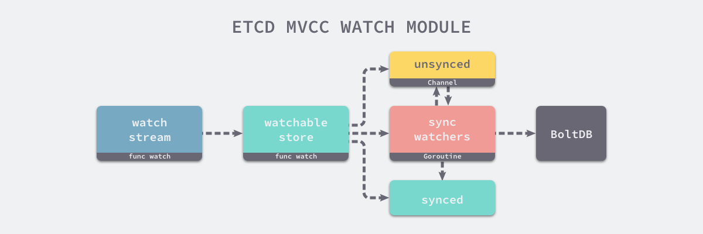

# etcd 的存储分析

etcd 目前支持 V2 和 V3 两个大版本，这两个版本在实现上有比较大的不同，一方面是对外提供接口的方式，另一方面就是底层的存储引擎，V2 版本的实例是一个纯内存的实现，所有的数据都没有存储在磁盘上，而 V3 版本的实例就支持了数据的持久化。


在这一节中，我们会介绍 V3 版本的 etcd 究竟是通过什么样的方式存储用户数据的。

Etcd v3 store 分为两部分，一部分是内存中的索引，kvindex，是基于google开源的一个golang的btree实现的，另外一部分是后端存储。按照它的设计，backend可以对接多种存储，当前使用的boltdb。boltdb是一个单机的支持事务的kv存储，Etcd 的事务是基于boltdb的事务实现的。Etcd 在boltdb中存储的key是reversion，value是 Etcd 自己的key-value组合，也就是说 Etcd 会在boltdb中把每个版本都保存下，从而实现了多版本机制。

## 一、后端
在 V3 版本的设计中，etcd 通过 backend 后端这一设计，很好地封装了存储引擎的实现细节，为上层提供一个更一致的接口，对于 etcd 的其他模块来说，它们可以将更多注意力放在接口中的约定上，不过在这里，我们更关注的是 etcd 对 Backend 接口的实现。
```
// https://sourcegraph.com/github.com/etcd-io/etcd@1cab49e/-/blob/mvcc/backend/backend.go#L51-69
type Backend interface {
    ReadTx() ReadTx
    BatchTx() BatchTx

    Snapshot() Snapshot
    Hash(ignores map[IgnoreKey]struct{}) (uint32, error)
    Size() int64
    SizeInUse() int64
    Defrag() error
    ForceCommit()
    Close() error
}
```
etcd 底层默认使用的是开源的嵌入式键值存储数据库 [bolt](https://github.com/boltdb/bolt)，但是这个项目目前的状态已经是归档不再维护了，如果想要使用这个项目可以使用 CoreOS 的 [bbolt](https://github.com/etcd-io/bbolt) 版本。


这一小节中，我们会简单介绍 etcd 是如何使用 BoltDB 作为底层存储的，首先可以先来看一下 pacakge 内部的 backend 结构体，这是一个实现了 Backend 接口的结构：
```
// https://sourcegraph.com/github.com/etcd-io/etcd@1cab49e/-/blob/mvcc/backend/backend.go#L80-104
type backend struct {
    size int64
    sizeInUse int64
    commits int64

    mu sync.RWMutex
    db *bolt.DB

    batchInterval time.Duration
    batchLimit    int
    batchTx       *batchTxBuffered

    readTx *readTx

    stopc chan struct{}
    donec chan struct{}

    lg *zap.Logger
}
```
从结构体的成员 db 我们就可以看出，它使用了 BoltDB 作为底层存储，另外的两个 readTx 和 batchTx 分别实现了 ReadTx 和 BatchTx 接口：
```
// https://sourcegraph.com/github.com/etcd-io/etcd@1cab49e/-/blob/mvcc/backend/read_tx.go#L30-36
type ReadTx interface {
    Lock()
    Unlock()

    UnsafeRange(bucketName []byte, key, endKey []byte, limit int64) (keys [][]byte, vals [][]byte)
    UnsafeForEach(bucketName []byte, visitor func(k, v []byte) error) error
}

// https://sourcegraph.com/github.com/etcd-io/etcd@1cab49e/-/blob/mvcc/backend/batch_tx.go#L28-38
type BatchTx interface {
    ReadTx
    UnsafeCreateBucket(name []byte)
    UnsafePut(bucketName []byte, key []byte, value []byte)
    UnsafeSeqPut(bucketName []byte, key []byte, value []byte)
    UnsafeDelete(bucketName []byte, key []byte)
    Commit()
    CommitAndStop()
}
```
从这两个接口的定义，我们不难发现它们能够对外提供数据库的读写操作，而 Backend 就能对这两者提供的方法进行封装，为上层屏蔽存储的具体实现：


每当我们使用 newBackend 创建一个新的 backend 结构时，都会创建一个 readTx 和 batchTx 结构体，这两者一个负责处理只读请求，一个负责处理读写请求：
```
// https://sourcegraph.com/github.com/etcd-io/etcd@1cab49e/-/blob/mvcc/backend/backend.go#L137-176
func newBackend(bcfg BackendConfig) *backend {
    bopts := &bolt.Options{}
    bopts.InitialMmapSize = bcfg.mmapSize()
    db, _ := bolt.Open(bcfg.Path, 0600, bopts)

    b := &backend{
        db: db,
        batchInterval: bcfg.BatchInterval,
        batchLimit:    bcfg.BatchLimit,
        readTx: &readTx{
            buf: txReadBuffer{
                txBuffer: txBuffer{make(map[string]*bucketBuffer)},
            },
            buckets: make(map[string]*bolt.Bucket),
        },
        stopc: make(chan struct{}),
        donec: make(chan struct{}),
    }
    b.batchTx = newBatchTxBuffered(b)
    go b.run()
    return b
}
```
当我们在 newBackend 中进行了初始化 BoltDB、事务等工作后，就会开一个 goroutine 异步的对所有批量读写事务进行定时提交：
```
// https://sourcegraph.com/github.com/etcd-io/etcd@1cab49e/-/blob/mvcc/backend/backend.go#L289-305
func (b *backend) run() {
    defer close(b.donec)
    t := time.NewTimer(b.batchInterval)
    defer t.Stop()
    for {
        select {
        case <-t.C:
        case <-b.stopc:
            b.batchTx.CommitAndStop()
            return
        }
        if b.batchTx.safePending() != 0 {
            b.batchTx.Commit()
        }
        t.Reset(b.batchInterval)
    }
}
```
对于上层来说，backend 其实只是对底层存储的一个抽象，很多时候并不会直接跟它打交道，往往都是使用它持有的 ReadTx 和 BatchTx 与数据库进行交互。

### 1.1 只读事务
目前大多数的数据库对于只读类型的事务并没有那么多的限制，尤其是在使用了 MVCC 之后，所有的只读请求几乎不会被写请求锁住，这大大提升了读的效率，由于在 BoltDB 的同一个 goroutine 中开启两个相互依赖的只读事务和读写事务会发生死锁，为了避免这种情况我们还是引入了 sync.RWLock 保证死锁不会出现：
```
// https://sourcegraph.com/github.com/etcd-io/etcd@1cab49e/-/blob/mvcc/backend/read_tx.go#L38-47
type readTx struct {
    mu  sync.RWMutex
    buf txReadBuffer

    txmu    sync.RWMutex
    tx      *bolt.Tx
    buckets map[string]*bolt.Bucket
}
```
你可以看到在整个结构体中，除了用于保护 tx 的 txmu 读写锁之外，还存在另外一个 mu 读写锁，它的作用是保证 buf 中的数据不会出现问题，buf 和结构体中的 buckets 都是用于加速读效率的缓存。


对于一个只读事务来说，它对上层提供了两个获取存储引擎中数据的接口，分别是 UnsafeRange 和 UnsafeForEach，在这里会重点介绍前面方法的实现细节：
```
// https://sourcegraph.com/github.com/etcd-io/etcd@1cab49e/-/blob/mvcc/backend/read_tx.go#L52-90
func (rt *readTx) UnsafeRange(bucketName, key, endKey []byte, limit int64) ([][]byte, [][]byte) {
    if endKey == nil {
        limit = 1
    }
    keys, vals := rt.buf.Range(bucketName, key, endKey, limit)
    if int64(len(keys)) == limit {
        return keys, vals
    }

    bn := string(bucketName)
    bucket, ok := rt.buckets[bn]
    if !ok {
        bucket = rt.tx.Bucket(bucketName)
        rt.buckets[bn] = bucket
    }

    if bucket == nil {
        return keys, vals
    }
    c := bucket.Cursor()

    k2, v2 := unsafeRange(c, key, endKey, limit-int64(len(keys)))
    return append(k2, keys...), append(v2, vals...)
}
```
上述代码中省略了加锁保护读缓存以及 Bucket 中存储数据的合法性，也省去了一些参数的检查，不过方法的整体接口还是没有太多变化，UnsafeRange 会先从自己持有的缓存 txReadBuffer 中读取数据，如果数据不能够满足调用者的需求，就会从 buckets 缓存中查找对应的 BoltDB bucket 并从 BoltDB 数据库中读取。
```
// https://sourcegraph.com/github.com/etcd-io/etcd@1cab49e/-/blob/mvcc/backend/batch_tx.go#L121-141
func unsafeRange(c *bolt.Cursor, key, endKey []byte, limit int64) (keys [][]byte, vs [][]byte) {
    var isMatch func(b []byte) bool
    if len(endKey) > 0 {
        isMatch = func(b []byte) bool { return bytes.Compare(b, endKey) < 0 }
    } else {
        isMatch = func(b []byte) bool { return bytes.Equal(b, key) }
        limit = 1
    }

    for ck, cv := c.Seek(key); ck != nil && isMatch(ck); ck, cv = c.Next() {
        vs = append(vs, cv)
        keys = append(keys, ck)
        if limit == int64(len(keys)) {
            break
        }
    }
    return keys, vs
}
```
这个包内部的函数 unsafeRange 实际上通过 BoltDB 中的游标来遍历满足查询条件的键值对。

到这里为止，整个只读事务提供的接口就基本介绍完了，在 etcd 中无论我们想要后去单个 Key 还是一个范围内的 Key 最终都是通过 Range 来实现的，这其实也是只读事务的最主要功能。

### 1.2 读写事务
只读事务只提供了读数据的能力，包括 UnsafeRange 和 UnsafeForeach，而读写事务 BatchTx 提供的就是读和写数据的能力了：
```
// https://sourcegraph.com/github.com/etcd-io/etcd@1cab49e/-/blob/mvcc/backend/batch_tx.go#L40-46
type batchTx struct {
    sync.Mutex
    tx      *bolt.Tx
    backend *backend

    pending int
}
```
读写事务同时提供了不带缓存的 batchTx 实现以及带缓存的 batchTxBuffered 实现，后者其实『继承了』前者的结构体，并额外加入了缓存 txWriteBuffer 加速读请求：
```
// https://sourcegraph.com/github.com/etcd-io/etcd@1cab49e/-/blob/mvcc/backend/batch_tx.go#L243-246
type batchTxBuffered struct {
    batchTx
    buf txWriteBuffer
}
```
后者在实现接口规定的方法时，会直接调用 batchTx 的同名方法，并将操作造成的副作用的写入的缓存中，在这里我们并不会展开介绍这一版本的实现，还是以分析 batchTx 的方法为主。

当我们向 etcd 中写入数据时，最终都会调用 batchTx 的 unsafePut 方法将数据写入到 BoltDB 中：
```
// https://sourcegraph.com/github.com/etcd-io/etcd@1cab49e/-/blob/mvcc/backend/batch_tx.go#L65-67
func (t *batchTx) UnsafePut(bucketName []byte, key []byte, value []byte) {
    t.unsafePut(bucketName, key, value, false)
}

// https://sourcegraph.com/github.com/etcd-io/etcd@1cab49e/-/blob/mvcc/backend/batch_tx.go#L74-103
func (t *batchTx) unsafePut(bucketName []byte, key []byte, value []byte, seq bool) {
    bucket := t.tx.Bucket(bucketName)
    if err := bucket.Put(key, value); err != nil {
        plog.Fatalf("cannot put key into bucket (%v)", err)
    }
    t.pending++
}
```
这两个方法的实现非常清晰并且简单，只是调用了 BoltDB 提供的 API 操作一下 bucket 中的数据，而另一个删除方法的实现与这个也差不多：
```
// https://sourcegraph.com/github.com/etcd-io/etcd@1cab49e/-/blob/mvcc/backend/batch_tx.go#L144-169
func (t *batchTx) UnsafeDelete(bucketName []byte, key []byte) {
    bucket := t.tx.Bucket(bucketName)
    err := bucket.Delete(key)
    if err != nil {
        plog.Fatalf("cannot delete key from bucket (%v)", err)
    }
    t.pending++
}
```
它们都是通过 Bolt.Tx 找到对应的 Bucket，然后做出相应的增删操作，但是这写请求在这两个方法执行后其实并没有提交，我们还需要手动或者等待 etcd 自动将请求提交：
```
// https://sourcegraph.com/github.com/etcd-io/etcd@1cab49e/-/blob/mvcc/backend/batch_tx.go#L184-188
func (t *batchTx) Commit() {
    t.Lock()
    t.commit(false)
    t.Unlock()
}

// https://sourcegraph.com/github.com/etcd-io/etcd@1cab49e/-/blob/mvcc/backend/batch_tx.go#L210-241
func (t *batchTx) commit(stop bool) {
    if t.tx != nil {
        if t.pending == 0 && !stop {
            return
        }

        start := time.Now()

        err := t.tx.Commit()

        rebalanceSec.Observe(t.tx.Stats().RebalanceTime.Seconds())
        spillSec.Observe(t.tx.Stats().SpillTime.Seconds())
        writeSec.Observe(t.tx.Stats().WriteTime.Seconds())
        commitSec.Observe(time.Since(start).Seconds())
        atomic.AddInt64(&t.backend.commits, 1)

        t.pending = 0
    }
    if !stop {
        t.tx = t.backend.begin(true)
    }
}
```
在每次调用 Commit 对读写事务进行提交时，都会先检查是否有等待中的事务，然后会将数据上报至 Prometheus 中，其他的服务就可以将 Prometheus 作为数据源对 etcd 的执行状况进行监控了。

## 二、索引
经常使用 etcd 的开发者可能会了解到，它本身对于每一个键值对都有一个 revision 的概念，键值对的每一次变化都会被 BoltDB 单独记录下来，所以想要在存储引擎中获取某一个 Key 对应的值，要先获取 revision，再通过它才能找到对应的值，在里我们想要介绍的其实是 etcd 如何管理和存储一个 Key 的多个 revision 记录。


在 etcd 服务中有一个用于存储所有的键值对 revision 信息的 btree，我们可以通过 index 的 Get 接口获取一个 Key 对应 Revision 的值：
```
// https://sourcegraph.com/github.com/etcd-io/etcd@1cab49e/-/blob/mvcc/index.go#L68-76
func (ti *treeIndex) Get(key []byte, atRev int64) (modified, created revision, ver int64, err error) {
    keyi := &keyIndex{key: key}
    if keyi = ti.keyIndex(keyi); keyi == nil {
        return revision{}, revision{}, 0, ErrRevisionNotFound
    }
    return keyi.get(ti.lg, atRev)
}
```
上述方法通过 keyIndex 方法查找 Key 对应的 keyIndex 结构体，这里使用的内存结构体 btree 是 Google 实现的一个版本：
```
// https://sourcegraph.com/github.com/etcd-io/etcd@1cab49e/-/blob/mvcc/index.go#L84-89
func (ti *treeIndex) keyIndex(keyi *keyIndex) *keyIndex {
    if item := ti.tree.Get(keyi); item != nil {
        return item.(*keyIndex)
    }
    return nil
}
```
可以看到这里的实现非常简单，只是从 treeIndex 持有的成员 btree 中查找 keyIndex，将结果强制转换成 keyIndex 类型后返回；获取 Key 对应 revision 的方式也非常简单：
```
// https://sourcegraph.com/github.com/etcd-io/etcd@1cab49e/-/blob/mvcc/key_index.go#L149-171
func (ki *keyIndex) get(lg *zap.Logger, atRev int64) (modified, created revision, ver int64, err error) {
    g := ki.findGeneration(atRev)
    if g.isEmpty() {
        return revision{}, revision{}, 0, ErrRevisionNotFound
    }

    n := g.walk(func(rev revision) bool { return rev.main > atRev })
    if n != -1 {
        return g.revs[n], g.created, g.ver - int64(len(g.revs)-n-1), nil
    }

    return revision{}, revision{}, 0, ErrRevisionNotFound
}
```
### 2.1 KeyIndex
在我们具体介绍方法实现的细节之前，首先我们需要理解 keyIndex 包含的字段以及管理同一个 Key 不同版本的方式：


每一个 keyIndex 结构体中都包含当前键的值以及最后一次修改对应的 revision 信息，其中还保存了一个 Key 的多个 generation，每一个 generation 都会记录当前 Key『从生到死』的全部过程，每当一个 Key 被删除时都会调用 timestone 方法向当前的 generation 中追加一个新的墓碑版本：
```
// https://sourcegraph.com/github.com/etcd-io/etcd@1cab49e/-/blob/mvcc/key_index.go#L127-145
func (ki *keyIndex) tombstone(lg *zap.Logger, main int64, sub int64) error {
    if ki.generations[len(ki.generations)-1].isEmpty() {
        return ErrRevisionNotFound
    }
    ki.put(lg, main, sub)
    ki.generations = append(ki.generations, generation{})
    return nil
}
```
这个 tombstone 版本标识这当前的 Key 已经被删除了，但是在每次删除一个 Key 之后，就会在当前的 keyIndex 中创建一个新的 generation 结构用于存储新的版本信息，其中 ver 记录当前 generation 包含的修改次数，created 记录创建 generation 时的 revision 版本，最后的 revs 用于存储所有的版本信息。

### 2.2 读操作
etcd 中所有的查询请求，无论是查询一个还是多个、是数量还是键值对，最终都会调用 rangeKeys 方法：
```
// https://sourcegraph.com/github.com/etcd-io/etcd@1cab49e/-/blob/mvcc/kvstore_txn.go#L112-165
func (tr *storeTxnRead) rangeKeys(key, end []byte, curRev int64, ro RangeOptions) (*RangeResult, error) {
    rev := ro.Rev

    revpairs := tr.s.kvindex.Revisions(key, end, rev)
    if len(revpairs) == 0 {
        return &RangeResult{KVs: nil, Count: 0, Rev: curRev}, nil
    }

    kvs := make([]mvccpb.KeyValue, int(ro.Limit))
    revBytes := newRevBytes()
    for i, revpair := range revpairs[:len(kvs)] {
        revToBytes(revpair, revBytes)
        _, vs := tr.tx.UnsafeRange(keyBucketName, revBytes, nil, 0)
        kvs[i].Unmarshal(vs[0])
    }
    return &RangeResult{KVs: kvs, Count: len(revpairs), Rev: curRev}, nil
}
```
为了获取一个范围内的所有键值对，我们首先需要通过 Revisions 函数从 btree 中获取范围内所有的 keyIndex：
```
// https://sourcegraph.com/github.com/etcd-io/etcd@1cab49e/-/blob/mvcc/index.go#L106-120
func (ti *treeIndex) Revisions(key, end []byte, atRev int64) (revs []revision) {
    if end == nil {
        rev, _, _, err := ti.Get(key, atRev)
        if err != nil {
            return nil
        }
        return []revision{rev}
    }
    ti.visit(key, end, func(ki *keyIndex) {
        if rev, _, _, err := ki.get(ti.lg, atRev); err == nil {
            revs = append(revs, rev)
        }
    })
    return revs
}
```
如果只需要获取一个 Key 对应的版本，就是直接使用 treeIndex 的方法，但是当上述方法会从 btree 索引中获取一个连续多个 revision 值时，就会调用 keyIndex.get 来遍历整颗树并选取合适的版本：
```
func (ki *keyIndex) get(lg *zap.Logger, atRev int64) (modified, created revision, ver int64, err error) {
    g := ki.findGeneration(atRev)
    if g.isEmpty() {
        return revision{}, revision{}, 0, ErrRevisionNotFound
    }

    n := g.walk(func(rev revision) bool { return rev.main > atRev })
    if n != -1 {
        return g.revs[n], g.created, g.ver - int64(len(g.revs)-n-1), nil
    }

    return revision{}, revision{}, 0, ErrRevisionNotFound
}
```
因为每一个 Key 的 keyIndex 中其实都存储着多个 generation，我们需要根据传入的参数返回合适的 generation 并从其中返回主版本大于 atRev 的 revision 结构。

对于上层的键值存储来说，它会利用这里返回的 revision 从真正存储数据的 BoltDB 中查询当前 Key 对应 revision 的结果。

### 2.3 写操作
当我们向 etcd 中插入数据时，会使用传入的 key 构建一个 keyIndex 结构体并从树中获取相关版本等信息：
```
// https://sourcegraph.com/github.com/etcd-io/etcd@1cab49e/-/blob/mvcc/index.go#L53-66
func (ti *treeIndex) Put(key []byte, rev revision) {
    keyi := &keyIndex{key: key}

    item := ti.tree.Get(keyi)
    if item == nil {
        keyi.put(ti.lg, rev.main, rev.sub)
        ti.tree.ReplaceOrInsert(keyi)
        return
    }
    okeyi := item.(*keyIndex)
    okeyi.put(ti.lg, rev.main, rev.sub)
}
```
treeIndex.Put 在获取内存中的 keyIndex 结构之后会通过 keyIndex.put 其中加入新的 revision：
```
// https://sourcegraph.com/github.com/etcd-io/etcd@1cab49e/-/blob/mvcc/key_index.go#L77-104
func (ki *keyIndex) put(lg *zap.Logger, main int64, sub int64) {
    rev := revision{main: main, sub: sub}

    if len(ki.generations) == 0 {
        ki.generations = append(ki.generations, generation{})
    }
    g := &ki.generations[len(ki.generations)-1]
    if len(g.revs) == 0 {
        g.created = rev
    }
    g.revs = append(g.revs, rev)
    g.ver++
    ki.modified = rev
}
```
每一个新 revision 结构体写入 keyIndex 时，都会改变当前 generation 的 created 和 ver 等参数，从这个方法中我们就可以了解到 generation 中的各个成员都是如何被写入的。

写入的操作除了增加之外，删除某一个 Key 的函数也会经常被调用：
```
// https://sourcegraph.com/github.com/etcd-io/etcd@1cab49e/-/blob/mvcc/kvstore_txn.go#L252-309
func (tw *storeTxnWrite) delete(key []byte) {
    ibytes := newRevBytes()
    idxRev := revision{main: tw.beginRev + 1, sub: int64(len(tw.changes))}
    revToBytes(idxRev, ibytes)

    ibytes = appendMarkTombstone(tw.storeTxnRead.s.lg, ibytes)

    kv := mvccpb.KeyValue{Key: key}

    d, _ := kv.Marshal()

    tw.tx.UnsafeSeqPut(keyBucketName, ibytes, d)
    tw.s.kvindex.Tombstone(key, idxRev)
    tw.changes = append(tw.changes, kv)
}
```
正如我们在文章前面所介绍的，删除操作会向结构体中的 generation 追加一个新的 tombstone 标记，用于标识当前的 Key 已经被删除；除此之外，上述方法还会将每一个更新操作的 revision 存到单独的 keyBucketName 中。

### 2.4 索引的恢复
因为在 etcd 中，所有的 keyIndex 都是在内存的 btree 中存储的，所以在启动服务时需要从 BoltDB 中将所有的数据都加载到内存中，在这里就会初始化一个新的 btree 索引，然后调用 restore 方法开始恢复索引：
```
// https://sourcegraph.com/github.com/etcd-io/etcd@1cab49e/-/blob/mvcc/kvstore.go#L321-433
func (s *store) restore() error {
    min, max := newRevBytes(), newRevBytes()
    revToBytes(revision{main: 1}, min)
    revToBytes(revision{main: math.MaxInt64, sub: math.MaxInt64}, max)

    tx := s.b.BatchTx()

    rkvc, revc := restoreIntoIndex(s.lg, s.kvindex)
    for {
        keys, vals := tx.UnsafeRange(keyBucketName, min, max, int64(restoreChunkKeys))
        if len(keys) == 0 {
            break
        }
        restoreChunk(s.lg, rkvc, keys, vals, keyToLease)
        newMin := bytesToRev(keys[len(keys)-1][:revBytesLen])
        newMin.sub++
        revToBytes(newMin, min)
    }
    close(rkvc)
    s.currentRev = <-revc

    return nil
}
```
在恢复索引的过程中，有一个用于遍历不同键值的『生产者』循环，其中由 UnsafeRange 和 restoreChunk 两个方法构成，这两个方法会从 BoltDB 中遍历数据，然后将键值对传到 rkvc 中，交给 restoreIntoIndex 方法中创建的 goroutine 处理：
```
// https://sourcegraph.com/github.com/etcd-io/etcd@1cab49e/-/blob/mvcc/kvstore.go#L486-506
func restoreChunk(lg *zap.Logger, kvc chan<- revKeyValue, keys, vals [][]byte, keyToLease map[string]lease.LeaseID) {
    for i, key := range keys {
        rkv := r evKeyValue{key: key}
        _ := rkv.kv.Unmarshal(vals[i])
        rkv.kstr = string(rkv.kv.Key)
        if isTombstone(key) {
            delete(keyToLease, rkv.kstr)
        } else if lid := lease.LeaseID(rkv.kv.Lease); lid != lease.NoLease {
            keyToLease[rkv.kstr] = lid
        } else {
            delete(keyToLease, rkv.kstr)
        }
        kvc <- rkv
    }
}
```
先被调用的 restoreIntoIndex 方法会创建一个用于接受键值对的 Channel，在这之后会在一个 goroutine 中处理从 Channel 接收到的数据，并将这些数据恢复到内存里的 btree 中：
```
// https://sourcegraph.com/github.com/etcd-io/etcd@1cab49e/-/blob/mvcc/kvstore.go#L441-484
func restoreIntoIndex(lg *zap.Logger, idx index) (chan<- revKeyValue, <-chan int64) {
    rkvc, revc := make(chan revKeyValue, restoreChunkKeys), make(chan int64, 1)
    go func() {
        currentRev := int64(1)
        defer func() { revc <- currentRev }()
        for rkv := range rkvc {
            ki = &keyIndex{key: rkv.kv.Key}
            ki := idx.KeyIndex(ki)

            rev := bytesToRev(rkv.key)
            currentRev = rev.main
            if ok {
                if isTombstone(rkv.key) {
                    ki.tombstone(lg, rev.main, rev.sub)
                    continue
                }
                ki.put(lg, rev.main, rev.sub)
            } else if !isTombstone(rkv.key) {
                ki.restore(lg, revision{rkv.kv.CreateRevision, 0}, rev, rkv.kv.Version)
                idx.Insert(ki)
            }
        }
    }()
    return rkvc, revc
}
```
恢复内存索引的相关代码在实现上非常值得学习，两个不同的函数通过 Channel 进行通信并使用 goroutine 处理任务，能够很好地将消息的『生产者』和『消费者』进行分离。


Channel 作为整个恢复索引逻辑的一个消息中心，它将遍历 BoltDB 中的数据和恢复索引两部分代码进行了分离。

## 三、存储
etcd 的 mvcc 模块对外直接提供了两种不同的访问方式，一种是键值存储 kvstore，另一种是 watchableStore 它们都实现了包内公开的 KV 接口：
```
// https://sourcegraph.com/github.com/etcd-io/etcd@1cab49e/-/blob/mvcc/kv.go#L100-125
type KV interface {
    ReadView
    WriteView

    Read() TxnRead
    Write() TxnWrite

    Hash() (hash uint32, revision int64, err error)
    HashByRev(rev int64) (hash uint32, revision int64, compactRev int64, err error)

    Compact(rev int64) (<-chan struct{}, error)
    Commit()
    Restore(b backend.Backend) error
    Close() error
}
```
### 3.1 kvstore
对于 kvstore 来说，其实没有太多值得展开介绍的地方，它利用底层的 BoltDB 等基础设施为上层提供最常见的增伤改查，它组合了下层的 readTx、batchTx 等结构体，将一些线程不安全的操作变成线程安全的。
```
// https://sourcegraph.com/github.com/etcd-io/etcd@1cab49e/-/blob/mvcc/kvstore_txn.go#L32-40
func (s *store) Read() TxnRead {
    s.mu.RLock()
    tx := s.b.ReadTx()
    s.revMu.RLock()
    tx.Lock()
    firstRev, rev := s.compactMainRev, s.currentRev
    s.revMu.RUnlock()
    return newMetricsTxnRead(&storeTxnRead{s, tx, firstRev, rev})
}
```
它也负责对内存中 btree 索引的维护以及压缩一些无用或者不常用的数据，几个对外的接口 Read、Write 就是对 readTx、batchTx 等结构体的组合并将它们的接口暴露给其他的模块。

### 3.2 watchableStore
另外一个比较有意思的存储就是 watchableStore 了，它是 mvcc 模块为外界提供 Watch 功能的接口，它负责了注册、管理以及触发 Watcher 的功能，我们先来看一下这个结构体的各个字段：
```
// https://sourcegraph.com/github.com/etcd-io/etcd@1cab49e/-/blob/mvcc/watchable_store.go#L45-65
type watchableStore struct {
    *store

    mu sync.RWMutex

    unsynced watcherGroup
    synced watcherGroup

    stopc chan struct{}
    wg    sync.WaitGroup
}
```
每一个 watchableStore 其实都组合了来自 store 结构体的字段和方法，除此之外，还有两个 watcherGroup类型的字段，其中 unsynced 用于存储未同步完成的实例，synced 用于存储已经同步完成的实例。

在初始化一个新的 watchableStore 时，我们会创建一个用于同步watcherGroup 的 Goroutine，在 syncWatchersLoop 这个循环中会每隔 100ms 调用一次 syncWatchers 方法，将所有未通知的事件通知给所有的监听者，这可以说是整个模块的核心：
```
func (s *watchableStore) syncWatchers() int {
    curRev := s.store.currentRev
    compactionRev := s.store.compactMainRev

    wg, minRev := s.unsynced.choose(maxWatchersPerSync, curRev, compactionRev)
    minBytes, maxBytes := newRevBytes(), newRevBytes()
    revToBytes(revision{main: minRev}, minBytes)
    revToBytes(revision{main: curRev + 1}, maxBytes)

    tx := s.store.b.ReadTx()
    revs, vs := tx.UnsafeRange(keyBucketName, minBytes, maxBytes, 0)
    evs := kvsToEvents(nil, wg, revs, vs)

    wb := newWatcherBatch(wg, evs)
    for w := range wg.watchers {
        w.minRev = curRev + 1

        eb, ok := wb[w]
        if !ok {
            s.synced.add(w)
            s.unsynced.delete(w)
            continue
        }

        w.send(WatchResponse{WatchID: w.id, Events: eb.evs, Revision: curRev})

        s.synced.add(w)
        s.unsynced.delete(w)
    }

    return s.unsynced.size()
}
```
简化后的 syncWatchers 方法中总共做了三件事情，首先是根据当前的版本从未同步的 watcherGroup 中选出一些待处理的任务，然后从 BoltDB 中后去当前版本范围内的数据变更并将它们转换成事件，事件和 watcherGroup 在打包之后会通过 send 方法发送到每一个 watcher 对应的 Channel 中。




上述图片中展示了 mvcc 模块对于向外界提供的监听某个 Key 和范围的接口，外部的其他模块会通过 watchStream.watch 函数与模块内部进行交互，每一次调用 watch 方法最终都会向 watchableStore 持有的 watcherGroup 中添加新的 watcher 结构。
```
// https://sourcegraph.com/github.com/etcd-io/etcd@1cab49e/-/blob/mvcc/watcher.go#L108-135
func (ws *watchStream) Watch(id WatchID, key, end []byte, startRev int64, fcs ...FilterFunc) (WatchID, error) {
    if id == AutoWatchID {
        for ws.watchers[ws.nextID] != nil {
            ws.nextID++
        }
        id = ws.nextID
        ws.nextID++
    }

    w, c := ws.watchable.watch(key, end, startRev, id, ws.ch, fcs...)

    ws.cancels[id] = c
    ws.watchers[id] = w
    return id, nil
}

// https://sourcegraph.com/github.com/etcd-io/etcd@1cab49e/-/blob/mvcc/watchable_store.go#L111-142
func (s *watchableStore) watch(key, end []byte, startRev int64, id WatchID, ch chan<- WatchResponse, fcs ...FilterFunc) (*watcher, cancelFunc) {
    wa := &watcher{
        key:    key,
        end:    end,
        minRev: startRev,
        id:     id,
        ch:     ch,
        fcs:    fcs,
    }

    synced := startRev > s.store.currentRev || startRev == 0
    if synced {
        s.synced.add(wa)
    } else {
        s.unsynced.add(wa)
    }

    return wa, func() { s.cancelWatcher(wa) }
}
```
当 etcd 服务启动时，会在服务端运行一个用于处理监听事件的 watchServer gRPC 服务，客户端的 Watch 请求最终都会被转发到这个服务的 Watch 函数中：
```
// https://sourcegraph.com/github.com/etcd-io/etcd@1cab49e/-/blob/etcdserver/api/v3rpc/watch.go#L136-206
func (ws *watchServer) Watch(stream pb.Watch_WatchServer) (err error) {
    sws := serverWatchStream{
        // ...
        gRPCStream:  stream,
        watchStream: ws.watchable.NewWatchStream(),
        ctrlStream: make(chan *pb.WatchResponse, ctrlStreamBufLen),
    }

    sws.wg.Add(1)
    go func() {
        sws.sendLoop()
        sws.wg.Done()
    }()

    go func() {
        sws.recvLoop()
    }()

    sws.wg.Wait()
    return err
}
```
当客户端想要通过 Watch 结果监听某一个 Key 或者一个范围的变动，在每一次客户端调用服务端上述方式都会创建两个 Goroutine，这两个协程一个会负责向监听者发送数据变动的事件，另一个协程会负责处理客户端发来的事件。
```
// https://sourcegraph.com/github.com/etcd-io/etcd@1cab49e/-/blob/etcdserver/api/v3rpc/watch.go#L220-334 
func (sws *serverWatchStream) recvLoop() error {
    for {
        req, err := sws.gRPCStream.Recv()
        if err == io.EOF {
            return nil
        }
        if err != nil {
            return err
        }

        switch uv := req.RequestUnion.(type) {
        case *pb.WatchRequest_CreateRequest:
            creq := uv.CreateRequest

            filters := FiltersFromRequest(creq)
            wsrev := sws.watchStream.Rev()
            rev := creq.StartRevision
            id, _ := sws.watchStream.Watch(mvcc.WatchID(creq.WatchId), creq.Key, creq.RangeEnd, rev, filters...)
            wr := &pb.WatchResponse{
                Header:   sws.newResponseHeader(wsrev),
                WatchId:  int64(id),
                Created:  true,
                Canceled: err != nil,
            }
            select {
            case sws.ctrlStream <- wr:
            case <-sws.closec:
                return nil
            }

        case *pb.WatchRequest_CancelRequest: // ...
        case *pb.WatchRequest_ProgressRequest: // ...
        default:
            continue
        }
    }
}
```
在用于处理客户端的 recvLoop 方法中调用了 mvcc 模块暴露出的 watchStream.Watch 方法，该方法会返回一个可以用于取消监听事件的 watchID；当 gRPC 流已经结束后者出现错误时，当前的循环就会返回，两个 Goroutine 也都会结束。

如果出现了更新或者删除事件，就会被发送到 watchStream 持有的 Channel 中，而 sendLoop 会通过 select来监听多个 Channel 中的数据并将接收到的数据封装成 pb.WatchResponse 结构并通过 gRPC 流发送给客户端：
```
func (sws *serverWatchStream) sendLoop() {
    for {
        select {
        case wresp, ok := <-sws.watchStream.Chan():
            evs := wresp.Events
            events := make([]*mvccpb.Event, len(evs))
            for i := range evs {
                events[i] = &evs[i]         }

            canceled := wresp.CompactRevision != 0
            wr := &pb.WatchResponse{
                Header:          sws.newResponseHeader(wresp.Revision),
                WatchId:         int64(wresp.WatchID),
                Events:          events,
                CompactRevision: wresp.CompactRevision,
                Canceled:        canceled,
            }

            sws.gRPCStream.Send(wr)

        case c, ok := <-sws.ctrlStream: // ...
        case <-progressTicker.C: // ...
        case <-sws.closec:
            return
        }
    }
}
```
对于每一个 Watch 请求来说，watchServer 会根据请求创建两个用于处理当前请求的 Goroutine，这两个协程会与更底层的 mvcc 模块协作提供监听和回调功能：


到这里，我们对于 Watch 功能的介绍就差不多结束了，从对外提供的接口到底层的使用的数据结构以及具体实现，其他与 Watch 功能相关的话题可以直接阅读 etcd 的源代码了解更加细节的实现。