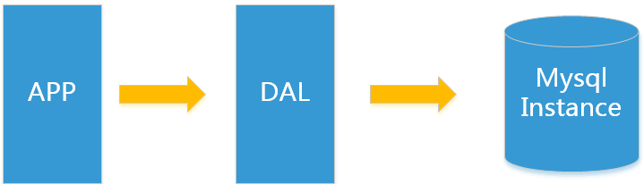
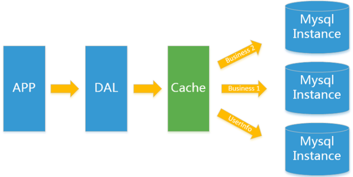
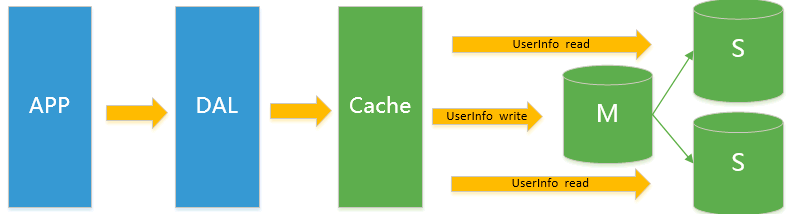
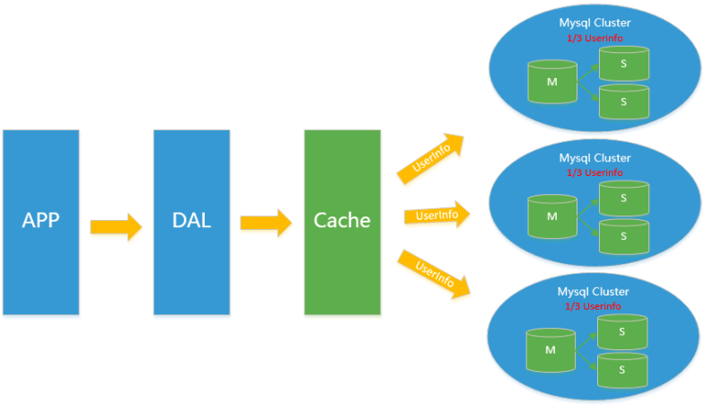
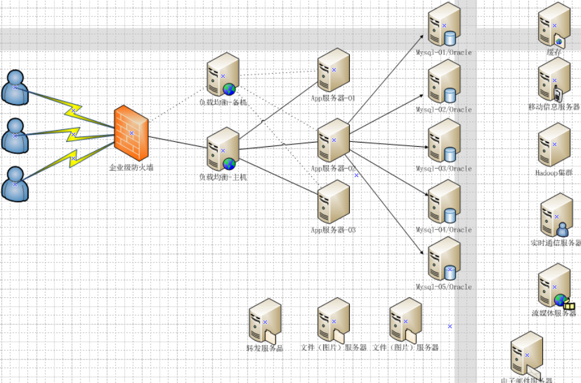

# 数据库架构
- 单机MySQL
- Memcached(缓存)+MySQL+垂直拆分
- Mysql主从读写分离
- 分表分库+水平拆分+mysql集群 
## 单机MySQL

###  单机MySQL数据存储的瓶颈是什么？
    1. 数据量的总大小 一个机器放不下时
    2. 数据的索引（B+ Tree）一个机器的内存放不下时
    3. 访问量(读写混合)一个实例不能承受
## Memcached(缓存)+MySQL+垂直拆分

 使用缓存技术来缓解数据库的压力，优化数据库的结构和索引。

## Mysql主从读写分离

由于数据库的写入压力增加，Memcached只能缓解数据库的读取压力。读写集中在一个数据库上让数据库不堪重负，大部分网站开始使用主从复制技术来达到读写分离，以提高读写性能和读库的可扩展性。Mysql的master-slave模式成为这个时候的网站标配了。

## 分表分库+水平拆分+mysql集群 

 在Memcached的高速缓存，MySQL的主从复制，读写分离的基础之上，这时MySQL主库的写压力开始出现瓶颈，而数据量的持续猛增，由于MyISAM使用表锁，在高并发下会出现严重的锁问题，大量的高并发MySQL应用开始使用InnoDB引擎代替MyISAM。
 
 同时，开始流行使用分表分库来缓解写压力和数据增长的扩展问题。这个时候，分表分库成了一个热门技术，是面试的热门问题也是业界讨论的热门技术问题。也就在这个时候，MySQL推出了还不太稳定的表分区，这也给技术实力一般的公司带来了希望。虽然MySQL推出了MySQL Cluster集群，但性能也不能很好满足互联网的要求，只是在高可靠性上提供了非常大的保证。

 

  
 ##  MySQL的扩展性瓶颈 
 MySQL数据库也经常存储一些大文本字段，导致数据库表非常的大，在做数据库恢复的时候就导致非常的慢，不容易快速恢复数据库。比如1000万4KB大小的文本就接近40GB的大小，如果能把这些数据从MySQL省去，MySQL将变得非常的小。关系数据库很强大，但是它并不能很好的应付所有的应用场景。MySQL的扩展性差（需要复杂的技术来实现），大数据下IO压力大，表结构更改困难，正是当前使用MySQL的开发人员面临的问题。
## 当前MySQL架构
  

## 为什么使用NoSQL ?
如果要对这些用户数据进行挖掘，那SQL数据库已经不适合这些应用了, NoSQL数据库的发展也却能很好的处理这些大的数据。

## 3V+3高
### 大数据时代的3V
- 海量Volume
- 多样Variety
- 实时Velocity
### 互联网需求的3高
- 高并发
- 高可扩
- 高性能

## 当下的NoSQL经典应用
当下的应用是sql和nosql一起使用
