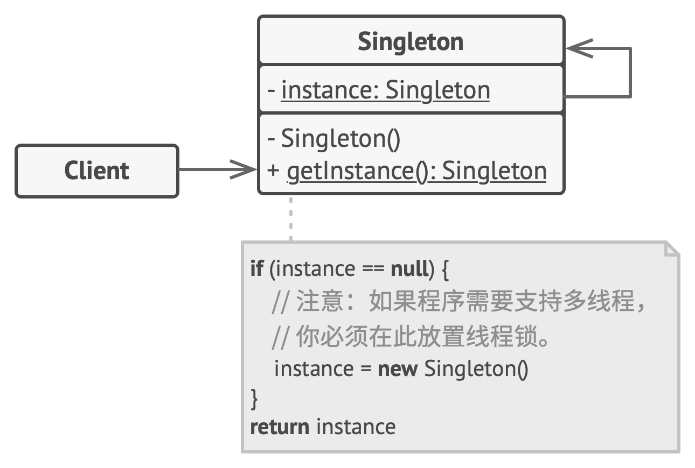

# 单例模式（Singleton Pattern）

## 1、概述
单例模式是Java中最简单的设计模式之一。这种设计模式属于创建模式，因为该模式提供了创建对象的最佳方法之一。

该模式涉及单个类，该类负责创建对象，同时确保仅创建单个对象。此类提供了一种访问其唯一对象的方法，该对象可以直接访问而无需实例化该类的对象。

## 2、解决了什么问题？ 
1. 如何确保一个类只有一个实例？
2. 如何轻松访问类的唯一实例？
3. 类如何控制其实例化？
4. 如何限制一个类的实例数？

## 3、如何解决？解决方案？
1. 隐藏该类的构造函数（即将默认构造函数设为私有），防止其他对象使用单例类的 new运算符。
2. 定义一个公共静态操作（getInstance()），该操作返回该类的唯一实例。

## 4、应用场景
1. 抽象工厂模式、构建器模式和原型模式都可以用单例来实现。
2. 如果程序中的某个类对于所有客户端只有一个可用的实例， 可以使用单例模式。
3. 如果你需要更加严格地控制全局变量， 可以使用单例模式。
4. 仅当满足以下所有三个条件时，才应考虑单例：
    - 无法合理分配单个实例的所有权
    - 延迟初始化是可取的
    - 不提供全局访问

## 5、UML图


## 6、单例模式实现
实现Singleton模式，有多种方法，但是所有方法都具有以下共同概念：
1. 类的**私有构造函数**，用于限制该类从其他类的实例化。
2. 类的**私有静态变量**，是该类的唯一实例。
3. 返回**类实例的公共静态方法**，这是获取单例类实例的全局访问点。

### 1.Eager initialization  饿汉式
```java

package com.journaldev.singleton;

public class EagerInitializedSingleton {
    
    private static final EagerInitializedSingleton instance = new EagerInitializedSingleton();
    
    //private constructor to avoid client applications to use constructor
    private EagerInitializedSingleton(){}

    public static EagerInitializedSingleton getInstance(){
        return instance;
    }
}

```
**注意事项:**
1. 适用于单列模式没有使用大量资源。在大多数情况下，都是为文件系统，数据库连接等资源创建Singleton类的getInstance。除非客户端调用该方法，否则应避免实例化
2. 该方法不提供任何用于异常处理
3. 在使用实例之前创建实例创建了实例，这不是最佳实践。

### 2.Static block initialization （静态块）
```java
package com.journaldev.singleton;

public class StaticBlockSingleton {

    private static StaticBlockSingleton instance;
    
    private StaticBlockSingleton(){}
    
    //static block initialization for exception handling
    static{
        try{
            instance = new StaticBlockSingleton();
        }catch(Exception e){
            throw new RuntimeException("Exception occured in creating singleton instance");
        }
    }
    
    public static StaticBlockSingleton getInstance(){
        return instance;
    }
}

```
**注意事项:**
1. 在使用实例之前创建实例创建了实例，这不是最佳实践。

### 3.Lazy Initialization （懒汉式）
```java

package com.journaldev.singleton;

public class LazyInitializedSingleton {

    private static LazyInitializedSingleton instance;
    
    private LazyInitializedSingleton(){}
    
    public static LazyInitializedSingleton getInstance(){
        if(instance == null){
            instance = new LazyInitializedSingleton();
        }
        return instance;
    }
}

```
**注意事项:**
1. 在全局访问方法中创建实例.
2. 线程不安全。
     - 在单线程环境下可以很好地工作，但是对于多线程系统，如果多个线程同时位于if条件中，则可能导致问题。它将破坏单例模式，并且两个线程都将获得单例类的不同实例
### 4.Thread Safe Singleton （线程安全）
```java

package com.journaldev.singleton;

public class ThreadSafeSingleton {

    private static ThreadSafeSingleton instance;
    
    private ThreadSafeSingleton(){}
    
    public static synchronized ThreadSafeSingleton getInstance(){
        if(instance == null){
            instance = new ThreadSafeSingleton();
        }
        return instance;
    }
    
}
```
**注意事项**
1. 创建线程安全的单例类的更简单方法是使全局访问方法同步，以便一次仅一个线程可以执行此方法。
2. 由于与同步方法相关的成本，它降低了性能。
3. 为了避免每次额外的开销，使用了双重检查的锁定原理。在这种方法中，在if条件中使用了同步块，并进行了附加检查，以确保仅创建一个singleton类的实例。
``` java
package com.journaldev.singleton;

public class ThreadSafeSingleton {

    private static ThreadSafeSingleton instance;
    
    private ThreadSafeSingleton(){}
    
    public static ThreadSafeSingleton getInstanceUsingDoubleLocking(){
        if(instance == null){
            synchronized (ThreadSafeSingleton.class) {
                if(instance == null){
                    instance = new ThreadSafeSingleton();
                }
            }
        }
        return instance;
    }   
}
```
### 5.Bill Pugh Singleton Implementation （静态内部类）**推荐**
```java

package com.journaldev.singleton;

public class BillPughSingleton {

    private BillPughSingleton(){}
    
    private static class SingletonHelper{
        private static final BillPughSingleton INSTANCE = new BillPughSingleton();
    }
    
    public static BillPughSingleton getInstance(){
        return SingletonHelper.INSTANCE;
    }
}
```
**注意事项：**
1. 内部私有静态类包含单例类的实例。加载singleton类时，SingletonHelper类不会加载到内存中，只有当有人调用getInstance方法时，该类才会加载并创建Singleton类实例。

2. 这是Singleton类使用最广泛的方法，因为它不需要同步

### 6.Enum Singleton
因为使用反射破坏单例模式，建议使用Enum来实现Singleton设计模式，因为Java确保在Java程序中仅将一次枚举值实例化一次。由于Java枚举值可全局访问，因此单例也是如此。缺点是枚举类型有些不灵活；例如，它不允许延迟初始化。
```java

package com.journaldev.singleton;

public enum EnumSingleton {

    INSTANCE;
    
    public static void doSomething(){
        //do something
    }
}

```
**使用反射破坏单例模式**
```java

package com.journaldev.singleton;

import java.lang.reflect.Constructor;

public class ReflectionSingletonTest {

    public static void main(String[] args) {
        EagerInitializedSingleton instanceOne = EagerInitializedSingleton.getInstance();
        EagerInitializedSingleton instanceTwo = null;
        try {
            Constructor[] constructors = EagerInitializedSingleton.class.getDeclaredConstructors();
            for (Constructor constructor : constructors) {
                //Below code will destroy the singleton pattern
                constructor.setAccessible(true);
                instanceTwo = (EagerInitializedSingleton) constructor.newInstance();
                break;
            }
        } catch (Exception e) {
            e.printStackTrace();
        }
        System.out.println(instanceOne.hashCode());
        System.out.println(instanceTwo.hashCode());
    }

}

```
当您运行上述测试类时，您会注意到两个实例的hashCode是不同的，这会破坏单例模式。

## 7、模式优缺点
### 优点
1. 可以保证一个类只有一个实例。
2. 获得了一个指向该实例的全局访问节点。
3. 仅在首次请求单例对象时对其进行初始化。

### 缺点
1. 违反了单一职责原则。 该模式同时解决了两个问题：
    - 保证一个类只有一个实例
    - 为该实例提供一个全局访问节点
2. 单例模式可能掩盖不良设计， 比如程序各组件之间相互了解过多等。
3. 该模式在多线程环境下需要进行特殊处理， 避免多个线程多次创建单例对象。
4. 单例的客户端代码单元测试可能会比较困难， 因为许多测试框架以基于继承的方式创建模拟对象。 由于单例类的构造函数是私有的， 而且绝大部分语言无法重写静态方法， 所以你需要想出仔细考虑模拟单例的方法。 要么干脆不编写测试代码， 或者不使用单例模式。

## 8、与其它设计模式的关系
1. 外观模式类通常可以转换为单例模式类， 因为在大部分情况下一个外观对象就足够了
2. 如果你能将对象的所有共享状态简化为一个享元对象， 那么享元模式就和单例类似了。 但这两个模式有两个根本性的不同。
    - 只会有一个单例实体， 但是享元类可以有多个实体， 各实体的内在状态也可以不同。
    - 单例对象可以是可变的。 享元对象是不可变的。
3. 抽象工厂模式、构建器模式和原型模式都可以用单例来实现。

## 9、注意事项
1. 单例模式与全局变量的区别
    - 单例模式和全局变量一样， 单例模式也允许在程序的任何地方访问特定对象。 但是它可以保护该实例不被其他代码覆盖。
    - 单例模式与全局变量不同， 它保证类只存在一个实例。 除了单例类自己以外， 无法通过任何方式替换缓存的实例。
    - 与全局变量相比，Singleton的优点在于，您可以完全确定使用Singleton时的实例数量，并且可以改变主意并管理任意数量的实例。
    - 单例通常优于全局变量，因为：
        - 它们不会用不必要的变量污染全局名称空间（或在具有嵌套名称空间的语言中，包含它们的名称空间）。
        - 它们允许延迟分配和初始化，而许多语言中的全局变量将始终消耗资源。
        
2. [单列序列化问题](https://www.journaldev.com/1377/java-singleton-design-pattern-best-practices-examples)
