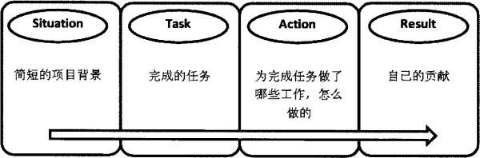

# 01-面试的流程 

## 电话面试

顾名思义，电话面试是面试官以打电话的形式考查应聘者。有些面试官会先和应聘者预约好电话面试的时间，而还有些面试官却喜欢搞突然袭击，一个电话打过去就开始面试。为了应付这种突然袭击，建议应聘者在投出简历之后的一两个星期之内，要保证手机电池能至少连续通话一个小时。另外，应聘者不要长时间呆在很嘈杂的地方。如果应聘者身在闹市的时候突然接到面试电话，那么双方就有可能因为听不清对方而倍感尴尬。

电话面试和现场面试最大的区别就是应聘者和面试官是见不到对方的，因此双方的沟通只能依靠声音。没有了肢体语言、面部表情，应聘者清楚地表达自己想法的难度就比现场面试时要大很多，特别是在解释复杂算法的时候。应聘者在电话面试的时候应尽可能用形象化的语言把细节说清楚。例如，在现场面试的时候，应聘者如果想说一个二叉树的结构，可以用笔在白纸上画出来，就一目了然。但在电话面试的时候，应聘者就需要把二叉树中有哪些结点，每个结点的左子结点是什么、右子结点是什么都要说得很清楚，只有这样面试官才能准确地理解应聘者的思路。
 
很多外企在电话面试时都会加上英语面试的环节，甚至有些公司全部面试都会用英语进行。电话面试时应聘者只能听到面试官的声音而看不到他的口型，这对应聘者的听力提出了更高的要求。如果应聘者在面试的时候没有听清楚或者听懂面试官的问题，千万不要不懂装懂、答非所问，这是面试的大忌。当不确定面试官的问题的时候，应聘者一定要大胆地向面试官多提问，直到弄清楚面试官的意图为止。

**面试小提示：**

应聘者在电话面试的时候应尽可能用形象的语言把细节说清楚；
如果在英语面试时没有听清或没有听懂面试官的问题，应聘者要敢于说Pardon.

## 共享桌面面试

享桌面远程面试(Phone-Screen Interview)是指利用一些共享桌面的软件（比如微软的LiveMeet1ng、思科的webEx等），应聘者把自己电脑的桌面共享给远程的面试官。这样两个人虽然没有坐在一起，但面试官却能通过共享桌面观看应聘者编程和调试的过程。目前只有为数不多的几家大公司会在邀请应聘者到公司参加现场面试之前，先进行一两轮共享桌面的远程面试。

这种形式的面试，面试官最关心的是应聘者的**编程习惯及调试能力**。

通常而试官会认可应聘者下列几种编程习惯：
 
-   **思考清楚再开始编码**。应聘者不要一听到题目就匆忙打开编程软件如VisualStudio开始敲代码，因为在没有形成清晰的思路之前写出的代码通常会漏洞百出。这些漏洞被面试官发现之后，应聘者容易慌张，这个时候再修改代码也会越改越乱，最终导致面试的结果不理想。更好的策略是应聘者应先想清楚解决问题的思路，算法的时间、空间复杂度各是什么，有哪些特殊情况需要处理等，然后再动手编写代码。

-   **良好的代码命名和缩进对齐习惯**。一目了然的变量和函数名，加以合理的缩进和括号对齐，会让面试官觉得应聘者有参与大型项目的开发经验。

 -  **能够单元测试**。通常面试官出的题目都是要求写函数解决某一问题，如果应聘者能够在定义函数之后，立即对该函数进行全面的单元测试，那就相当于向面试官证明了自己有着专业的软件开发经验。如果应聘者是先写单元测试用例，再写解决问题的函数，我相信面试官定会对你刮目相看，因为能做到测试在前、开发在后的程序员实在是太稀缺了，他会毫不犹豫地抛出绿色的橄榄枝。
     
通常我们在写代码的时候都会遇到问题。当应聘者运行代码发现结果不对之后的表现，也是面试官关注的重点，因为应聘者此时的反应、采取的措施都能体现出他的调试功底。如果应聘者能够熟练地设置断点、单步跟踪、查看内存、分析调用栈，能很快发现问题的根源并最终解决问题，那么面试官将会觉得他的开发经验很丰富。调试能力是在书本上学不到的，只有通过大量的软件开发实践才能积累出调试技巧。当面试官发现一个应聘者的调试功底很扎实的时候，他在写面试报告的时候是不会吝啬赞美之词的。

**面试小提示:** 

在共享桌面远程面试过程中，面试官最关心的是应聘者的编程习惯及调试能力。

## 现场面试

去公司参加现场面试之前，应聘者应做好以下几点准备：
-   **规划好路线并估算出行时间**。应聘者要事先估算在路上需要花费多长时间，并预留半小时左右的缓冲时间以应对堵车等意外情况。如果面试迟到，那至少印象分会大打折扣。
-   **准备好得体的衣服**。IT公司通常衣着比较随意，应聘者通常没有必要穿着正装，一般舒服干净的衣服都可以。
-   **注意面试邀请函里的面试流程**。如果面试有好几轮，时间也很长，那么你在面试过程中可能会觉得疲劳并思维变得迟钝。比如微软对技术职位通常有五轮面试，连续几个小时处在高压的面试之中，人难免会变得精疲力尽。因此应聘者可以带一些提神的饮料或者食品，在两轮面试之间提神醒脑。
-   **准备几个问题**。每一轮面试的最后，面试官都会让应聘者问几个问题，应聘者可以提前准备好问题。

现场面试是整个面试流程中的重头戏。由于是坐在面试官的对面，应聘者的一举一动都看在面试官的眼里。面试官通过应聘者的语言和行动，考查他的沟通能力、学习能力、编程能力等综合实力。

## 面试的三个环节
 
 通常面试官会把每一轮面试分为三个环节：首先是**行为面试**，面试官参照简历了解应聘者的过往经验：然后是**技术面试**，这一环节很有可能会要求应聘者现场写代码：最后一个环节是**应聘者问几个自己最感兴趣的问题**。下面将详细讨论面试的这三个环节。

 ### 行为面试环节

面试开始的5、10分钟通常是行为面试的时间。在行为面试这个环节里，面试官会注意应聘者的性格特点，深入地了解简历中列举的项目经历。由于这一环节一般不会问技术难题，因此也是一个暖场的过程，应聘者可以利用这几分钟时间调整自己的情绪，进入面试的状态。

不少面试官会让应聘者做一个简短的自我介绍。由于面试官手中拿着应聘者的简历，而那里有应聘者的详细信息，因此此时的自我介绍不用花很多时间，用30秒到1分钟的时间介绍自己的主要学习、工作经历就即可。如果面试官对你的某一段经历或者参与的某一个项目很感兴趣，他会有针对性地提几个问题详细了解。

1．应聘者的项目经验

应聘者自我介绍之后，面试官接着会对照应聘者的简历去详细了解他感兴趣的项目。应聘者在准备简历的时候，建议用如图1.3所示的STAR模型描述自己经历过的每一个项目。
 

 -    **Situation:简短的项目背景**，比如项目的规模，开发的软件的功能、目标用户等。
 -    **Task:自己完成的任务**。这个要写详细，要让面试官对自己的工作一目了然。在用词上要注意区分“参与”和“负责”：如果只是加入某一个开发团队写了几行代码就用“负责”，那就很危险。面试官看到简历上应聘者“负责”了某个项目，他可能就会问项目的总体框架设计、核心算法、团队合作等问题。这些问题对于只是简单 “参与”的人来说，是很难回答的，会让面试官认为你不诚实，印象分会减去很多。
 -    **Action:为了完成任务自己做了哪些工作，是怎么做的**。这里可以详细介绍。做系统设计的，可以介绍系统架构的特点；做软件开发的，可以写基于什么工具在哪个平台下应用了哪些技术：做软件测试的，可以写是手工测试还是自动化测试，是白盒测试还是黑盒测试等。
 -   **Result:自己的贡献**。这方面的信息可以写得具体些，最好能用数字加以说明。如果是参与功能开发，可以说按时完成了多少功能；如果做优化，可以说性能提高的百分比是多少：如果是维护，可以说修改了多少个Bug。

如果在应聘者的简历中上述4类信息还不够清晰，面试官可能会追问相关的问题。除此之外，面试官针对项目经验最常问的问题还包括如下几个类型：
-   你在该项目中碰到的最大的问题是什么，你是怎么解决的？
-   从这个项目中你学到了什么？
-   什么时候会和其他团队成员（包括开发人员、测试人员、设计人员、项目经理等）有什么样的冲突，你们是怎么解决冲突的？

应聘者在准备简历的时候，针对每一个项目经历都应提前做好相应的准备。只有准备充分，应聘者在行为面试这个环节才可以表现得游刃有余了。

**面试小提示:** 
在介绍项目经验（包括在简历上介绍和面试时口头介绍）时，应聘者不必详述项目的背景，而要突出介绍自己完成的工作及取得的成绩。

2.应聘者掌握的技能

除了应聘者参与过的项目之外，面试官对应聘者掌握的技能也很感兴趣，他有可能针对简历上提到的技能提出问题。和描述项目时要注意“参与”和“负责”一样，描述技能掌握程度时也要注意“了解”、“熟悉”和 “精通”的区别。

“了解”指对某一个技术只是上过课或者看过书，但没有做过实际的项目。通常不建议在简历中列出只是肤浅地了解一点的技能，除非这项技术应聘的职位的确需要。比如某学生读本科的时候学过《计算机图形学》这门课程，但一直没有开发过与图形绘制相关的项目，那就只能算是了解。
如果他去应聘Autodesk公司，那他可以在简历上提一下他了解图形学。 Autodesk是一个开发三维设计软件的公司，有很多职位或多或少都会与图形学有关系，那么了解图形学的总比完全不了解的要适合一些。但如果他是去应聘Oracle,那就没有必要提这一点了，因为开发数据库系统的oracle 公司大部分职位与图形学没有什么关系。

简历中我们描述技能的掌握程度大部分应该是“熟悉”。如果我们在实际项目中使用某一项技术已经有较长的时间，通过查阅相关的文档可以独立解决大部分问题，我们就熟悉它了。对应届毕业生而言，他毕业设计所用到的技能，可以用“熟悉”：对己经工作过的，在项目开发过程中所用到的技能，也可以用“熟悉。

如果我们对一项技术使用得得心应手，在项目开发过程中当同学或同事向我们请教这个领域的问题我们都有信心也有能力解决，这个时候我们就可以说自己精通了这项技术。应聘者不要试图在简历中把自己修饰成“高人"而轻易使用“精通”，除非自己能够很轻松地回答这个领域里的绝大多数问题，否则就会适得其反。通幣如果应聘者在简历中说自己精通某一项技术，面试官就会对他有很高的期望值，因此会挑一些比较难的问题来问。这也是越装高手就越容易露馅的原因。曾经碰到一个在简历中说自己精通 C++的应聘者，连成员变量的初始化顺序这样的问题都被问得一头雾水，那最终的结果也就可想而知了。

3.回答"为什么跳槽"
在面试已经有工作经验的应聘者的时候，面试官总喜欢问为什么打算跳槽。每个人都有自己的跳槽动机和原因，因此面试官也不会期待一个标准答案。面试官只是想通过这个问题来了解应聘者的性格，因此应聘者可以大胆地根据自己的真实想法来回答这个问题，但是，应聘者也不要想说什么就说什么，以免给面试官留下负面的印象。

在回答这个问题时不要抱怨，也不要流露出负面的情绪。负面的情绪通常是能够传染的，当应聘者总是在抱怨的时候，面试官就会担心如果把他招进来的话他将成为团队负面情绪的传染源，从而影响整个团队的士气。

应聘者应尽量避免以下4个原因：
- 	老板太苛刻。如果面试官就是当前招聘的职位的老板，他听到应聘者抱怨现在的老板苛刻时，他肯定会想要是把这个人招进来，接下来他就会抱怨我也苛刻了。
- 	同事太难相处。如果应聘者说他周围有很多很难相处的同事，面试官很有可能会觉得这个人他本身就很难相处。
- 	加班太频繁。对于大部分IT企业来说，加班是家常便饭。如果正在面试的公司也需要经常加班，那等于应聘者说他不想进这家公司。
- 	工资太低。现在的工资太低的确是大部分人跳槽的真实原因，但不建议在面试的时候对面试官抱怨。面试的目的是拿到offer,我们要尽量给面试官留下好印象。现在假设你是面试官，有两个人来面试：一个人一开口就说现在工资太低了，希望新工作能加多少多少工资；另一个说我只管努力干活，工资公司看着给，相信公司不会亏待勤奋的员工。你更喜欢哪个？这里不是说工资不重要，但我们要清楚面试不是谈工资的时候。等完成技术面试之后谈offer的时候，再和HR谈工资也不迟。通过面试之后我们就掌握主动了，想怎么谈就怎么谈，如果工资真的开高了HR会和你很客气地商量。

 ### 技术面试环节
 面试官在通过简历及行为面试大致了解应聘者的背景之后，接下来就要开始技术面试了。一轮1小时的面试，通常技术面试会占据40、50分钟。这是面试的重头戏，对面试的结果起决定性作用。虽然不同公司里不同面试官的背景、性格各不相同，但总体来说他们都会关注应聘者5种素质：扎实的基础知识、能写高质量的代码、分析问题时思路清晰、能优化时间效率和空间效率，以及学习沟通等各方面的能力
 

应聘者在面试之前需要做足准备，对编程语言、数据结构和算法等基础知识有全面的了解。面试的时候如果遇到简单的问题，应聘者一定要注重细节，写出完整、鲁棒的代码。如果遇到复杂的问题，应聘者可以通过画图、举具体例子分析和分解复杂问题等方法先理清思路再动手编程。除此之外，应聘者还应该不断优化时间效率和空间效率，力求找到最优的解法。在面试过程中，应聘者还应该主动提问，以弄清楚题目的要求，表现自己的沟通能力。当面试官前后问的两个问题有相关性的时候，尽量把解决前面问题的思路迁移到后面的问题中去，展示自己良好的学习能力。如果能做到这么几点，那么通过面试获得心仪的职位将是水到渠成的事情。

1. 扎实的基础知识
    扎实的基本功是成为优秀程序员的前提条件，因此面试官首要关注的应聘者素质就是是否具备扎实的基础知识。通常基本功在编程面试环节体现在3个方面：编程语言、数据结构和算法。
    首先，每个程序员至少要掌握一两门编程语言。面试官从应聘者在面试过程中写的代码及跟进的提问中，能看出其编程语言掌握的熟练程度。以大部分公司面试要求的C++举例。如果写的函数需要传入一个指针，面试官可能会向是否需要为该指针加上const,把const加在指针不同的位置是否有区别；如果写的函数需要传入的参数是一个复杂类型的实例，面试官可能会问传入值参数和传入引用参敵有什么区别，什么时候需要为传入的引用参数加上consta

    其次，数据结构通常是编程面试过程中考查的重点。在参加面试之前，应聘者需要熟练掌握链表、树、栈、队列和哈希表等数据结构，以及它们的操作。如果我们留意各大公司的面试题，就会发现链表和二叉树相关的问题是很多面试官喜欢问的问题。这方面的问题看似比较简单，但要真正掌握也不容易，特别适合在这么短的面试时间内检验应聘者的基本功。如果应聘者事先对链表的插入和删除结点了如指掌，对二叉树的各种遍历方法的循环和递归写法都烂熟于胸，那么真正到了面试的时候也就游刃有余了。

    最后，大部分公司都会注重考查查找、排序等算法。应聘者可以在了解各种查找和排序算法的基础上，重点掌握二分查找、归并排序和快速排序，因为很多面试题都只是这些算法的变体而己。少数对算法很重视的公司比如谷歌或者百度，还会要求应聘者熟练掌握动态规划和贪婪算法。

2. 高质量的代码
    只有注重质量的程序员，才能写出鲁棒稳定的大型软件。在面试过程中，面试官总会格外关注边界条件、特殊输入等看似细枝末节但实质至关重要的地方，以考查应聘者是否注重代码质量。很多时候，面试官发现应聘者写出来的代码只能完成最基本的功能，一旦输入特殊的边界条件参数就会错误百出甚至程序崩溃。

    总有些应聘者很困感：面试的时候觉得题目很简单，感觉自己都做出来了，可最后为什么被拒了呢？面试被拒有很多种可能，比如面试官认为你性格不适合、态度不够诚恳等。但在技术面试过程中，这些都不是最重要的。技术面试的面试官一般都是程序员，程序员通常没有那么多想法，他们只认一个理：题目做对、做完整了，就让你通过面试；否则失败。所以遇到简单题目却被拒的情况，应聘者应认真反思在思路或者代码中存在哪些漏洞。

    通常越是简单的问题，面试官的期望值就会越高。如果题目很简单，面试官就会期待应聘者能够很完整地解决问题，除了完成基本功能之外，还要考虑到边界条件、错误处理等各个方面。比如这道题·面试官不仅仅是期待你能完成把字符串转换成整数这个最起码的要求，而且希望你能考虑到各种特殊的输入。面试官至少会期待应聘者能够在不需要提示的情况下，考虑到输入的字符串中有非数字字符和正负号，要考虑到最人的正整数和最小的负整数以及溢出。同时面试官还期待应聘者能够考虑到当输入的字符串不能转换成整数时，应该如何做错误处理。当把这个问题的方方面面都考虑到的时候，我们就不会再认为这道题简单了。

    除了问题考虑不全面之外，还有一个面试官不能容忍的错误就是程序不够鲁棒。以前面的那段代码为例，只要输入一个空指针，程序立即崩溃。这样的代码如果加入到软件当中，将是灾难。因此当面试官看到代码中对空指针没有判断并加以特殊处理的时候，通常他连往下看的兴趣都没有。

    要想很好地解决前面的问题，最好的办法是在动手写代码之后想好测试用例。只有把各种可能的输入事先都想好了，才能在写代码的时候把各种情况都做相应的处理。写完代码之后，也不要立刻给面试官检查，而是先在心里默默地运行。当输入之前想好的所有测试用例都能得到合理的输出时，再把代码交给面试官。做到了这一步，通过面试拿到offer就是顺理成章的事情了。

    **面试小提示:** 
    面试官除了希望应聘者的代码能够完成基本的功能之外，还会关注应聘者是否考虑了边界条件、特殊输入（比如NULL指针，空字符串等）及 错误处理。

3. 清晰的思路

    只有思路清晰，应聘者才有可能在面试过程中解决复杂的问题。有些时候面试官会有意出一些比较复杂的问题，以考查应聘者能否在短时间内形成清晰的思路并解决问题。对于确实很复杂的问题，面试官甚至不期待应聘者能在面试不到一个小时的时间里给出完整的答案，他更看重的可能还是应聘者是否有清晰的思路。面试官通常不喜欢应聘者在没有形成清晰思路之前就草率地开始写代码，这样写出来的代码容易逻辑混乱、错误百出。

    应聘者可以用几个简单的方法帮助自己形成清晰的思路。首先是举几个简单的具体例子让自己理解问题。当我们一眼看不出问题中隐藏的规律的时候，可以试着用一两个具体的例子模拟操作的过程，这样说不定就能通过具体的例子找到抽象的规律。其次可以试着用图形表示抽象的数据结构。像分析与链表、二叉树相关的题目，我们都可以画出它们的结构来简化题目。最后可以试着把复杂的问题分解成若干个简单的了问题，再一一解决。很多基于递归的思路，包括分治法和动态规划，都是把复杂的问题分解成一个或者多个简单的子问题。

    **面试小提示：** 
    如果在面试的时候遇到难题，我们有3种办法分析、解决复杂的问题：画图能使抽象问题形象化，举例使抽象问题具体化，分解使复杂问题简单化。

 ### 优化效率的能力

 优秀的程序员对时间和内存的消耗锱铢必较，他们很有激情地不断优化自己的代码。当面试官出的题目有多种解法的时候，通常他会期待应聘者最终能够找到最优解。当面试官提示还有更好的解法的时候，应聘者不能放弃思考，而应该努力寻找在时间消耗或者空间消耗上可以优化的地方。

 要想优化时间或者空间效率，首先要知道如何分析效率。即使是同一个算法，用不同方法实现的效率可能也会大不相同，我们要能够分析出算法及其代码实现的效率。

 要想优化代码的效率，我们还要熟知各种数据结构的优缺点，并能选择合适的数据结构解决问题。

 要想优化代码的效率，我们也要熟练掌握常用的算法。面试中最常用的算法是查找和排序。

 ### 优秀的综合能力
 在面试过程中，应聘者除了展示自己的编程能力和技术功底之外，还需要展示自己的软技能(Soft Skills),诸如自己的沟通能力和学习能力。随着软件系统的规模越来越大，软件开发己经告别了单打独斗的年代，程序员与他人的沟通变得越来越重要。在面试过程中·面试官会观察应聘者在介绍项目经验或者算法思路时是否观点明确、逻辑清晰，并以此判断其沟通能力的强弱。另外，面试官也会从应聘者说话的神态和语气来判断他是否有团队合作的意识。通常面试官不会喜欢高傲或者轻视合作者的人。
IT行业知识更新很快，因此程序员只有具备很好的学习能力才能跟上知识更替的步伐。通常面试官有两种办法考查应聘者的学习能力。面试官的第一种方法是询问应聘者最近在看什么书、从中学到了哪些新技术。面试官可以用这个问题了解应聘者的学习憾望和学习能力。面试官的第二种方法是抛出一个新概念，接下来他会观察应聘者能不能在较短时间内理解这个新概念并解决相关的问题。比如面试官要求应聘者计算第巧00个丑数。很多人都没有听说过丑数这个概念。这个时候面试官就会观察应聘者面对丑数这个新概念时，能不能经过提问、思考、再提问的过程，最终找出丑数的规律从而找到解决方案（详见面试题34 “丑数”）。
知识迁移能力是一种特殊的学习能力。如果我们能够把已经掌握的知识迁移到其他领域，那么学习新技术或者解决新问题就会变得容易。面试官经常会先问一个简单的问题，再问一个很复杂但和前面的简单问题相关的问题。这个时候面试官期待应聘者能够从简单问题中得到启示，从而找到解决复杂问题的窍门。比如而试官先要求应聘者写一个函数求斐波那契数列，再问一个青蛙跳台阶的问题：一只青蛙一次可以跳上1级台阶，也可以跳上2级台阶。请问这只青蛙跳上n级台阶总共有多少种跳法。应聘者如果具有较强的知识迁移能力，就能分析出青蛙跳台阶问题实质上只是斐波那契数列的一个应用（详见面试题9 “斐波那契数列”）。

还有不少 官喜欢考查应聘者的抽象建模能力和发散思维能力。面试官从日常生活中提炼出问题，比如面试题44 “扑克牌中的顺子”，考查应聘者能不能把问题抽象出来用合理的数据结构表示，并找到其中的规律解决这个问题。面试官也可以限制应聘者不得使用常规方法，这要求应聘者具备创新精神，能够打开思路从多角度去分析、解决问题。比如在面试题 47 “不用加减乘除做加法”中，面试官期待应聘者能够打开思路，用位运算实现薑数的加法。

### 应聘者提问环节
在结束面试前的5一10分钟，面试官会给应聘者机会问几个问题，应聘者的问题的质量对面试的结果也有一定的影响。有些人的沟通能力很强，马上就能想到有意思的问题。但对于大多数人而言，在经受了面试官将近一小时的拷问之后可能己经精疲力竭，再迅速想出几个问题难度很大。因此建议应聘者不妨在面试之前做些功课，为每一轮面试准备2、3个问题，这样到提问环节的时候就游刃有余了。
面试官让应聘者问几个问题，主要是想了解他最关心的问题有哪些，因此应聘者至少要问一两个问题，否则面试官就会觉得你对我们公司、职位等都不感兴趣，那你来面试做什么？但是也不是什么问题都可以在这个时候问。如果问题问得比较合适，对应聘者来说是个加分的好机会；但如果问的问题不太合适，面试官对他的印象就会大打折扣。

有些问题是不适合在技术面试这个环节里问的。首先是不要问和自己的职位没有关系的问题，比如问“公司未来五年的发展战略是什么”。如果应聘的职位是CTO,而面试官是CEO,这倒是个合适的问题。如果应聘的只是在一线开发的职位，那这个问题离我们就太远了，与我们的切身利益没有多少关系。另外，坐在对面的面试官很有可能也只是一个在一线开发的程序员，他该怎么回答这个关系公司发展战略的问题呢？

其次是不要问薪水。技术面试不是谈薪水的时候，要谈工资要等通过面试之后和HR谈。而且让面试官觉得你最关心的问题就是薪水，给面试官留下的印象也不好。
再次是不要立即打听面试结果，比如问“您觉得我能拿到Offer吗”之类的问题。现在大部分公司的面试都有好几轮，最终决定应聘者能不能通过面试，是要把所有面试官的评价综合起来的。问这个问题相当于白问，因为问了面试官也不可能告诉应聘者结果，还会让面试官觉得他没有自我评估的能力。
最后推荐问的问题是与招聘的职位或者项目相关的问题。如果这种类型的问题问得很到位，那么面试官就会觉得你对应聘的职位很有兴趣。不过要问好这种类型的问题也不容易，因为首先对应聘的职位或者项目的背景要有一定的了解。我们可以从两方面去了解相关的信息：一是面试前做足功课，到网上去收集一些相关的信息，做到对公司成立时间、主要业务、职位要求等都了然于胸；二是面试过程中留心面试官说过的话。有不少面   试官在面试之前会简单介绍与招聘职位相关的项目，其中会包含其他渠道无法得到的信息，比如项目进展情况等。应聘者可以从中找出一两个点，然后向面试官提问。

## 本章小结
本章重点介绍了面试的流程。通常面试是从电话面试开始的。接下来可能有一两轮共享桌面远程面试，面试官通过桌面共享软件远程考查应聘者的编程和调试能力。加果应聘者的表现足够优秀，那么公司将邀请他到公司去接受现场面试。

一般每一轮面试都有三个环节。首先是行为面试环节，面试官在这一环节中对照简历询问应聘者的项目经验和掌握的技能。接下来就是技术面试环节，这是面试的重头戏。在这一环节里，面试官除了关注应聘者的编程能力和技术功底之外，还会注意考查他的沟通能力和学习能力。在面试的最后通常面试官会留几分钟时间让应聘者问几个他感兴趣的问题。

本节介绍了面试官关注应聘者5个方面的素质：基础知识是否扎实、能否写出高质量的代码、思路是否清晰、是否有优化效率的能力，以及包括学习能力、沟通能力在内的综合素质是否优秀。

