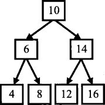

# 面试需要的基础知识

## 面试官谈基础知识
面向对象的特性
构造函数
设计模式

内存的使用管理

数据结构和算法
编程能力
部分数学知识
问题的分析和推理能力

编程基本功(字符串处理)
并发控制
算法复杂度
语言的基本概念

编程基础
计算机系统基础知识
算法 
设计能力

OS理解
一门编程语言的掌握程度
常用的算法和数据结构

## 编程语言

在面试的过程中，面试官要么直接问语言的语法，要么让应聘者用一种编程语言写代码解决一个问题，通过写出的代码来判断应聘者对他使用的语言的掌握程度。
### C++
通常语言面试有3种类型。
第一种类型是面试官直接询问应聘者对c++ 概念的理解。这种类型的问题，面试官特别喜欢了解应聘者对c++关键字的理解程度。

面试C/C++的第二种题型就是面试官拿出事先准备好的代码，让应聘者分析代码的运行结果。这种题型选择的代码通常包含比较复杂微妙的语言特性，这要求应聘者对c++考点有着透彻的理解。即使应聘者对考点有一点点模糊，那么最终他得到的结果和实际运行的结果可能就会差距甚远。

第三种题型就是要求应聘者写代码定义一个类型或者实现类型中的成员函数。让应聘者写代码的难度自然比让应聘者分析代码要高不少，因为能想明白的未必就能写得清楚。很多考查C十+语法的代码题围绕在构造函数、析构函数及运算符重载。

## 数据结构

数据结构一直是技术面试的重点，大多数面试题都是围绕着数组、字符串、链表、树、栈及队列这几种常见的数据结构展开的，因此每一个应聘者都要熟练掌握这几种数据结构。

数组和字符串是两种最基本的数据结构，它们用连续内存分别存储数字和字符。链表和树是而试中出现频率最高的数据结构。由于操作链表和树需要操作大量的指针，应聘者在解决相关问题的时候一定要留意代码的鲁棒性，否则容易出现程序崩溃的问题。栈是一个与递归紧密相关的数据结构，同样队列也与广度优先遍历算法紧密相关。深刻理解这两种数据结构能帮助我们解决很多算法问题。

### 数组

数组可以说是最简单的一种数据结构，它占据一块连续的内存并按照顺序存储数据。创建数组时，我们需要首先指定数组的容量大小，然后根据大小分配内存。即使我们只在数组中存储一个数字，也需要为所有的数据预先分配内存。因此数组的空间效率不是很好，经常会有空闲的区域没有得到充分利用。

由于数组中的内存是连续的，于是可以根据下标在0(1)时间读/写任何元素，因此它的时间效率是很高的。我们可以根据数组时间效率高的优点，用数组来实现简单的哈希表：把数组的下标设为哈希表的键值(Key),而把数组中的每一个数字设为哈希表的值(Value),这样每一个下标及数组中该下标对应的数字就组成了一个键值一值的配对。有了这样的哈希表，我们就可以在0(1)实现查找，从而可以快速高效地解决很多问题。

为了解决数组空间效率不高的问题，人们又设计实现了多种动态数组，比如C++的STL中的vector.为了避免浪费，我们先为数组开辟较小的空间，然后往数组中添加数据。当数据的数目超过数组的容量时，我们再重新分配一块更大的空间(STL的vector每次扩充容量时，新的容量都是前一次的两倍），把之前的数据复制到新的数组中，再把之前的内存释放，这样就能减少内存的浪费。但我们也注意到每一次扩充数组容量时都有大量的额外操作，这对时间性能有负面影响，因此使用动态数组时要尽量减少改变数组容量大小的次数。

**数组和指针的区别与联系**
当我们声明一个数组时，其数组的名字也是一个指针，该指针指向数组的第一个元素。我们可以用一个指针来访问数组。但值得注意的是，C/C++没有记录数组的大小，因此用指针访问数组中的元素时，程序员要确保没有超出数组的边界。

### 字符串
字符串是由若干字符组成的序列。由于字符串在编程时使用的频率非常高，为了优化，很多语言都对字符串做了特殊的规定。


### 链表

链表应该是面试时被提及最频繁的数据结构。

链表的结构很简单，它由指针把若干个结点连接成链状结构。

链表的创建、插入结点、删除结点等操作都只需要20行左右的代码就能实现，其代码量比较适合面试。而像哈希表、有向图等复杂数据结构，实现它们的一个操作需要的代码量都较大，很难在几十分钟的面试中完成。另外，由于链表是一种动态的数据结构，其操作需要对指针进行操作，因此应聘者需要有较好的编程功底才能写出完整的操作链表的代码。而且链表这种数据结构很灵活，面试官可以用链表来设计具有挑战性的面试题。基于上述几个原因，很多面试官都特别青睐链表相关的题目。

我们说链表是一种动态数据结构，是因为在创建链表时，无须知道链表的长度。当插入一个结点时，我们只需要为新结点分配内存·然后调整指针的指向来确保新结点被链接到链表当中。内存分配不是在创建链表时一次性完成，而是每添加一个结点分配一次内存。由于没有闲置的内存，链表的空间效率比数组高。如果单向链表的结点定义如下

### 树
树是一种在实际编程中经常遇到的数据结构。

它的逻辑很简单：除了根结点之外每个结点只有一个父结点，根结点没有父结点；除了叶结点之外所有结点都有一个或多个子结点，叶结点没有子结点。父结点和子结点之间用指针链接。

由于树的操作会涉及大量的指针，因此与树有关的面试题都不太容易。当面试官想考查应聘者在有复杂指针操作的情况下写代码的能力，他往往会想到用与树有关的面试题。

面试的时候提到的树，大部分都是二叉树。

所谓二叉树是树的一种特殊结构，在二叉树中每个结点最多只能有两个子结点。在二叉树中最重要的操作莫过于遍历，即按照某一顺序访问树中的所有结点。通常树有如下几种遍历方式：

- 前序遍历：先访问根结点，再访问左子结点，最后访问右子结点。

    图中的二叉树的前序遍历的顺序是10、6、4、8、14、12、16。 
- 中序遍历：先访问左子结点，再访问根结点，最后访问右子结点。

    图中的二叉树的中序遍历的顺序是4、6、8、10、12、14、16。 
- 后序遍历：先访问左子结点，再访问右子结点，最后访问根结点。

    图中的二叉树的后序遍历的顺序是4、8、6、12、16、14、10。



这3种遍历都有递归和循环两种不同的实现方法，每一种遍历的递归实现都比循环实现要简捷很多。
因此应聘者应该对这3种遍历的6种实现方法都了如指掌。

**宽度优先遍历**：先访问树的第一层结点，再访问树的第二层结点，一“一直到访问到最下面一层结点。在同一层结点中，以从左到右的顺序依次访问。我们可以对包括二叉树在内的所有树进行宽度优先遍历。
上图中的二叉树的宽度优先遍历的顺序是10、6、14、 4、8、12、16。

二叉树有很多特例，二叉搜索树就是其中之一。在二叉搜索树中，左子结点总是小于或等于根结点，而右子结点总是大于或等于根结点。图2．5中的二叉树就是一棵二叉搜索树。我们可以平均在O(logN)的时间内根据数值在二叉搜索树中找到一个结点。

二叉树有很多特例，二叉搜索树就是其中之一。在二叉搜索树中，左子结点总是小于或等于根结点，而右子结点总是大于或等于根结点。图2．5中的二叉树就是一棵二叉搜索树。我们可以平均在）的时间内根据数值在二叉搜索树中找到一个结点。

二叉树的另外两个特例是堆和红黑树。堆分为最大堆和最小堆。在最大堆中根结点的值最大，在最小堆中根结点的值最小。有很多需要快速找到最大值或者最小值的问题都可以用堆来解决。红黑树是把树中的结点定义为红、黑两种颜色，并通过规则确保从根结点到叶结点的最长路径的长度不超过最短路径的两倍。


### 栈和队列
栈是一个非常常见的数据结构，它在计算机领域中被广泛应用，比如操作系统会给每个线程创建一个栈用来存储函数调用时各个函数的参数、返回地址及临时变量等。栈的特点是后进先出，即最后被压入(push)栈的元素会第一个被弹出(pop)

通常栈是一个不考虑排序的数据结构，我们需要O(n)时间才能找到栈中最大或者最小的元素。如果想要在O(1)时间内得到栈的最大或者最小值，我们需要对栈做特殊的设计.

队列是另外一种很重要的数据结构。和栈不同的是，队列的特点是先进先出，即第一个进入队列的元素将会第一个出来。

栈和队列虽然是特点针锋相对的两个数据结构，但有意思的是它们却相互联系。


## 算法和数据操作
和数据结构一样，考查算法的面试题也备受面试官的青睐，其中排序和查找是面试时考查算法的重点。在准备面试的时候，我们应该重点掌握**二分查找、归并排序和快速排序**，做到能随时正确、完整地写出它们的代码。
有很多算法都可以用递归和循环两种不同的方式实现。通常基于递归的实现方法代码会比较简洁，但性能不如基于循环的实现方法。在面试的时候，我们可以根据题目的特点，甚至可以和面试官讨论选择合适的方法编程。
位运算可以看成是一类特殊的算法，它是把数字表示成二进制之后对0 和1的操作。由于位运算的对象为二进制数字，所以不是很直观，但掌握它也不难，因为总共只有与、或、异或、左移和右移5种位运算。

### 查找和排序
查找和排序都是在程序设计中经常用到的算法。查找相对而言较为简单，不外乎顺序查找、二分查找、哈希表查找和二叉排序树查找。在面试的时候，不管是用循环还是用递归，面试官都期待应聘者能够信手拈来写出完整正确的二分查找代码，否则可能连继续面试的兴趣都没有。

哈希表和二叉排序树查找的重点在于考查对应的数据结构而不是算法。哈希表最主要的优点是我们利用它能够在O(1)时间查找某一元素，是效率最高的查找方式。但其缺点是需要额外的空间来实现哈希表。

与二叉排序树查找算法对应的数据结构是二叉搜索树.

排序比查找要复杂一些。面试官会经常要求应聘者比较插入排序、冒泡排序、归并排序、快速排序等不同算法的优劣。**强烈建议应聘者在准备面试的时候，一定要对各种排序算法的特点烂熟于胸，能够从额外空间消耗、平均时间复杂度和最差时间复杂度等方面去比较它们的优缺点**。需要特别强调的是，很多公司的面试官喜欢在面试环节中要求应聘者写出快速排序的代码。

实现快速排序算法的关键在于在数组中选择一个数字，接下来把数组中的数字分为两部分，比选择的数字小的数字移到数组的左边，比选择的数字大的数字移到数组的右边。
### 递归和循环
如果我们需要重复地多次计算相同的问题，通常可以选择用递归或者循环两种不同的方法。递归是在一个函数的内部调用这个函数自身。而循环则是通过设置计算的初始值及终止条件，在一个范围内重复运算。比如求1 +2+...+n,我们可以用递归或者循环两种方式求出结果.

**面试小提示:** 
通常基于递归实现的代码比基于循环实现的代码要简洁很多，更加容易实现。如果面试官没有特殊要求，应聘者可以优先采用递归的方法蝙程。

递归虽然有简洁的优点，但它同时也有显著的缺点。递归由于是函数调用自身，而函数调用是有时间和空间的消耗的：每一次函数调用，都需要在内存栈中分配空间以保存参数、返回地址及临时变量，而且往栈里压入数据和弹出数据都需要时间。这就不难理解上述的例子中递归实现的效率不如循环。
另外，递归中有可能很多计算都是重复的，从而对性能带来很大的负面影响。递归的本质是把一个问题分解成两个或者多个小问题。如果多个小问题存在相互重叠的部分，那么就存在重复的计算。

除了效率之外，递归还有可能引起更严重的问题：调用栈溢出。前面分析中提到需要为每一次函数调用在内存栈中分配空间，而每个进程的栈的容量是有限的。当递归调用的层级太多时，就会超出栈的容量，从而导致调用栈溢出。
### 位运算
位运算是把数字用二进制表示之后，对每一位上0或者1的运算。
进制及其位运算是现代计算机学科的基石，很多底层的技术都离不开位运算，因此位运算相关的题目也经常出现在面试中。由于我们在H常生活中习惯了十进制，很多人看到二进制及位运算都觉得很难适应。
理解位运算的第一步是理解二进制。二进制是指数字的每一位都是0 或者10比如十进制的2转化为二进制之后是10,而十进制的10转换成二进制之后是1010。
其实二进制的位运算并不是很难掌握，因为位运算总共只有五种运算：与、或、异或、左移和右移。与、或和异或运算的规律我们可以用表总结如下：


左移运算符m << n表示把m左移n位。左移n位的时候，最左边的n 位将被丢弃，同时在最右边补上n个0。比如：

```
00001010 << 2 = 00101000 
10001010 << 3 = 01010000
```

右移运算符m >> n表示把m右移n位。右移n位的时候，最右边的n 位将被丢弃。但右移时处理最左边位的情形要稍微复杂一点。如果数字是一个无符号数值，则用0填补最左边的n位。如果数字是一个有符号数值，则用数字的符号位填补最左边的n位。也就是说如果数字原先是一个正数，则右移之后在最左边补n个0；如果数字原先是负数，则右移之后在最左边补n个1;下面是对两个8位有符号数作右移的例子：

```
00001010 >> 2 = 00000010 
10001010 >> 3 = 11110001
```

