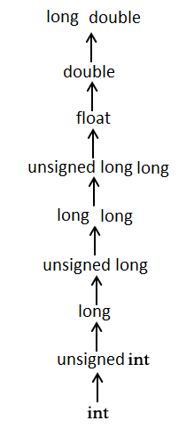

# C语言基础
- 基本语法
- 数据类型
- 变量
- 常量
- 运算符


## 基本语法
**C 的令牌（Tokens）**

C 程序由各种令牌组成，令牌可以是关键字、标识符、常量、字符串值，或者是一个符号。 C 语句包括五个令牌：
- 分号 `;`
- 注释
- 标识符
- 关键字
- C 中的空格
### 分号 `;`
在 C 程序中，分号是语句结束符。也就是说，每个语句必须以分号结束。它表明一个逻辑实体的结束。
### 注释
C 语言有两种注释方式：
- 单行注释

    以 // 开始的单行注释，这种注释可以单独占一行。

- 多行注释 

    /* */ 这种格式的注释可以单行或多行。
> 不能在注释内嵌套注释，注释也不能出现在字符串或字符值中。
### 标识符
C 标识符是用来标识变量、函数，或任何其他用户自定义项目的名称。
- 一个标识符以字母 A-Z 或 a-z 或下划线 _ 开始，后跟零个或多个字母、下划线和数字（0-9）。
- C 标识符内不允许出现标点字符，比如 @、$ 和 %。
- C 是区分大小写的编程语言。因此，在 C 中，Manpower 和 manpower 是两个不同的标识符。
### 关键字
 C 中的保留字如下：
|关键字|	说明|
|------|------|
|auto|	声明自动变量
|break|	跳出当前循环
|case|	开关语句分支
|char|	声明字符型变量或函数返回值类型
|const|	声明只读变量
|continue|	结束当前循环，开始下一轮循环
|default|	开关语句中的"其它"分支
|do|	循环语句的循环体
|double|	声明双精度浮点型变量或函数返回值类型
|else|	条件语句否定分支（与 if 连用）
|enum|	声明枚举类型
|extern|	声明变量或函数是在其它文件或本文件的其他位置定义
|float|	声明浮点型变量或函数返回值类型
|for|	一种循环语句
|goto|	无条件跳转语句
|if|	条件语句
|int|	声明整型变量或函数
|long|	声明长整型变量或函数返回值类型
|register|	声明寄存器变量
|return|	子程序返回语句（可以带参数，也可不带参数）
|short|	声明短整型变量或函数
|signed|	声明有符号类型变量或函数
|sizeof|	计算数据类型或变量长度（即所占字节数）
|static|	声明静态变量
|struct|	声明结构体类型
|switch|	用于开关语句
|typedef|	用以给数据类型取别名
|unsigned|	声明无符号类型变量或函数
|union|	声明共用体类型
|void|	声明函数无返回值或无参数，声明无类型指针
|volatile|	说明变量在程序执行中可被隐含地改变
|while|	循环语句的循环条件

 > 这些保留字不能作为常量名、变量名或其他标识符名称。
#### C99 新增关键字
```
_Bool	_Complex	_Imaginary	inline	restrict
```
#### C11 新增关键字
```
_Alignas	_Alignof	_Atomic	_Generic	_Noreturn   _Static_assert	_Thread_local
```

### C 中的空格
只包含空格的行，被称为空白行，可能带有注释，C 编译器会完全忽略它。

在 C 中，空格用于描述空白符、制表符、换行符和注释。空格分隔语句的各个部分，让编译器能识别语句中的某个元素（比如 int）在哪里结束，下一个元素在哪里开始。

## 数据类型
C 中的类型可分为以下几种：
- 基本类型：
    
    它们是算术类型，包括两种类型：

    - 整数类型
    - 浮点类型。
- 枚举类型：
    
    它们也是算术类型，被用来定义在程序中只能赋予其一定的离散整数值的变量。
- void 类型：

    类型说明符 void 表明没有可用的值。
- 派生类型：

    它们包括：指针类型、数组类型、结构类型、共用体类型和函数类型。

> 数组类型和结构类型统称为聚合类型。
>
> 函数的类型指的是函数返回值的类型。
### 整数类型
|类型|	存储大小|	值范围|
|-----|------|------|
|char|	1 字节|	-128 到 127 或 0 到 255|
|unsigned char|	1 字节|	0 到 255|
|signed char|	1 字节|	-128 到 127|
|int|	2 或 4 字节|	-32,768 到 32,767 或 -2,147,483,648 到 2,147,483,647|
|unsigned int|	2 或 4 字节|	0 到 65,535 或 0 到 4,294,967,295|
|short|	2 字节|	-32,768 到 32,767|
|unsigned short|	2 字节|	0 到 65,535|
|long|	4 字节|	-2,147,483,648 到 2,147,483,647|
|unsigned long|	4 字节|	0 到 4,294,967,295|

> 各种类型的存储大小与系统位数有关，但目前通用的以64位系统为主。

**示例：获取某个类型或某个变量在特定平台上的准确大小，**
```
#include <stdio.h>
#include <limits.h>
 
int main()
{
   printf("int 存储大小 : %lu \n", sizeof(int)); //%lu 为 32 位无符号整数，
   
   return 0;
}
```

### 浮点类型
|类型|	存储大小|	值范围|	精度|
|-----|------|------|------|
|float|	4 字节|	1.2E-38 到 3.4E+38|	6 位小数
|double|	8 字节|	2.3E-308 到 1.7E+308|	15 位小数|
|long double|	16 字节|	3.4E-4932 到 1.1E+4932|	19 位小数|
>头文件 float.h 定义了宏，在程序中可以使用这些值和其他有关实数二进制表示的细节

**示例：**
```
#include <stdio.h>
#include <float.h>
 
int main()
{
   printf("float 存储最大字节数 : %d \n", sizeof(float));
   printf("float 最小值: %E\n", FLT_MIN ); //%E 为以指数形式输出单、双精度实数
   printf("float 最大值: %E\n", FLT_MAX );
   printf("精度值: %d\n", FLT_DIG );
   
   return 0;
}

```
### [字符类型](./C字符.md)
### [字符串类型](./C字符串.md)
### 强制类型转换
强制类型转换是把变量从一种类型转换为另一种数据类型。

```
(type_name) expression
```
#### 整数提升
整数提升是指把小于 int 或 unsigned int 的整数类型转换为 int 或 unsigned int 的过程。

#### 常用的算术转换
常用的算术转换是隐式地把值强制转换为相同的类型。编译器首先执行整数提升，如果操作数类型不同，则它们会被转换为下列层次中出现的最高层次的类型：



> 常用的算术转换不适用于赋值运算符、逻辑运算符 `&& `和`||`
### void 类型
void 类型指定没有可用的值。它通常用于以下三种情况下：

|类型| 描述|
|------|------|
|函数返回为空|C 中有各种函数都不返回值，或者您可以说它们返回空。不返回值的函数的返回类型为空。例如 void exit (int status);|
|函数参数为空|C 中有各种函数不接受任何参数。不带参数的函数可以接受一个 void。例如 int rand(void);|
|指针指向 void|类型为 void * 的指针代表对象的地址，而不是类型。例如，内存分配函数 void *malloc( size_t size ); 返回指向 void 的指针，可以转换为任何数据类型。|

### [枚举类型](./Cenum(枚举).md)

### 派生类型：

它们包括：[数组类型](./C数组.md)、[指针类型](./C指针.md)、[结构类型](./C结构体.md)、[共用体类型](./C共用体.md)和[函数类型](./C函数.md)。
## 变量
变量其实只不过是程序可操作的存储区的名称。C 中每个变量都有特定的类型，类型决定了变量存储的大小和布局，该范围内的值都可以存储在内存中，运算符可应用于变量上。

- 变量的名称可以由字母、数字和下划线字符组成。
- 它必须以字母或下划线开头。
- 大写字母和小写字母是不同的，因为 C 是大小写敏感的

**基本的变量类型：**

|类型|	描述|
|------|------|
|char|	通常是一个字节（八位）。这是一个整数类型。|
|int|	对机器而言，整数的最自然的大小。|
|float|	单精度浮点值。单精度是这样的格式，1位符号，8位指数，23位小数。|
|double	|双精度浮点值。双精度是1位符号，11位指数，52位小数。|
|void|	表示类型的缺失。|
> C 语言也允许定义各种其他类型的变量，比如枚举、指针、数组、结构、共用体等等


### 变量定义
变量定义就是告诉编译器在何处创建变量的存储，以及如何创建变量的存储。

**语法：**

变量定义指定一个数据类型，并包含了该类型的一个或多个变量的列表，如下所示：
```
type variable_list;
```
> type 必须是一个有效的 C 数据类型，可以是 char、w_char、int、float、double 或任何用户自定义的对象，
>
>variable_list 可以由一个或多个标识符名称组成，多个标识符之间用逗号分隔。

下面列出几个有效的声明：
```
int    i, j, k; //声明并定义了变量 i、j 和 k，这指示编译器创建类型为 int 的名为 i、j、k 的变量。
char   c, ch;
float  f, salary;
double d;
```
**带初始化的变量定义**

变量可以在声明的时候被初始化（指定一个初始值）。初始化器由一个等号，后跟一个常量表达式组成，如下所示：
```
type variable_name = value;
```
下面列举几个实例：
```
extern int d = 3, f = 5;    // d 和 f 的声明与初始化
int d = 3, f = 5;           // 定义并初始化 d 和 f
byte z = 22;                // 定义并初始化 z
char x = 'x';               // 变量 x 的值为 'x'
```
**不带初始化的变量定义**

不带初始化的定义：带有静态存储持续时间的变量会被隐式初始化为 NULL（所有字节的值都是 0），其他所有变量的初始值是未定义的。
### 变量声明

变量声明向编译器保证变量以指定的类型和名称存在，这样编译器在不需要知道变量完整细节的情况下也能继续进一步的编译。

变量声明只在编译时有它的意义，在程序连接时编译器需要实际的变量声明。

变量的声明有两种情况：

1. 一种是需要建立存储空间的。

    例如：`int a `在声明的时候就已经建立了存储空间。
2. 另一种是不需要建立存储空间的，通过使用`extern`关键字声明变量名而不定义它。 
    
    例如：`extern int a `其中变量 a 可以在别的文件中定义的。
> 除非有extern关键字，否则都是变量的定义。
```
extern int i; //声明，不是定义
int i; //声明，也是定义
```

### C 中的左值（Lvalues）和右值（Rvalues）

C中有两种类型的表达式：

- 左值（lvalue）：指向内存位置的表达式被称为左值（lvalue）表达式。左值可以出现在赋值号的左边或右边。
- 右值（rvalue）：术语右值（rvalue）指的是存储在内存中某些地址的数值。右值是不能对其进行赋值的表达式，也就是说，右值可以出现在赋值号的右边，但不能出现在赋值号的左边。

变量是左值，因此可以出现在赋值号的左边。数值型的字面值是右值，因此不能被赋值，不能出现在赋值号的左边。
## 常量
- 常量是固定值，在程序执行期间不会改变。这些固定的值，又叫做字面量。

- 常量可以是任何的基本数据类型，比如整数常量、浮点常量、字符常量，或字符串字面值，也有枚举常量。

- 常量就像是常规的变量，只不过常量的值在定义后不能进行修改。
### 整数常量
整数常量可以是十进制、八进制或十六进制的常量。前缀指定基数：
- 0x 或 0X 表示十六进制，
- 0 表示八进制，
- 不带前缀则默认表示十进制。

整数常量也可以带一个后缀，后缀是 U 和 L 的组合，
- U 表示无符号整数（unsigned），
- L 表示长整数（long）。
- 后缀可以是大写，也可以是小写，U 和 L 的顺序任意。
### 浮点常量
浮点常量由整数部分、小数点、小数部分和指数部分组成。您可以使用小数形式或者指数形式来表示浮点常量。

当使用小数形式表示时，必须包含整数部分、小数部分，或同时包含两者。当使用指数形式表示时， 必须包含小数点、指数，或同时包含两者。带符号的指数是用 e 或 E 引入的。
### 字符常量
字符常量是括在单引号中，例如，'x' 可以存储在 char 类型的简单变量中。

> 字符常量可以是一个普通的字符（例如 'x'）、一个转义序列（例如 '\t'），或一个通用的字符（例如 '\u02C0'）。

在 C 中，有一些特定的字符，当它们前面有反斜杠时，它们就具有特殊的含义，被用来表示如换行符（\n）或制表符（\t）等。下表列出了一些这样的转义序列码：

|转义序列|	含义|
|------|------|
|\\|	\ 字符|
|\'|	' 字符|
|\"|	" 字符|
|\?|	? 字符|
|\a|	警报铃声|
|\b|	退格键|
|\f|	换页符|
|\n|	换行符|
|\r|	回车|
|\t|	水平制表符|
|\v	|垂直制表符|
|\ooo|	一到三位的八进制数|
|\xhh . . .	|一个或多个数字的十六进制数|

### 字符串常量
字符串字面值或常量是括在双引号 "" 中的。一个字符串包含类似于字符常量的字符：普通的字符、转义序列和通用的字符。

> 可以使用空格做分隔符，把一个很长的字符串常量进行分行。

### 定义常量
在 C 中，有两种简单的定义常量的方式：

- 使用 #define 预处理器。
- 使用 const 关键字。

**示例： `#define` 预处理器**

下面是使用 #define 预处理器定义常量的形式：
```
#define identifier value
#define LENGTH 10 
```
**示例：const 关键字**

可以使用 const 前缀声明指定类型的常量，如下所示：
```
const type variable = value;
const int  LENGTH = 10;
```
> 注意：通常把常量定义为大写字母形式，
## 运算符
运算符是一种告诉编译器执行特定的数学或逻辑操作的符号。C 语言内置了丰富的运算符，并提供了以下类型的运算符：

- 算术运算符
- 关系运算符
- 逻辑运算符
- 位运算符
- 赋值运算符
- 杂项运算符

### 算术运算符
|运算符|	描述|	
|------|------|
|+|	把两个操作数相加|	
|-|	从第一个操作数中减去第二个操作数|	
|*|	把两个操作数相乘|	
|/|	分子除以分母|	
|%|	取模运算符，整除后的余数|	
|++|	自增运算符，整数值增加 1|	
|--|	自减运算符，整数值减少 1|
### 关系运算符
|运算符|	描述|	实例|
|------|------|------|
|==|	检查两个操作数的值是否相等，如果相等则条件为真。|	(A == B) 不为真。
|!=|	检查两个操作数的值是否相等，如果不相等则条件为真。|	(A != B) 为真。
|>|	检查左操作数的值是否大于右操作数的值，如果是则条件为真。|	(A > B) 不为真。
|<|	检查左操作数的值是否小于右操作数的值，如果是则条件为真。|	(A < B) 为真。
|>=	|检查左操作数的值是否大于或等于右操作数的值，如果是则条件为真。|	(A >= B) 不为真。
|<=|	检查左操作数的值是否小于或等于右操作数的值，如果是则条件为真。|	(A <= B) 为真。
### 逻辑运算符
|运算符|	描述|	实例|
|------|------|------|
|&&|	称为逻辑与运算符。如果两个操作数都非零，则条件为真。|	(A && B) 为假。
|`||`|	称为逻辑或运算符。如果两个操作数中有任意一个非零，则条件为真。|	(A || B) 为真。
|!|	称为逻辑非运算符。用来逆转操作数的逻辑状态。如果条件为真则逻辑非运算符将使其为假。|	!(A && B) 为真。
### 位运算符
位运算符作用于位，并逐位执行操作。&、 | 和 ^ 的真值表如下所示：

|p|         q|  p & q|  `p | q`|   p ^ q|
|------|------|------|------|------|
|0|	0|	0|	0|	0|
|0|	1|	0|	1|	1|
|1|	1|	1|	1|	0|
|1|	0|	0|	1|	1|

|运算符|	描述|	实例|
|------|------|------|
|&|	按位与操作，按二进制位进行"与"运算。运算规则：<br>0&0=0;   <br>0&1=0;   <br> 1&0=0;  <br>   1&1=1;|	(A & B) 将得到 12，即为 0000 1100
|`|`|	按位或运算符，按二进制位进行"或"运算。运算规则：<br>`0|0`=0; <br>  `0|1`=1; <br>  `1|0`=1; <br>   `1|1`=1;<br>|	(A | B) 将得到 61，即为 0011 1101
|^|	异或运算符，按二进制位进行"异或"运算。运算规则：<br>0^0=0;  <br> 0^1=1; <br> 1^0=1; <br> 1^1=0;	|(A ^ B) 将得到 49，即为 0011 0001
|~|	取反运算符，按二进制位进行"取反"运算。运算规则：<br>~1=0; <br>  ~0=1;<br>	|(~A ) 将得到 -61，即为 1100 0011，一个有符号二进制数的补码形式。
|<<|	二进制左移运算符。将一个运算对象的各二进制位全部左移若干位（左边的二进制位丢弃，右边补0）。|	A << 2 将得到 240，即为 1111 0000|
|>>|	二进制右移运算符。将一个数的各二进制位全部右移若干位，正数左补0，负数左补1，右边丢弃。|A >> 2 将得到 15，即为 0000 1111
### 赋值运算符
|运算符|	描述|	实例|
|------|------|------|
|=|	简单的赋值运算符，把右边操作数的值赋给左边操作数|	C = A + B 将把 A + B 的值赋给 C
|+=|	加且赋值运算符，把右边操作数加上左边操作数的结果赋值给左边操作数|	C += A 相当于 C = C + A
|-=|	减且赋值运算符，把左边操作数减去右边操作数的结果赋值给左边操作数|	C -= A 相当于 C = C - A
|*=	|乘且赋值运算符，把右边操作数乘以左边操作数的结果赋值给左边操作数|	C *= A 相当于 C = C * A
|/=|	除且赋值运算符，把左边操作数除以右边操作数的结果赋值给左边操作数|	C /= A 相当于 C = C / A
|%=|	求模且赋值运算符，求两个操作数的模赋值给左边操作数|	C %= A 相当于 C = C % A
|<<=|	左移且赋值运算符|	C <<= 2 等同于 C = C << 2
|>>=|	右移且赋值运算符|	C >>= 2 等同于 C = C >> 2
|&=|	按位与且赋值运算符|	C &= 2 等同于 C = C & 2
|^=	|按位异或且赋值运算符|	C ^= 2 等同于 C = C ^ 2
|`|=`|	按位或且赋值运算符|	C |= 2 等同于 C = C | 2
### 杂项运算符- sizeof & 三元
下表列出了 C 语言支持的其他一些重要的运算符，包括 sizeof 和 ? :。

|运算符|	描述|	实例|
|------|------|------|
|sizeof()|	返回变量的大小。|	sizeof(a) 将返回 4，其中 a 是整数。
|&|	返回变量的地址。|	`&a`; 将给出变量的实际地址。
|*|	指向一个变量。|	*a; 将指向一个变量。
|?:|	条件表达式|	如果条件为真 ? 则值为 X : 否则值为 Y
### C 中的运算符优先级
运算符的优先级确定表达式中项的组合。

下表将按运算符优先级从高到低列出各个运算符，具有较高优先级的运算符出现在表格的上面，具有较低优先级的运算符出现在表格的下面。在表达式中，较高优先级的运算符会优先被计算。

|类别| 	运算符| 	结合性| 
|------|------|------|
|后缀 |	() [] -> . ++ - - | 	从左到右 
|一元| 	+ - ! ~ ++ - - (type)* & sizeof |	从右到左 
|乘除| 	* / % |	从左到右 
|加减| 	+ - |	从左到右 
|移位| 	<< >> |	从左到右 
|关系| 	< <= > >= |	从左到右 
|相等| 	== != |	从左到右 
|位与| AND 	& |	从左到右 
|位异或| XOR 	^ |	从左到右 
|位或| OR 	`|` |	从左到右 
|逻辑与| AND 	&&| 	从左到右 
|逻辑或| OR 	`||`| 	从左到右 
|条件| 	?:|从右到左 
|赋值| 	= += -= *= /= %=>>= <<= &= ^= `|=` |	从右到左 
|逗号| 	, |	从左到右 