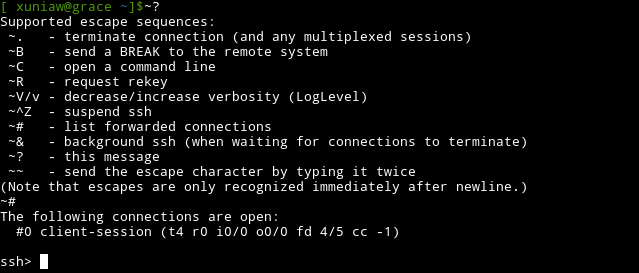

# Linux SSH
## 什么是SSH？

简单说，SSH是一种网络协议，用于计算机之间的加密登录。

如果一个用户从本地计算机，使用SSH协议登录另一台远程计算机，我们就可以认为，这种登录是安全的，即使被中途截获，密码也不会泄露。

需要指出的是，SSH只是一种协议，存在多种实现，既有商业实现，也有开源实现
> OpenSSH :http://www.openssh.com/
> PuTTY【Windows】:http://www.chiark.greenend.org.uk/~sgtatham/putty
## SSH服务
1. SSH服务的开启
执行命令
```
systemctl start sshd.service 
``` 
或者
```
service sshd status 
```
可以查看SSH服务是否启动。(centOS 5 中可以使用命令` /etc/init.d/ssh status` )
- active表示SSH服务是启动的。
- inactive表示SSH服务已关闭

2. 服务操作

    - 执行命令 `systemctl start sshd.service` 或者 `service sshd start` 启动SSH服务。
    - 执行命令 `systemctl stop sshd.service` 或者 `service sshd stop` 停止SSH服务。
    - 执行命令 `systemctl restart sshd.service` 或者 `service sshd restart `重启SSH服务。
    - 执行命令 `systemctl enable sshd.service` 或者 `service sshd enable` 设置服务开机自启。
## 口令登录
第一次登录对方主机，系统会出现下面的提示：
```
 　　   $ ssh user@host
    
    　　The authenticity of host 'host (12.18.429.21)' can't be established.
    
    　　RSA key fingerprint is 98:2e:d7:e0:de:9f:ac:67:28:c2:42:2d:37:16:58:4d.
    
    　　Are you sure you want to continue connecting (yes/no)?

```

这段话的意思是，无法确认host主机的真实性，只知道它的公钥指纹，问你还想继续连接吗？
> 所谓"公钥指纹"，是指公钥长度较长（这里采用RSA算法，长达1024位），很难比对，所以对其进行MD5计算，将它变成一个128位的指纹。
用户决定接受这个远程主机的公钥。
```
　　Are you sure you want to continue connecting (yes/no)? yes
```
系统会出现一句提示，表示host主机已经得到认可。
```
　　Warning: Permanently added 'host,12.18.429.21' (RSA) to the list of known hosts.
```
然后，会要求输入密码。
```
　　Password: (enter password)
```
如果密码正确，就可以登录了。

当远程主机的公钥被接受以后，它就会被保存在文件`$HOME/.ssh/known_hosts`之中。下次再连接这台主机，系统就会认出它的公钥已经保存在本地了，从而跳过警告部分，直接提示输入密码。

每个SSH用户都有自己的`known_hosts`文件，此外系统也有一个这样的文件，通常是`/etc/ssh/ssh_known_hosts`，保存一些对所有用户都可信赖的远程主机的公钥。

## 公钥登录【免密登录】
所谓"公钥登录"，原理很简单，就是用户将自己的公钥储存在远程主机上。登录的时候，远程主机会向用户发送一段随机字符串，用户用自己的私钥加密后，再发回来。远程主机用事先储存的公钥进行解密，如果成功，就证明用户是可信的，直接允许登录shell，不再要求密码。
> 免密登录的原理 ： https://www.digitalocean.com/community/tutorials/ssh-essentials-working-with-ssh-servers-clients-and-keys
这种方法要求用户必须提供自己的公钥。如果没有现成的，可以直接用ssh-keygen生成一个：
```
　　$ ssh-keygen
```
运行上面的命令以后，系统会出现一系列提示，可以一路回车。其中有一个问题是，要不要对私钥设置口令（passphrase），如果担心私钥的安全，这里可以设置一个。

运行结束以后，在`$HOME/.ssh/`目录下，会新生成两个文件：`id_rsa.pub`和`id_rsa`。前者是你的公钥，后者是你的私钥。

这时再输入下面的命令，将公钥传送到远程主机host上面：
```
　　$ ssh-copy-id user@host
```
好了，从此你再登录，就不需要输入密码了。

如果还是不行，就打开远程主机的`/etc/ssh/sshd_config`这个文件，检查下面几行前面"#"注释是否取掉。

    　　RSAAuthentication yes
    　　PubkeyAuthentication yes
    　　AuthorizedKeysFile .ssh/authorized_keys
    
然后，重启远程主机的ssh服务。

    　　// ubuntu系统
    　　service ssh restart
    
    　　// debian系统
    　　/etc/init.d/ssh restart
    

### authorized_keys文件

远程主机将用户的公钥，保存在登录后的用户主目录的`$HOME/.ssh/authorized_keys`文件中。公钥就是一段字符串，只要把它追加在`authorized_keys`文件的末尾就行了。

这里不使用上面的`ssh-copy-id`命令，改用下面的命令，解释公钥的保存过程：
```
　　$ ssh user@host 'mkdir -p .ssh && cat >> .ssh/authorized_keys' < ~/.ssh/id_rsa.pub
```
这条命令由多个语句组成，依次分解开来看：
- （1）`"$ ssh user@host"`，表示登录远程主机；
- （2）单引号中的`mkdir .ssh && cat >> .ssh/authorized_keys`，表示登录后在远程shell上执行的命令：
- （3）`"$ mkdir -p .ssh"`的作用是，如果用户主目录中的.ssh目录不存在，就创建一个；
- （4）`'cat >> .ssh/authorized_keys' < ~/.ssh/id_rsa.pub`的作用是，将本地的公钥文件`~/.ssh/id_rsa.pub`，重定向追加到远程文件authorized_keys的末尾。

写入`authorized_keys`文件后，公钥登录的设置就完成了。
## 命令整理
### 基本用法
SSH 命令只需要指定用户名和主机名参数即可. 主机名可以是 IP 地址或者域名. 命令格式如下:
```
$ ssh user@hostname
```
### 使用其他端口
SH 默认连接到目标主机的 22 端口上,但是由于各种原因你可能需要连接到其他端口.
```
ssh -p 10022 user@hostname
```
### 远程执行命令
```
$ ssh pi@10.42.0.47 ls -l
```
eg.
```
　$ ssh user@host 'mkdir -p .ssh && cat >> .ssh/authorized_keys' < ~/.ssh/id_rsa.pub
```
单引号中间的部分，表示在远程主机上执行的操作；后面的输入重定向，表示数据通过SSH传向远程主机。

这就是说，SSH可以在用户和远程主机之间，建立命令和数据的传输通道

### 绑定本地端口

既然SSH可以传送数据，那么我们可以让那些不加密的网络连接，全部改走SSH连接，从而提高安全性。

假定我们要让8080端口的数据，都通过SSH传向远程主机，命令就这样写：
```
　　$ ssh -D 8080 user@host
```
SSH会建立一个socket，去监听本地的8080端口。一旦有数据传向那个端口，就自动把它转移到SSH连接上面，发往远程主机。可以想象，如果8080端口原来是一个不加密端口，现在将变成一个加密端口。
### 本地端口转发

有时，绑定本地端口还不够，还必须指定数据传送的目标主机，从而形成点对点的"端口转发"。为了区别后文的"远程端口转发"，我们把这种情况称为"本地端口转发"（Local forwarding）。

假定host1是本地主机，host2是远程主机。由于种种原因，这两台主机之间无法连通。但是，另外还有一台host3，可以同时连通前面两台主机。因此，很自然的想法就是，通过host3，将host1连上host2。

我们在host1执行下面的命令：
```
　　$ ssh -L 2121:host2:21 host3
```
命令中的L参数一共接受三个值，分别是"本地端口:目标主机:目标主机端口"，它们之间用冒号分隔。这条命令的意思，就是指定SSH绑定本地端口2121，然后指定host3将所有的数据，转发到目标主机host2的21端口（假定host2运行FTP，默认端口为21）。

这样一来，我们只要连接host1的2121端口，就等于连上了host2的21端口。
```
　　$ ftp localhost:2121
```
"本地端口转发"使得host1和host3之间仿佛形成一个数据传输的秘密隧道，因此又被称为"SSH隧道"。

eg1
```
　　$ ssh -L 5900:localhost:5900 host3
```
它表示将本机的5900端口绑定host3的5900端口（这里的localhost指的是host3，因为目标主机是相对host3而言的）。

eg2

通过host3的端口转发，ssh登录host2。
```
　　$ ssh -L 9001:host2:22 host3
```
这时，只要ssh登录本机的9001端口，就相当于登录host2了。
```
　　$ ssh -p 9001 localhost
```
上面的-p参数表示指定登录端口。
### 远程端口转发

既然"本地端口转发"是指绑定本地端口的转发，那么"远程端口转发"（remote forwarding）当然是指绑定远程端口的转发。

还是接着看上面那个例子，host1与host2之间无法连通，必须借助host3转发。但是，特殊情况出现了，host3是一台内网机器，它可以连接外网的host1，但是反过来就不行，外网的host1连不上内网的host3。这时，"本地端口转发"就不能用了，怎么办？

解决办法是，既然host3可以连host1，那么就从host3上建立与host1的SSH连接，然后在host1上使用这条连接就可以了。

我们在host3执行下面的命令：
```
　　$ ssh -R 2121:host2:21 host1
```
R参数也是接受三个值，分别是"远程主机端口:目标主机:目标主机端口"。这条命令的意思，就是让host1监听它自己的2121端口，然后将所有数据经由host3，转发到host2的21端口。由于对于host3来说，host1是远程主机，所以这种情况就被称为"远程端口绑定"。

绑定之后，我们在host1就可以连接host2了：
```
　　$ ftp localhost:2121
```
这里必须指出，"远程端口转发"的前提条件是，host1和host3两台主机都有sshD和ssh客户端。
### 挂载远程文件系统
基于 SSH 的工具叫 sshfs. sshfs 可以让你在本地直接挂载远程主机的文件系统.

```
$ sshfs -o idmap=user user@hostname:/home/user ~/Remote
```
eg.
```
 sshfs -o idmap=user pi@10.42.0.47:/home/pi ~/Pi
```
该命令就将远程主机 pi 用户的主目录挂载到本地主目录下的 Pi 文件夹.
>  sshfs 教程: https://linoxide.com/how-tos/sshfs-mount-remote-directories/
### X11 图形界面
 SSH 基本命令加上参数 -X 连接到远程主机即可开启 X11 转发功能. 登录后你可能觉得没什么差别, 但是当你运行一个图形界面程序后就会发现其中的不同的.
```
$ ssh -X pi@10.42.0.47
```

eg.
```
$ pistore
```
如果你想在运行图形界面程序的同时做些别的事情, 只需要简单地在命令末尾加一个 & 符号.
```
$ pistore&
```
### 转义字符
SSH 提供了多样的转义字符功能. 用 SSH 连接到任意一台远程主机然后输入 ~? 你就可以看到支持的转义字符和功能说明列表. 以下例子展示了 ~# 和 ~C 的效果.


###  配置 SSH
 SSH 的配置:打开 `/etc/ssh/sshd_config` 进行编辑


### 构建 ssh 密钥对
运行以下命令创建密钥对:
```
$ ssh-keygen -t dsa
```
此命令会要求你输入密码(可以留空), 然后就会生成密钥并会显示一张该密钥对应的随机图.

### 寻找主机密钥
在你准备添加密钥之前不妨先用以下命令看看是否已经添加了对应主机的密钥了.
```
$ ssh-keygen -F 10.42.0.47
```

### 删除主机密钥
某些情况下, 比如主机地址更改或者不再使用某个密钥, 你就可能需要删除某个密钥.
```
$ ssh-keygen -R 10.42.0.47
```
用以上命令就可删除. 这比手动在 ~/.ssh/known_hosts 文件中删除要方便很多.

### SCP进行跨机器拷贝
scp是secure copy的简写，用于在Linux下进行远程拷贝文件的命令，和它类似的命令有cp，不过cp只是在本机进行拷贝不能跨服务器，而且scp传输是加密的。可能会稍微影响一下速度。当你服务器硬盘变为只读 read only system时，用scp可以帮你把文件移出来。另外，scp还非常不占资源，不会提高多少系统负荷，在这一点上，rsync就远远不及它了。虽然 rsync比scp会快一点，但当小文件众多的情况下，rsync会导致硬盘I/O非常高，而scp基本不影响系统正常使用。

1. 命令格式：
```
scp [参数] [原路径] [目标路径]
```
2. 命令功能：
scp是 secure copy的缩写, scp是linux系统下基于ssh登陆进行安全的远程文件拷贝命令。linux的scp命令可以在linux服务器之间复制文件和目录。

3. 使用实例：
scp命令的实际应用概述： 
- 从本地服务器复制到远程服务器：

**复制文件：**

命令格式：
```
scp local_file remote_username@remote_ip:remote_folder
scp local_file remote_username@remote_ip:remote_file
scp local_file remote_ip:remote_folder
scp local_file remote_ip:remote_file
```
- 第1,2个指定了用户名，命令执行后需要输入用户密码，第1个仅指定了远程的目录，文件名字不变，第2个指定了文件名 
- 第3,4个没有指定用户名，命令执行后需要输入用户名和密码，第3个仅指定了远程的目录，文件名字不变，第4个指定了文件名

**复制目录：**

命令格式：
```
scp -r local_folder remote_username@remote_ip:remote_folder
scp -r local_folder remote_ip:remote_folder
```
- 第1个指定了用户名，命令执行后需要输入用户密码； 
- 第2个没有指定用户名，命令执行后需要输入用户名和密码；

注意：remote_folder是一个远程主机上已经存在的文件夹，如果不存在则报错，remote_file是本地文件复制到远程主机上的后新文件名，可以和原文件名不一样。

**从远程服务器复制到本地服务器：**
从远程复制到本地的scp命令与上面的命令雷同，只要将从本地复制到远程的命令后面2个参数互换顺序就行了。
例如：
```
scp root@server01:/home/root/data/abc.txt /home/space/data/123.txt
scp -r server01:/home/root/data/ /home/space/data/ 
```

### SFTP
sftp是Secure File TransferProtocol的缩写，安全文件传送协议。可以为传输文件提供一种安全的加密方法。sftp与 ftp有着几乎一样的语法和功能。SFTP为 SSH的一部分，是一种传输档案至Blogger伺服器的安全方式。其实在SSH软件包中，已经包含了一个叫作SFTP(Secure File Transfer Protocol)的安全文件传输子系统，SFTP本身没有单独的守护进程，它必须使用sshd守护进程（端口号默认是22）来完成相应的连接操作，所以从某种意义上来说，SFTP并不像一个服务器程序，而更像是一个客户端程序。SFTP同样是使用加密传输认证信息和传输的数据，所以，使用SFTP是非常安全的。但是，由于这种传输方式使用了加密/解密技术，所以传输效率比普通的FTP要低得多，如果您对网络安全性要求更高时，可以使用SFTP代替FTP。

1. 连接方式
常用的方式有两种，一种直接采用sftp连接远端服务器IP,另一种则先登录远程服务器，在开启sftp功能
```
sftp [remotehost IP ]
```
通过sftp连接`[host]`，端口为默认的22，用户为Linux当前登录用户。
```
sftp -oPort=[port][remotehost IP]
```
通过sftp连接远程服务器，指定端口`[port]`，用户为Linux当前登录用户。

```
sftp[user]@[remotehost IP]
```
通过sftp连接远程服务器，端口为默认的22，指定用户`[user]`。

```
sftp -oPort=[port][user]@[ remotehost IP]
```
通过sftp连接`[remotehost IP]`，端口为`[port]`，用户为`[user]`。


2. 基本操作命令
首先可以查询该FTP给我们提供了那些基本命令，就输入:help命令，就帮我们显示该FTP提供所有的命令

- pwd：查询linux主机所在目录(也就是远程主机目录)
- lpwd：查询本地目录
- ls：查询连接到当前linux主机所在目录有哪些文件
- lls：查询当前本地上传目录有哪些文件
- lcd：改变本地上传目录的路径
- cd：改变远程上传目录
- get：将远程目录中文件下载到本地目录
- put：将本地目录中文件上传到远程主机(linux)
- put：后面可以接本地文件的绝对路径，也可以回车后弹出选择文件的窗口。
- quit：断开FTP连接
- rename：搬移或重命名一个的远程服务器文件
- rm：删除一个文件
- rmdir：在远程服务器上删除一个目录删除一个目录

