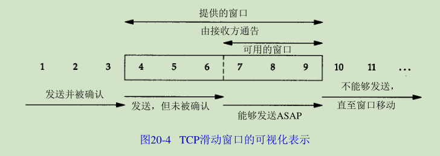

# TCP滑动窗口

## 滑动窗口
滑动窗口通俗来讲就是一种流量控制技术。

它本质上是描述接收方的TCP数据报缓冲区大小的数据，发送方根据这个数据来计算自己最多能发送多长的数据，如果发送方收到接收方的窗口大小为0的TCP数据报，那么发送方将停止发送数据，等到接收方发送窗口大小不为0的数据报的到来.
## 工作原理

 

 在这个图中，我们将字节从 1至11进行标号。接收方通告的窗口称为提出的窗口(offered window)（ o ff e r e d它覆盖了从第4字节到第9字节的区域，表明接收方已经确认了包括第 3字节在内的数据，且通告窗口大小为 6。回顾第1 7章，我们知道窗口大小是与确认序号相对应的。发送方计算它的可用窗口，该窗口表明多少数据可以立即被发送。
 
 当接收方确认数据后，这个滑动窗口不时地向右移动。窗口两个边沿的相对运动增加或减少了窗口的大小。我们使用三个术语来描述窗口左右边沿的运动：

1. 称窗口左边沿向右边沿靠近为窗口合拢。这种现象发生在数据被发送和确认时。
2. 当窗口右边沿向右移动时将允许发送更多的数据，我们称之为窗口张开。这种现象发生在另一端的接收进程读取已经确认的数据并释放了 TCP的接收缓存时。
3. 当右边沿向左移动时，我们称之为窗口收缩。 Host Requirements RFC强烈建议不要使用这种方式。但TCP必须能够在某一端产生这种情况时进行处理。

下图表示了这三种情况。

因为窗口的左边沿受另一端发送的确认序号的控制，因此不可能
向左边移动。如果接收到一个指示窗口左边沿向左移动的 ACK，则它被认为是一个重复 ACK，
并被丢弃。

如果左边沿到达右边沿，则称其为一个零窗口，此时发送方不能够发送任何数据。

示例：

以该图为例可以总结如下几点：
1. 发送方不必发送一个全窗口大小的数据。
2. 来自接收方的一个报文段确认数据并把窗口向右边滑动。这是因为窗口的大小是相对于确认序号的。
3. 正如从报文段7到报文段8中变化的那样，窗口的大小可以减小，但是窗口的右边沿却不能够向左移动。
4. 接收方在发送一个ACK前不必等待窗口被填满。在前面我们看到许多实现每收到两个报文段就会发送一个ACK。
## 窗口大小
由接收方提供的窗口的大小通常可以由接收进程控制，这将影响 TCP的性能。

- 4.2BSD默认设置发送和接受缓冲区的大小为2048个字节。在4.3BSD中双方被增加为4096个字节。正如我们在本书中迄今为止所看到的例子一样， SunOS4.1.3、BSD/386和SVR4仍然使用4096字节的默认大小。其他的系统，如Solaris2.2、4.4BSD和AIX3.2则使用更大的默认缓存大小，如8192或16384等。
- 插口A P I允许进程设置发送和接收缓存的大小。接收缓存的大小是该连接上所能够通告的最大窗口大小。有一些应用程序通过修改插口缓存大小来增加性能。

## PUSH标志
每一个TCP例子中，我们都看到了PUSH标志。

发送方使用该标志通知接收方将所收到的数据全部提交给接收进程。这里的数据包括与 PUSH一起传送的数据以及接收方TCP已经为接收进程收到的其他数据。

在最初的TCP规范中，一般假定编程接口允许发送进程告诉它的 TCP何时设置PUSH标志。
例如，在一个交互程序中，当客户发送一个命令给服务器时，它设置 PUSH标志停下来等待服务器的响应。通过允许客户应用程序通知其 TCP设置PUSH标志，客户进程通知 TCP在向服务器发送个报文段时不要因等待额外数据而使已提交数据在缓存中滞留。类似地，当服务器的 TCP接到一个设置了PUSH标志的报文段时，它需要立即将这些数据递交给服务器进程而不能等待断是否还会有额外的数据到达。

然而，目前大多数的 A P I没有向应用程序提供通知其 TCP设置PUSH标志的方法。的确，许多实现程序认为PUSH标志已经过时，一个好的TCP实现能够自行决定何时设置这个标志。

如果待发送数据将清空发送缓存，则大多数的源于伯克利的实现能够自动设置 PUSH标志。这意味着我们能够观察到每个应用程序写的数据均被设置了 PUSH标志，因为数据在写的时候就立即被发送。
> 代码中的注释表明该算法对那些只有在缓存被填满或收到一个PUSH标志时才向应用程序提交数据的TCP实现有效。
> 使用插口A P I通知TCP设置正在接收数据的 PUSH标志或得到该数据是否被设置PUSH标志的信息是不可能的。

由于源于伯克利的实现一般从不将接收到的数据推迟交付给应用程序，因此它们忽略所接收的PUSH标志。

## 慢启动
现在，TCP需要支持一种被称为“慢启动 (slow start)”的算法。该算法通过观察到新分组进入网络的速率应该与另一端返回确认的速率相同而进行工作。

慢启动为发送方的TCP增加了另一个窗口：拥塞窗口(congestion window)，记为cwnd。与另一个网络的主机建立 TCP连接时，拥塞窗口被初始化为 1个报文段（即另一端通告的报文段大小）。每收到一个ACK，拥塞窗口就增加一个报文段（ cwnd以字节为单位，但是慢启动以报文段大小为单位进行增加）。发送方取拥塞窗口与通告窗口中的最小值作为送上限。拥塞窗口是发送方使用的流量控制，而通告窗口则是接收方使用的流量控制。

发送方开始时发送一个报文段，然后等待 ACK。当收到该ACK时，拥塞窗口从1增加为2，即可以发送两个报文段。当收到这两个报文段的 ACK时，拥塞窗口就增加为4。这是一种指数增加的关系。

在某些点上可能达到了互联网的容量，于是中间路由器开始丢弃分组。这就通知发送方它的拥塞窗口开得过大。当我们在下一章讨论 TCP的超时和重传机制时，将会看到它们是怎样对拥塞窗口起作用的。现在，我们来观察一个实际中的慢启动。

## 成块数据的吞吐量
### 带宽时延乘积
可以计算通道的容量为：
capacity(bit)=bandwidth(b/s) × round-triptime(s)
一般称之为带宽时延乘积。这个值依赖于网络速度和两端的 RTT，可以有很大的变动。
### 拥塞
当数据到达一个大的管道（如一个快速局域网）并向一个较小的管道（如一个较慢的广域网）发送时便会发生拥塞。当多个输入流到达一个路由器，而路由器的输出流小于这些输入流的总和时也会发生拥塞。