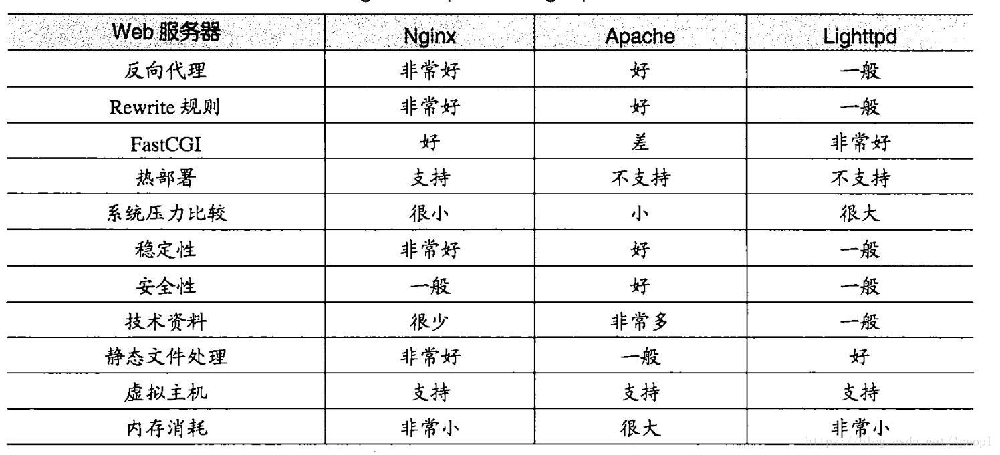

# Web 服务器 - web Server
* Apache Tomcat
* Nginx

* Lighttpd
* Apache
* Zeus
* IIS
## Nginx
Nginx不仅是一个小巧且高效的HTTP服务器，也可以做一个高效的负载均衡反向代理，通过它接受用户的请求并分发到多个Mongrel进程可以极大提高Rails应用的并发能力。
## Lighttpd
Lighttpd是由德国人 Jan Kneschke 领导开发的，基于BSD许可的开源WEB服务器软件，其根本的目的是提供一个专门针对高性能网站，安全、快速、兼容性好并且灵活的web  server环境。具有非常低的内存开销，CPU占用率低，效能好，以及丰富的模块等特点。支持FastCGI, CGI, Auth, 输出压缩(output  compress), URL重写, Alias等重要功能。

## Apache
Apache是世界使用排名的Web服务器软件。它几乎可以运行在所有的计算机平台上。由于Apache是开源免费的，因此有很多人参与到新功能的开发设计，不断对其进行完善。  Apache的特点是简单、速度快、性能稳定，并可做代理服务器来使用。
## Apache Tomcat
Tomcat是Apache 软件基金会(Apache Software Foundation)的Jakarta  项目中的一个核心项目，由Apache、Sun 和其他一些公司及个人共同开发而成。Tomcat 技术先进、性能稳定，而且免费，因而深受Java  爱好者的喜爱并得到了部分软件开发商的认可，成为目前比较流行的Web 应用服务器.
## Zeus
Zeus是一个运行于Unix下的非常的Web 服务器，据说性能超过Apache，是效率的Web 服务器之一
## IIS

IIS(Internet信息服务)英文Internet Information  Server的缩写。它是微软公司主推的服务器。IIS的特点具有：安全性，强大，灵活。

## Nginx与Apache、Lighttpd的综合对比
