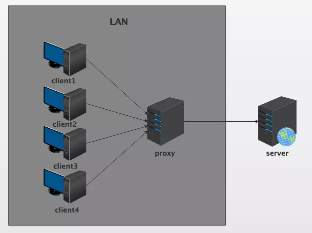
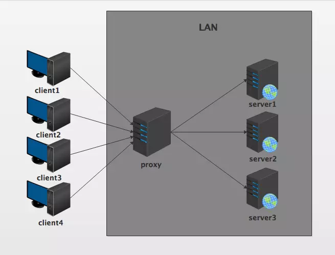

# 反向代理

## 什么是反向代理？
互联网应用基本都基于CS基本结构，即client端和server端。代理其实就是在client端和真正的server端之前增加一层提供特定服务的服务器，即代理服务器。

## 正向代理
反向代理不好理解，正向代理大家总有用过，翻墙工具其实就是一个正向代理工具。它会把们访问墙外服务器server的网页请求，代理到一个可以访问该网站的代理服务器proxy，这个代理服务器proxy把墙外服务器server上的网页内容获取，再转发给客户。具体的流程如下图。

概括说：就是客户端和代理服务器可以直接互相访问，属于一个LAN（局域网）；代理对用户是非透明的，即用户需要自己操作或者感知得到自己的请求被发送到代理服务器；代理服务器通过代理用户端的请求来向域外服务器请求响应内容。
## 反向代理
反向代理则正好相反，先看流程图图。

在反向代理中（事实上，这种情况基本发生在所有的大型网站的页面请求中），客户端发送的请求，想要访问server服务器上的内容。但将被发送到一个代理服务器proxy，这个代理服务器将把请求代理到和自己属于同一个LAN下的内部服务器上，而用户真正想获得的内容就储存在这些内部服务器上。看到区别了吗，这里proxy服务器代理的并不是客户，而是服务器，即向外部客户端提供了一个统一的代理入口，客户端的请求，都先经过这个proxy服务器，至于在内网真正访问哪台服务器内容，由这个proxy去控制。一般代理是指代理客户端，而这里代理的对象是服务器，这就是“反向”这个词的意思。Nginx就是来充当这个proxy的作用。

概括说：就是代理服务器和真正server服务器可以直接互相访问，属于一个LAN（服务器内网）；代理对用户是透明的，即无感知。不论加不加这个反向代理，用户都是通过相同的请求进行的，且不需要任何额外的操作；代理服务器通过代理内部服务器接受域外客户端的请求，并将请求发送到对应的内部服务器上。
## 为什么要Nginx反向代理
使用反向代理最主要的两个原因：
- 1）安全及权限。可以看出，使用反向代理后，用户端将无法直接通过请求访问真正的内容服务器，而必须首先通过Nginx。可以通过在Nginx层上将危险或者没有权限的请求内容过滤掉，从而保证了服务器的安全。
- 2）负载均衡。例如一个网站的内容被部署在若干台服务器上，可以把这些机子看成一个集群，那么Nginx可以将接收到的客户端请求“均匀地”分配到这个集群中所有的服务器上（内部模块提供了多种负载均衡算法），从而实现服务器压力的负载均衡。此外，nginx还带有健康检查功能（服务器心跳检查），会定期轮询向集群里的所有服务器发送健康检查请求，来检查集群中是否有服务器处于异常状态，一旦发现某台服务器异常，那么在以后代理进来的客户端请求都不会被发送到该服务器上（直到后面的健康检查发现该服务器恢复正常），从而保证客户端访问的稳定性。

