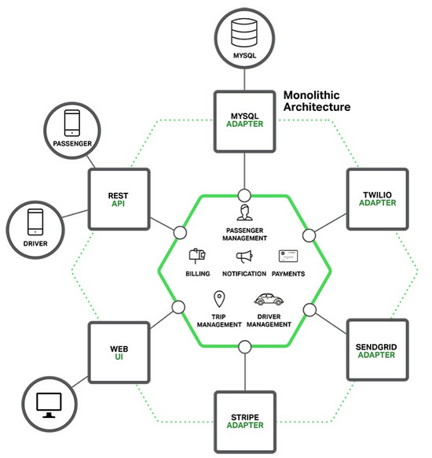

# 微服务
微服务 —— 也称为微服务架构 —— 是一种架构风格，它将应用程序构建为松散耦合服务的集合，这些服务实现了各种业务功能。微服务体系结构支持大型复杂应用程序的持续交付/部署。它还使组织能够发展其技术堆栈。

**微**：狭义来讲就是体积小

**服务**：相对较小且独立的功能单元

简单来说，微服务架构就是将一个完整的应用从数据存储开始垂直拆分多个不同的服务，每个服务能独立部署、独立维护、独立扩展。系统中的各个微服务可被独立部署，各个微服务之间是松耦合的。每个微服务仅关注于完成一件任务并很好地完成该任务。通常，每个任务代表着一个小的业务能力。
## 单体式架构

Java 应用程序被打包成 WAR 文件部署在如 Tomcat上，他们很容易开发、部署，因为 IDE 和其他工具就是专注于构建单体应用。 

这种简单的方法有很大的局限性：

- 复杂性逐渐变高

    项目有几十万行代码，各个模块之间区别比较模糊，逻辑比较混乱，代码越多复杂性越高，越难解决遇到的问题。

- 技术债务逐渐上升

    人员流动问题

- 部署速度逐渐变慢

    代码越多编译越慢，部署越慢

- 阻碍技术创新

    想要改变些什么，但历史包袱太重

- 无法按需伸缩

    比如cpu密集型的模块，比如大内存模块等

一旦应用程序成了一个庞大、复杂的单体，开发会陷入一个痛苦的境地，敏捷开发和交付的任何一次尝试都将原地徘徊。主要问题是应用程序实在非常复杂，其对于任何一个开发人员来说显得过于庞大。最终，正确修复 bug 和实现新功能变得非常困难而耗时。
## 微服务 — 解决复杂问题
- 每个服务通常实现一组不同的特性或功能
- 每个微服务会暴露一个供其他微服务或应用客户端消费的 API

## 微服务架构特点
- 易于开发和维护
- 启动较快
- 局部修改容易部署
- 技术栈不受限
- 按需伸缩
- 微服务架构模式可以实现每个微服务独立部署，独立扩展。

## 微服务的架构优势

- 快速发布
- 独立扩展
- 快速试错
- 快速应用新技术

## 微服务的劣势
- 性能损失，微服务之间都是通过restfull或grpc的方式进行通信。
- 系统复杂，一个应用或多个应用有非常多的服务
- 服务太多监控复杂。
- 微服务架构不适用于
    - 对单机性能要求高
    - 例如：操作系统，数据库
- 对运维要求比较高
- 接口调整成本高

## 微服务架构需要面临的一些问题
- 如何发现服务
- 如何对服务链路进行追踪
- 如何管理配置
- 如何对服务API进行控制
- 如何部署(持续交付)

## 工具
### Consul
Consul是一个服务管理软件。它主要特点:

- Service Discovery

    服务发现和配置的工具。分布式, 高度可用，并且具有非常好的可伸缩性。

- Failure Detection

    将服务发现与健康检查配对，可以防止路由请求对不健康的主机，并使服务能够轻松地提供断路器。

- Multi Datacenter

    在没有复杂的配置的情况下，Consul调度到多个数据中心。在其他数据中心查找服务，或保持请求本地。

- KV Storage

    灵活的 Key/Value 存储动态配置，功能标记，协调，Leader选举等。配置更改和即时通知。

可以用Consul来实现以下功能:

- 分布式key/value，用于做配置中心。
- 分布式session，用于解决session的问题。
- 分布式锁，其key/value也可以用于分布式锁的问题
- 资源中心，动态管理redis、datasource、rabbitmq等资源
### Kong 
Kong 是一个现成 的 Api Gateway 的解决方案。

Kong有以下主要特点:

- 众多的插件
- 基于OpenResty
- 可视化配置
- 与Consul搭配使用
- Api管理、限流、授权、降级、负载、请求分发、日志等等
- 性能高

## 框架
*  kite https://github.com/koding/kite
*  go-micro https://github.com/micro/go-micro
## 使用
1. 服务拆分
    拆分的原则是通过服务功能划分，尽量避免双向依赖
2. 服务间通信

    服务间使用protobuf协议对数据进行编码，使用UDP作为传输协议。

3. 服务发现

    Etcd搭建多节点高可用的服务发现。

4. 服务保护

    我们选择Hystrix作为服务保护以及服务降级的方案。
    每个服务开发者，需要定义自己服务接口的并发量、超时时间以及fallback方法。

5. 部署方案
    - Docker Swarm
    - Kubernetes
    - 裸机部署

## 微服务架构
当前主流的微服务架构可以分为三类：
1. 基于传统高性能RPC技术和服务治理的微服务框架，这个领域的王者是ZeroC IceGrid；
2. 以HTTP REST为通信机制的通用性微服务架构，最典型的为Spring Cloud；
3. 基于容器技术，没有提过特定的RPC通信机制，理论上任何分布式应用都可以运行在微服务架构平台上，言外之意就是要选择合适的通信协议，比如REST、Thrift、gRPC等，这个领域的王者是Google的Kubernetest。

微服务架构的项目在实施过程中经常需要考虑的问题：
- 引入自动化工具与集中运维管理工具，用于程序的编译打包、自动化部署和升级等工作；
- 需要研究、测评大量相关开源工具并引入微服务架构中，原因是之前的很多中间件工具只适合于单体应用；
- 团队重构，包括展现层和微服务层，建议团队中的骨干技术人员成为微服务层的开发主力；
- 高质量的文档。

## 参考资料
* [微服务入门权威指南](https://juejin.im/post/5ab0d1a3f265da23731448e0)