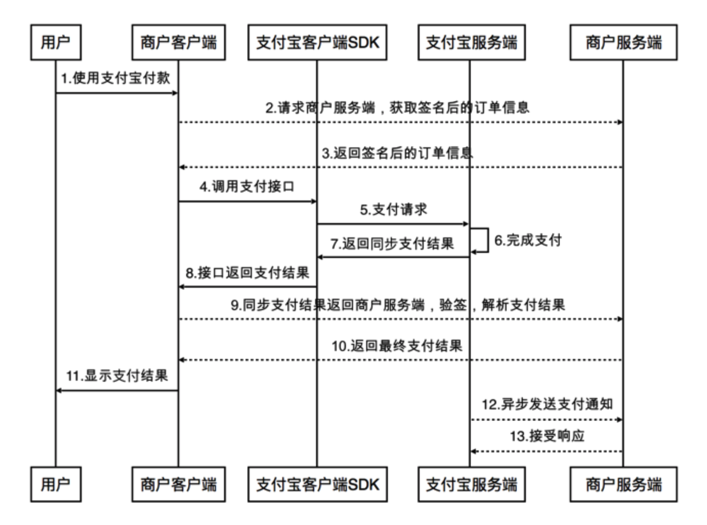
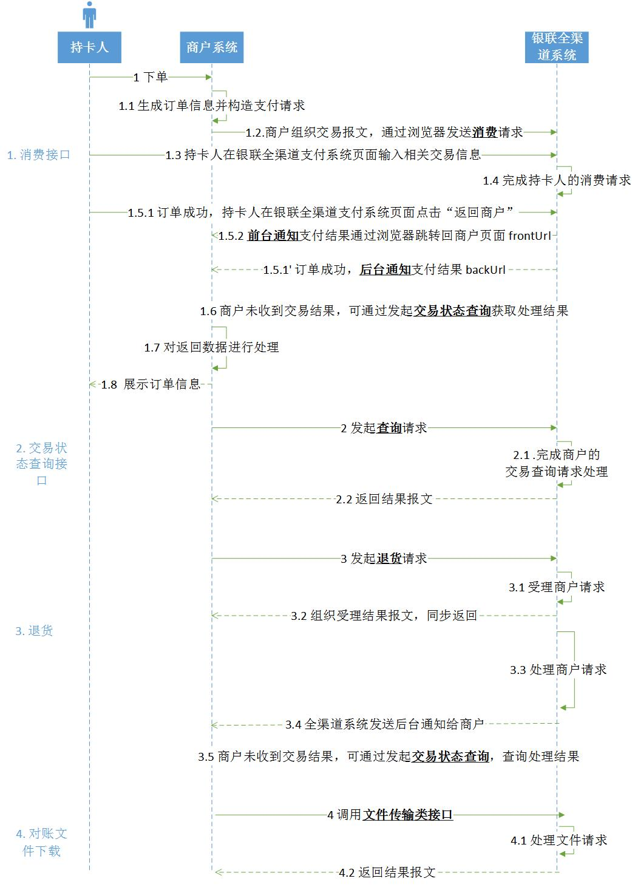

# 第三方支付
- 微信
- 支付宝
- 银联
- 各大银行
- 其他第三方平台

## 微信
* [微信开发平台](https://open.weixin.qq.com/)
* [golang微信支付服务端](https://studygolang.com/articles/5636)
* [微信支付(WeChat Pay) SDK](https://github.com/objcoding/wxpay)

## 支付宝
* [蚂蚁金服开发平台](https://open.alipay.com/developmentAccess/developmentAccess.htm)
* [支付宝SDK](https://github.com/ascoders/alipay)
* [支付宝 AliPay SDK](https://github.com/smartwalle/alipay)

## 银联
* [银联开发平台](https://open.unionpay.com/tjweb/api/list)

## 参考资料
